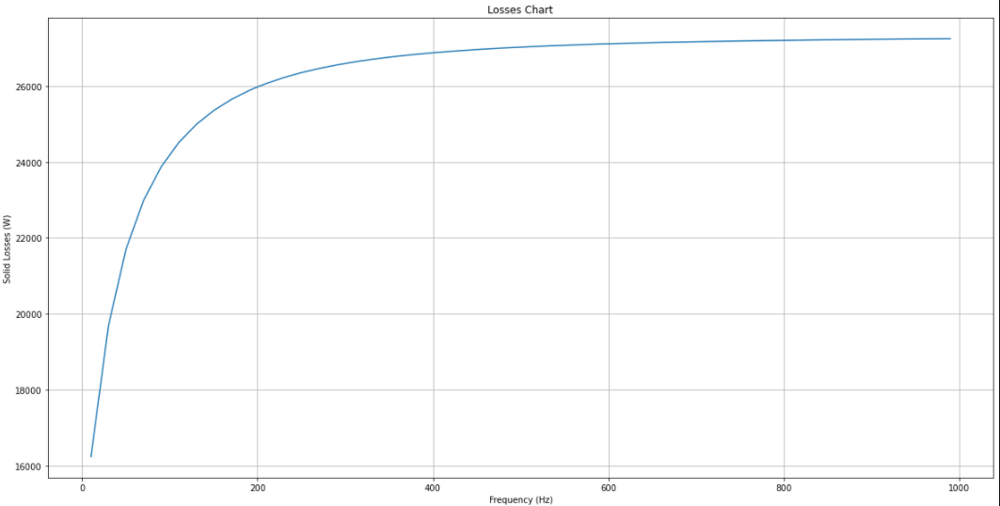

Examples
========

Here you can find a list of examples that shows how to use PyAEDT in
real practical cases.

**Getting Started Examples:**

..
   - `JupyterLab HFSS Full Example <../Examples/Notebooks/HFSS_Icepak_fullEXample.ipynb>`_: It is a Jupyter lab file that shows how user can launch pyaedt from Jupyter lab. It requires Juputer Lab to be installed on your machine.

   - `JupyterLab HFSS Full Example Non Graphical <../../Examples/Notebooks/HFSS_Icepak_fullEXample-NG.ipynb>`_: It is a Jupyter lab file that shows how user can launch pyaedt from Jupyter lab. It requires Juputer Lab to be installed on your machine. Non Graphical Version

   - `JupyterLab Far Field PostProcessing Example <../../Examples/Notebooks/far_field_test.ipynb>`_: It is a Jupyter lab file that shows how user can use matplotly to postprocess data from AEDT in Non-Graphical mode. It requires Juputer Lab to be installed on your machine.

   - `JupyterLab Sherlock to Icepak Example <../../Examples/Notebooks/SherlockToIcepak.ipynb>`_: It is a Jupyter lab file that shows how user can import files from Sherlock and create Icepak Project.

   - `JupyterLab Maxwll Example 1 <../../Examples/Notebooks/maxwell_pyaedt_test.ipynb>`_: It is a Jupyter lab file that shows how user can create a maxwell project, run analysis and plot results.

   - `JupyterLab Maxwll Example 2 <../../Examples/Notebooksmaxwell_pyaedt_test-NG.ipynb>`_: It is a Jupyter lab file that shows how user can create a maxwell project, run analysis and plot results. Non Graphical Version

   - `JupyterLab Netlist Example <../../Examples/Notebooks/Netlist.ipynb>`_: It is a Jupyter lab file that shows how user can read a netlist and create a schematic

   - `HFSS Example <../../Examples/01_HFSS_Icepak_FullProject.py>`_: Includes HFSS and Icepak Analysis

   - `Maxwell 3D Example <../../Examples/02_Maxwell_Icepak_App_Example.py>`_: It includes Maxwell and Icepak Analysis

   - `Solution Setup Example <../../Examples/13_Solution_Setup_Example.py>`_: It includes example to create automatically a Simulation Setup in different tools

   - `Q3D Example <../../Examples/03_Q3D_Example.py>`_ Q3D_Example.py: It includes an example of creating Q3D Project

   - `EDB Example <../../Examples/08A_EDB_From3DLayout_Example.py>`_: It includes an example of using Edb API from pyaedt within 3DLayout (read ONLY)

   - `EDB Standalone Example <../../Examples/08B_EDB_Standalone_example.py>`_: It includes an example of using Edb API ouside aedt (read/write)

   - `HFSS 3D Layout Example <../../Examples/08C_HFSS_3DLayout_example.py>`_: It includes an example of using HFSS3DLayout

   - `Dipole Example <../../Examples/05_Dipole_Example.py>`_: It includes an example of using HFSS

   - `Circuit Example <../../Examples/06_Circuit_Example.py>`_: A Simple RLC Example

   - `Netlist Example <../../Examples/09_Import_Netlist.py>`_: A Simple HSPICE Netlist Import Example

   - `Geometry Creation Example <../../Examples/10_Geometry_Creation_Package.py>`_: A Simple Package Creation Example

   - `Ansys Report Example <../../Examples/11_Ansys_Report.py>`_: An example on how to create pdf reports

   - `HeatSink Example <../../Examples/11_Ansys_Report.py>`_: An example on how to create a fully parametrized HeatSink

Jupyeter can be launched with the following command:

*"jupyter lab pathtopyaedtRoot/Documentation/Examples/example_name.ipynb"* and jupyter server will be launched and the notebook will be loaded

Example
-------

**1. Insert a Maxwell design and instantiate Geometry modeler.**

.. code:: python

    from pyaedt.Destkop import Desktop
    from pyaedt.Circuit import Maxwell3D

    with Desktop("2020.1", NG=True):
         # AEDT 2020R1 in Non-Graphicalmode will be launched
         M3D = Maxwell3D(solution_type="EddyCurrent")
         GEO = M3D.modeler
         GEO.model_units = "mm"
         CS = GEO.coordinate_system

**2. Create the Model**

.. code:: python

   plate = GEO.primitives.create_box([0, 0, 0], [294, 294, 19], name="Plate", matname="aluminum")
   hole = GEO.primitives.create_box([18,18,0], [108, 108, 19], name="Hole")

**3. modeler operations**

.. code:: python

   GEO.subtract([plate], [hole])
   M3D.assignmaterial(plate, "aluminum")
   M3D.solve_inside("Plate")
   adaptive_frequency = "200Hz"
   p_plate = M3D.post.volumetric_loss("Plate") # Create fields postprocessing variable for loss in object Plate
   M3D.save_project(project_name) # unable to save file by passing the file name or directory as an argument.

**4. Create Coils**

.. code:: python

   center_hole = M3D.modeler.Position(119, 25, 49)
   center_coil = M3D.modeler.Position(94, 0, 49)
   coil_hole = GEO.primitives.create_box(center_hole, [150, 150, 100], name="Coil_Hole")  # All positions in model units
   coil = GEO.primitives.create_box(center_coil, [200, 200, 100], name="Coil")  # All positions in model units
   GEO.subtract([coil], [coil_hole])
   M3D.assignmaterial(coil, "copper")
   M3D.solve_inside("Coil")
   p_coil = M3D.post.volumetric_loss("Coil")

**5. Create relative coordinate system**

.. code:: python

   CS.create([200, 100, 0], view="XY", name="Coil_CS")

**6. Create coil terminal**

.. code:: python

   GEO.section(["Coil"], M3D.CoordinateSystemPlane.ZXPlane)
   GEO.separate_bodies(["Coil_Section1"])
   GEO.primitives.delete("Coil_Section1_Separate1")
   M3D.assign_current(["Coil_Section1"], amplitude=2472)

**7. draw region**

.. code:: python

   M3D.modeler.create_air_region(pad_percent=[300] * 6)

**8. Simulation Setup**

.. code:: python

   M3D.eddy_effects_on(['Plate'])
   Setup = M3D.create_setup()
   Setup.props["MaximumPasses"] = 12
   Setup.props["MinimumPasses"] = 2
   Setup.props["MinimumConvergedPasses"] = 1
   Setup.props["PercentRefinement"] = 30
   Setup.props["Frequency"] = adaptive_frequency
   Setup.props["HasSweepSetup"] = True
   Setup.props["StartValue"] = "1e-08GHz"
   Setup.props["StopValue"] = "1e-06GHz"
   Setup.props["StepSize"] = "2e-08GHz"

   Setup.update()
   Setup.enable_expression_cache([p_plate, p_coil], "Fields", "Phase=\'0deg\' ", True)

**8. Solve Project**

.. code:: python

   M3D.analyse_nominal()

**8. Get Report Data**

.. code:: python

   M3D.post.report_types
   ['EddyCurrent', 'Fields']
   val = M3D.post.get_report_data(expression="SolidLoss")

**8. Advanced Plot with matplotlib**

.. code:: python

   fig, ax = plt.subplots(figsize=(20, 10))

   ax.set(xlabel='Frequency (Hz)', ylabel='Solid Losses (W)', title='Losses Chart')
   ax.grid()
   mag_data = np.array(val.data_magnitude())
   freq_data = np.array([i*1e9 for i in val.sweeps["Freq"]])
   ax.plot(freq_data, mag_data)
   plt.show()

    Matplotlib Losses Plot

**9. Save and Close**

.. code:: python

   M3D.save_project(project_name)

Plots can be generated within AEDT or externally as shown in this
example. Additional examples show that the approach can be
applied to touchstone or other report data. Additionally, Field Plots
can be exported and processed using ``Plotly`` package

