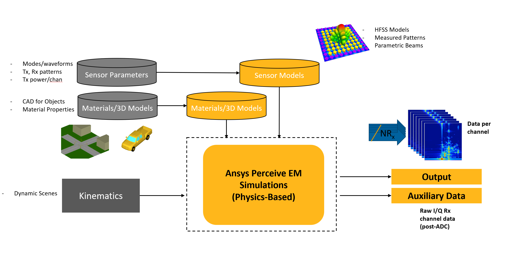

Perceive EM
===========
Perceive EM is a highly performant, physical optics (PO)-based shooting and bouncing rays (SBR)
technology deployed through a lightweight API that seamlessly integrates into any digital twin platform.

.. note::
    Requires Perceive EM 2025 R1 or later.

The ``PerceiveEM`` class is the main interface to the **Ansys Perceive EM API**, designed to provide simulation control,
scene management, and material definition for radar sensor simulation scenarios. It acts as a Python wrapper
within PyAEDT to seamlessly interact with the underlying native API.

.. currentmodule:: ansys.aedt.core.perceive_em.core.api_interface

.. autosummary::
   :toctree: _autosummary
   :nosignatures:

   PerceiveEM

Initialization
--------------

The constructor allows specifying a Perceive EM version. If not provided, it attempts to auto-detect
the latest supported version installed on the system.

.. code-block:: python

    from ansys.aedt.core.perceive_em.core.api_interface import PerceiveEM

    perceive_em = PerceiveEM()

Simulation workflow
-------------------

Perceive EM has the simulation workflow described in the following picture:

The Perceive EM API includes classes for the different simulation steps:

.. grid:: 2

   .. grid-item-card:: Scene
            :link: perceive_em/scene
            :link-type: doc
            :margin: 2 2 0 0

            Manage actors and antenna platforms

   .. grid-item-card:: Material
            :link: perceive_em/material
            :link-type: doc
            :margin: 2 2 0 0

            Manage materials

   .. grid-item-card:: Simulation
            :link: perceive_em/simulation
            :link-type: doc
            :margin: 2 2 0 0

            Manage simulation settings

Example
-------

This example builds a complete scene and launch the simulation.

.. code-block:: python

    from pathlib import Path
    import numpy as np
    import matplotlib.pyplot as plt

    from ansys.aedt.core.generic.settings import settings
    from ansys.aedt.core.perceive_em.core.api_interface import PerceiveEM
    from ansys.aedt.core.perceive_em.scene.antenna_platform import AntennaPlatform
    from ansys.aedt.core.perceive_em.modules.antenna_device import AntennaDevice
    from ansys.aedt.core.perceive_em.modules.antenna import Antenna
    from ansys.aedt.core.perceive_em.modules.material import MaterialManager
    from ansys.aedt.core.perceive_em import MISC_PATH
    from ansys.aedt.core.perceive_em.visualization.scene_visualization import SceneVisualization

    from ansys.aedt.core.perceive_em.modules.waveform import RangeDopplerWaveform
    from ansys.aedt.core.perceive_em.modules.antenna import Transceiver

    """User inputs"""

    """Waveform"""
    center_freq = 77e9
    num_freqs = 512
    bandwidth = 300e6
    cpi_duration = 10e-3
    num_pulse_CPI = 101

    waveform = RangeDopplerWaveform()
    waveform.center_frequency = center_freq
    waveform.bandwidth = bandwidth
    waveform.pulse_cpi = num_pulse_CPI
    waveform.frequency_samples = num_freqs
    waveform.cpi_duration = cpi_duration

    """Scene definition"""
    frames_per_second = 30
    dt = 1 / frames_per_second
    T = 10
    frame_number = int(T / dt)

    update_camera_view = False
    actor_attachment = None
    # side, top, front , scene_top, first_person, third_person
    camera_orientation = "scene_top"
    distance_factor = 3.0
    height_factor = 2.2

    """Transceivers"""
    tx = Transceiver()
    tx.name = 'antenna_tx'
    tx.antenna_type = "farfield"
    tx.input_data = MISC_PATH / "antenna_device_library" / "dipole.ffd"
    tx.operation_mode = "Tx"

    rx = Transceiver()
    rx.name = 'antenna_rx'
    rx.antenna_type = "farfield"
    rx.input_data = MISC_PATH / "antenna_device_library" / "dipole.ffd"
    rx.operation_mode = "Rx"

    """Simulation options"""
    # Set to -1 if no GO blockage, set to 0 or higher for GO blockage
    go_blockage = 1
    max_num_refl = 5
    max_num_trans = 1
    ray_spacing = 0.55

    # Bird trajectory
    circle_radius = 3
    orbit_center = np.array([5, 0, 1])

    ########################################################################################################################
    """PyAEDT Perceive EM API"""
    ########################################################################################################################

    """Initialize scene"""
    perceive_em = PerceiveEM()

    """Add bird to scene"""
    actor_bird = perceive_em.scene.add_bird(name="bird",
                                            input_file=MISC_PATH / "actor_library" / "bird" / "bird.json")

    """Add city to scene"""
    material_manager = MaterialManager(perceive_em)
    available_materials = material_manager.available_materials
    # If material is not available you can add a new one using add_material method
    actor_city = perceive_em.scene.add_actor(name="city")
    actor_city.add_part(input_file=MISC_PATH / "actor_library" / "city.stl",
                        name=None,
                        material="asphalt",
                        color="white",
                        transparency=0.8)

    """Add antenna single Tx and Rx"""
    antenna_platform = perceive_em.scene.add_single_tx_rx(tx=tx, rx=rx, waveform=waveform)

    """Bird scene"""
    interp_func_pos_bird, interp_func_rot_bird = actor_bird.circle_trajectory(
        duration=T,
        n_frames=frame_number,
        circle_radius=circle_radius,
        orbit_center=orbit_center,
        rotation_start_deg=90,
        rotation_end_deg=450)

    # Visualization object

    # Scale farfield to improve visibility
    antenna_devices = antenna_platform.antenna_devices[antenna_platform.antenna_device_names[0]]
    modes = antenna_devices.modes[antenna_devices.mode_names[0]]
    antenna_rx = modes.antennas_rx["antenna_rx"].scale_mesh = [0.1, 0.1, 0.1]
    antenna_tx = modes.antennas_tx["antenna_tx"].scale_mesh = [0.1, 0.1, 0.1]

    actors = perceive_em.scene.actors
    actors.update(perceive_em.scene.antenna_platforms)

    modeler = SceneVisualization(actors, size=(1920, 1088))
    modeler.camera_orientation = camera_orientation
    modeler.camera_attachment = actor_attachment
    modeler.height_factor = height_factor
    modeler.distance_factor = distance_factor

    # Simulation setup

    perceive_em.simulation.ray_spacing = ray_spacing
    perceive_em.simulation.max_reflections = max_num_refl
    perceive_em.simulation.max_transmissions = max_num_trans
    perceive_em.simulation.go_blockage = go_blockage
    perceive_em.simulation.field_of_view = 180

    perceive_em.simulation.auto_configure_simulation()

    perceive_em.simulation.response_type = perceive_em.simulation.response_types["range_doppler"]
    perceive_em.simulation.mode = antenna_platform.antenna_devices[antenna_platform.antenna_device_names[0]].active_mode

    perceive_em.simulation.validate()

    plt.ion()

    fig, ax = plt.subplots()
    self = type('', (), {})()
    self.ax = ax
    self.fig = fig

    imData = np.random.rand(100, 100)
    self.mpl_ax_handle = ax.imshow(imData, cmap='viridis')

    plot_limits = None

    update_time = 0
    for frame in range(frame_number):
        time = frame * dt

        # Update actor position
        for actor_name, actor in perceive_em.scene.actors.items():
            if time > 10:
                update_time = np.mod(update_time, 10)
            else:
                update_time = time
            if hasattr(actor, "actor_type") and actor.actor_type == "bird":
                actor.coordinate_system.auto_update = False
                actor.coordinate_system.position = interp_func_pos_bird(update_time)
                actor.coordinate_system.rotation = interp_func_rot_bird(update_time)
                actor.coordinate_system.auto_update = True
            actor.update(time=update_time)

        for antenna_platform_name, antenna_platform in perceive_em.scene.antenna_platforms.items():
            if time > 10:
                update_time = np.mod(update_time, 10)
            else:
                update_time = time
            antenna_platform.update(time=update_time)

        modeler.update_frame(update_camera_view=update_camera_view)

        perceive_em.simulation.analyze()
        response = perceive_em.simulation.get_solution_data()

        imData = np.rot90(20 * np.log10(np.fmax(np.abs(response[0][0]), 1.e-30)))

        if isinstance(imData, list):
            imData = np.array(imData)

        if imData.ndim == 1:
            if not hasattr(self, 'mpl_ax_handle') or not isinstance(self.mpl_ax_handle, plt.Line2D):
                ax.clear()
                self.mpl_ax_handle, = ax.plot(imData)
            else:
                self.mpl_ax_handle.set_ydata(imData)
            self.ax.set_ylim(np.min(imData), np.max(imData))
        else:
            self.mpl_ax_handle.set_data(imData)
            if plot_limits is not None:
                self.mpl_ax_handle.set_clim(vmin=plot_limits[0], vmax=plot_limits[1])
            else:
                self.mpl_ax_handle.set_clim(vmin=np.min(imData), vmax=np.max(imData))

        self.fig.canvas.draw()
        self.fig.canvas.flush_events()
        plt.pause(0.001)

    modeler.close()

.. toctree::
   :hidden:
   :maxdepth: 2

   perceive_em/scene
   perceive_em/material
   perceive_em/simulation