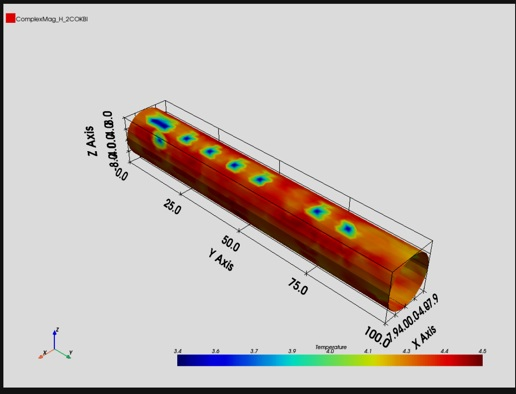

Visualization
=============

This section outlines the available modules for creating and editing data within and outside AEDT.

PyAEDT offers four primary levels of visualization:

* **Reports**
* **Post-processing**
* **Graphics**
* **Advanced Visualization**

Reports
~~~~~~~

AEDT provides extensive flexibility for generating reports.
PyAEDT includes dedicated classes to manipulate all report properties, offering full control over report customization.

.. toctree::
   :maxdepth: 1

   visualization/report

Post-processing
~~~~~~~~~~~~~~~

AEDT has different post-processing tools.
PyAEDT provides classes to interact with and modify any of these tools,
enhancing data analysis and visualization capabilities.

.. toctree::
   :maxdepth: 1

   visualization/post

.. image:: ../Resources/field_plot.png
  :width: 800
  :alt: Postprocessing features

Graphics
~~~~~~~~

Specialized plotting options.

.. toctree::
   :maxdepth: 1

   visualization/plot

Advanced Visualization
~~~~~~~~~~~~~~~~~~~~~~

High-level visualization tools.

.. toctree::
   :maxdepth: 1

   visualization/advanced

