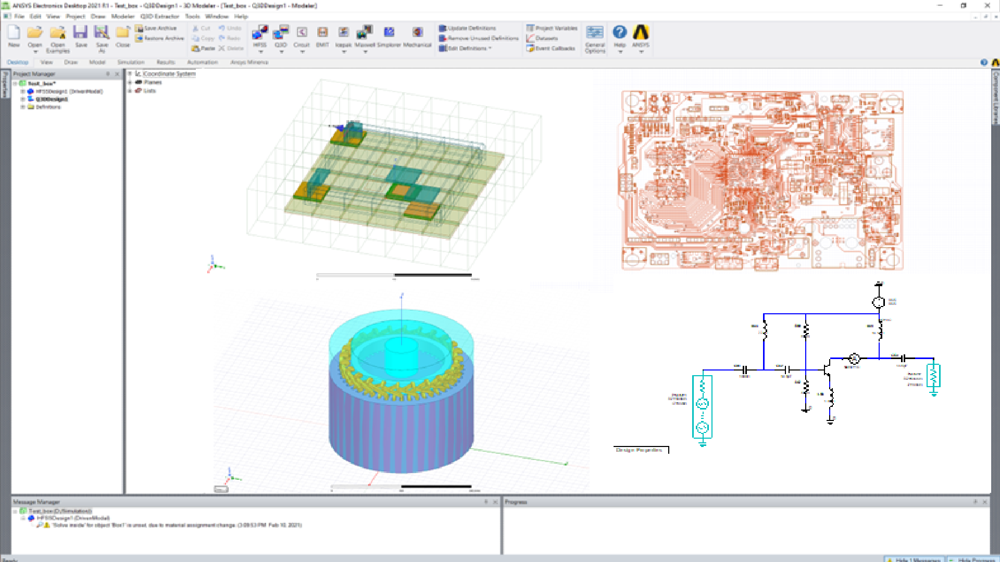

==================
API AEDT reference
==================

This section describes PyAEDT core classes, methods, and functions
for AEDT apps and modules. Use the search feature or click links
to view API documentation.
The Ansys Electronics Desktop (AEDT) is a platform that enables true electronics system design.
`AEDT <https://www.ansys.com/products/electronics>`_ provides access to the Ansys gold-standard
electro-magnetics simulation solutions such as Ansys HFSS,
Ansys Maxwell, Ansys Q3D Extractor, Ansys Siwave, and Ansys Icepak using electrical CAD (ECAD) and
Mechanical CAD (MCAD) workflows.
In addition, it includes direct links to the complete Ansys portfolio of thermal, fluid,
and Mechanical solvers for comprehensive multiphysics analysis.
Tight integration among these solutions provides unprecedented ease of use for setup and
faster resolution of complex simulations for design and optimization.

The PyAEDT API includes classes for apps and modules. You must initialize the
PyAEDT app to get access to all modules and methods. Available apps are:

- `HFSS <https://www.ansys.com/products/electronics/ansys-hfss>`_
- `HFSS 3D Layout <https://www.ansys.com/products/electronics/ansys-hfss>`_
- `Maxwell 3D <https://www.ansys.com/products/electronics/ansys-maxwell>`_
- `Maxwell 2D <https://www.ansys.com/products/electronics/ansys-maxwell>`_
- `Maxwell Circuit <https://www.ansys.com/products/electronics/ansys-maxwell>`_
- `Q3D <https://www.ansys.com/products/electronics/ansys-q3d-extractor>`_
- `Q2D Extractor <https://www.ansys.com/products/electronics/ansys-q3d-extractor>`_
- `Icepak <https://www.ansys.com/products/electronics>`_
- `Mechanical <https://www.ansys.com/products/structures/ansys-mechanical>`_
- RMXprt
- Emit
- Circuit
- `TwinBuilder <https://www.ansys.com/products/digital-twin/ansys-twin-builder>`_

All other classes and methods are inherited into the app class.
The desktop app is implicitly launched in any of the other applications.
Before accessing a PyAEDT app, the desktop app has to be launched and initialized.
The desktop app can be explicitly or implicitly initialized as shown in the following examples.

Example with ``Desktop`` class explicit initialization:

.. code:: python

    from pyaedt import launch_desktop, Circuit
    d = launch_desktop(specified_version="2022.2",
                       non_graphical=False,
                       new_desktop_session=True,
                       close_on_exit=True,
                       student_version=False):
     circuit = Circuit()
     ...
     # Any error here should be caught by the desktop app.
     ...
     d.release_desktop()

Example with ``Desktop`` class implicit initialization:

.. code:: python

    from pyaedt import Circuit
    circuit = Circuit(specified_version="2022.2",
                      non_graphical=False,
                      new_desktop_session=True,
                      close_on_exit=True,
                      student_version=False):
     circuit = Circuit()
     ...
     # Any error here should be caught by the desktop app.
     ...
     circuit.release_desktop()

.. toctree::
   :maxdepth: 2

   Application
   MaterialManagement
   Primitives3D
   Primitives2D
   Primitive_Objects
   Primitives3DLayout
   PrimitivesCircuit
   Boundaries
   Mesh
   Setup
   Post
   DesktopMessenger
   Optimetrics
   Variables
   Constants
   Configuration
   SetupTemplates
   CableModeling

