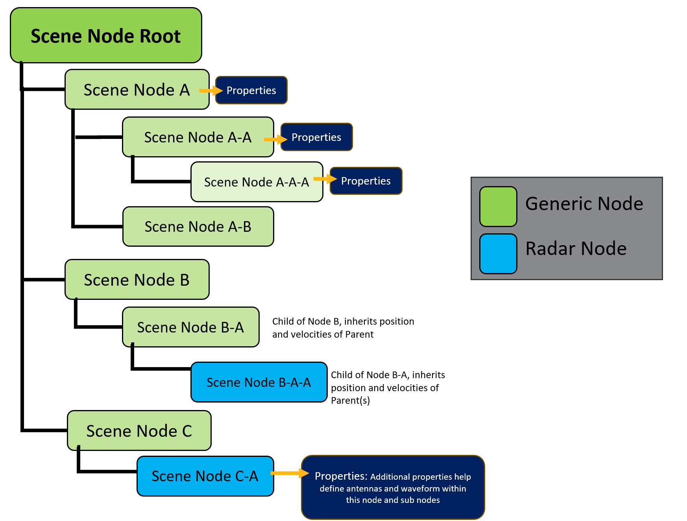
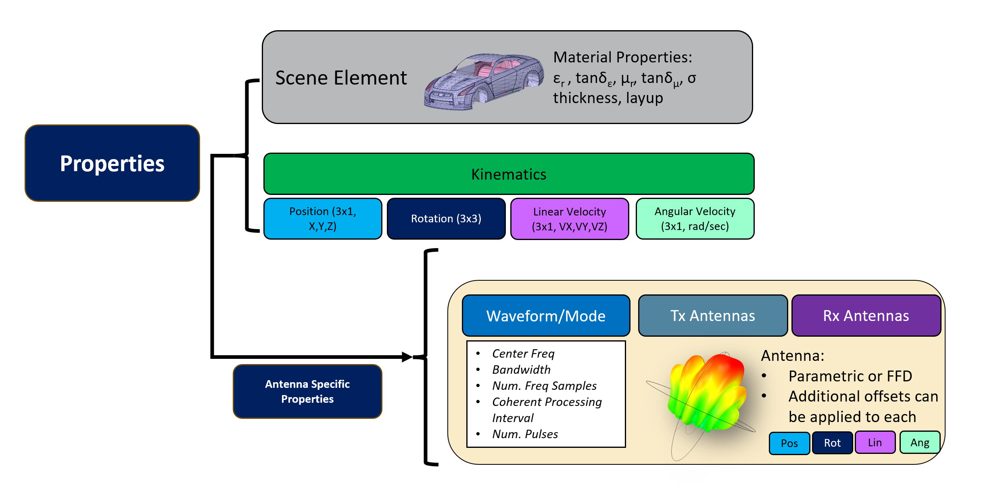
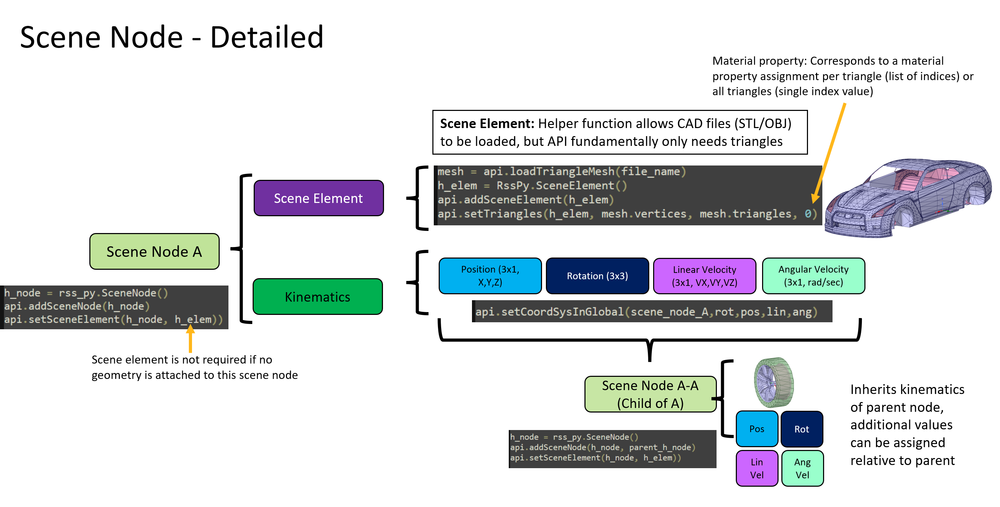
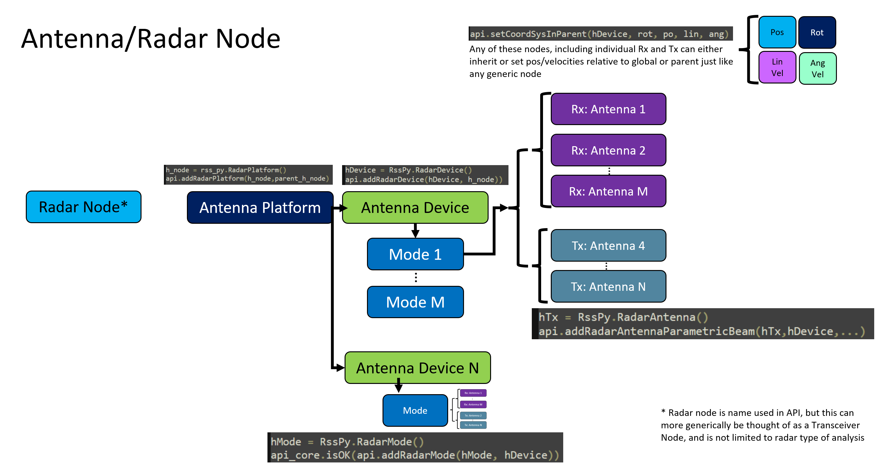

Scene
=====

The scene manages all components in a radar simulation scene, including actors and antenna platforms.

.. currentmodule:: ansys.aedt.core.perceive_em.scene.scene_root

.. autosummary::
   :toctree: _autosummary
   :nosignatures:

   SceneManager

Perceive EM Simulation is defined using the concept of building a scene tree.

The tree is defined through a parent and child relationship of nodes, and properties assigned to each node.
There are two types of nodes: generic and radar nodes.

You can add actors or antenna platforms to the scene:

.. currentmodule:: ansys.aedt.core.perceive_em.scene

.. autosummary::
   :toctree: _autosummary
   :nosignatures:

   Actor
   AntennaPlatform

In the following picture you can see the Perceive EM node main properties:

In the following sections, it is describe the scene node properties and the antenna node one which has specific properties.
Both has different API classes.

Scene node
----------

Perceive EM scene node has the following properties:

The following class control the kinematics of the actors:

.. currentmodule:: ansys.aedt.core.perceive_em.modules

.. autosummary::
   :toctree: _autosummary
   :nosignatures:

   CoordinateSystem

Using Actor class, you can define advanced actors, like for instance:

.. currentmodule:: ansys.aedt.core.perceive_em.misc.actor_library.advanced_actors

.. autosummary::
   :toctree: _autosummary
   :nosignatures:

   Bird

Antenna node
------------

Perceive EM radar node is special. Each antenna platform has antenna devices, and each antenna device can have
multiple modes, which defines the waveform used in the simulation. Each mode can have multiple transceivers,
transmitters, or receivers.

The following class control the antenna device:

.. currentmodule:: ansys.aedt.core.perceive_em.modules

.. autosummary::
   :toctree: _autosummary
   :nosignatures:

   AntennaDevice

The following class control the antenna mode:

.. currentmodule:: ansys.aedt.core.perceive_em.modules

.. autosummary::
   :toctree: _autosummary
   :nosignatures:

   AntennaMode
   Waveform
   RangeDopplerWaveform

The following class control the antenna transceiver:

.. currentmodule:: ansys.aedt.core.perceive_em.modules

.. autosummary::
   :toctree: _autosummary
   :nosignatures:

   Antenna
   Transceiver
   ParametricBeam

Example
--------
>>> from ansys.aedt.core.perceive_em.core.api_interface import PerceiveEM
>>> from ansys.aedt.core.perceive_em.scene.antenna_platform import AntennaPlatform
>>> from ansys.aedt.core.perceive_em.modules.waveform import RangeDopplerWaveform
>>> from ansys.aedt.core.perceive_em.modules.antenna import Transceiver
>>> from ansys.aedt.core.perceive_em import MISC_PATH
>>> perceive_em = PerceiveEM()
>>> actor_city = perceive_em.scene.add_actor(name="city")
>>> actor_city.add_part(input_file=MISC_PATH / "actor_library" / "city.stl", name=None, material="asphalt")
>>> waveform = RangeDopplerWaveform()
>>> rx = Transceiver()
>>> rx.name = 'antenna_rx'
>>> rx.antenna_type = "farfield"
>>> rx.input_data = MISC_PATH / "antenna_device_library" / "dipole.ffd"
>>> rx.operation_mode = "Rx"
>>> tx = Transceiver()
>>> tx.name = 'antenna_tx'
>>> tx.antenna_type = "farfield"
>>> tx.input_data = MISC_PATH / "antenna_device_library" / "dipole.ffd"
>>> tx.operation_mode = "Tx"
>>> antenna_platform = perceive_em.scene.add_single_tx_rx(tx=tx, rx=rx, waveform=waveform)

.. toctree::
   :hidden:
   :maxdepth: 2

   perceive_em/scene
   perceive_em/material
   perceive_em/simulation