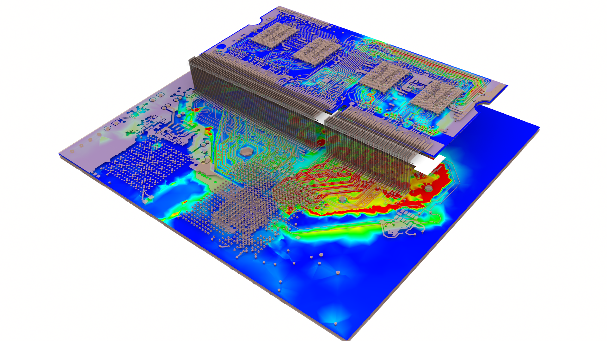

EDB manager
===========
An AEDB database is a folder that contains the database representing any part of a PCB.
It can be opened and edited using the ``Edb`` class.

.. currentmodule:: pyaedt

.. autosummary::
   :toctree: _autosummary

   edb.Edb

.. code:: python

    from pyaedt import Edb
    # this call returns the Edb class initialized on 2022 R2
    edb = Edb(myedb, edbversion="2022.2")

    ...

EDB modules
~~~~~~~~~~~
This section lists the core EDB modules for reading and writing information
to AEDB files.

.. currentmodule:: pyaedt.edb_core

.. autosummary::
   :toctree: _autosummary
   :nosignatures:

   components.Components
   hfss.EdbHfss
   siwave.EdbSiwave
   nets.EdbNets
   padstack.EdbPadstacks
   layout.EdbLayout
   stackup.EdbStackup
   stackup.Stackup

.. code:: python

    from pyaedt import Edb
    edb = Edb(myedb, edbversion="2022.2")

    # this call returns the EdbHfss Class
    comp = edb.core_hfss

    # this call returns the Components Class
    comp = edb.core_components

    # this call returns the EdbSiwave Class
    comp = edb.core_siwave

    # this call returns the EdbPadstacks Class
    comp = edb.core_padstack

    # this call returns the EdbStackup Class
    comp = edb.core_stackup

    ...
