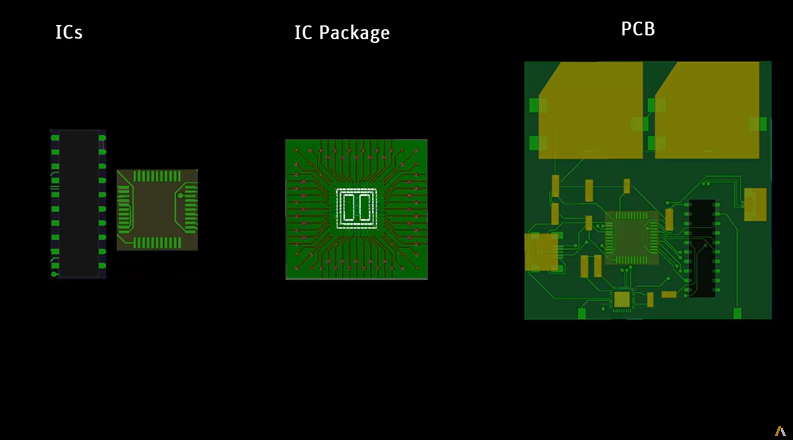

=================
API EDB reference
=================

This section describes PyAEDT EDB classes, methods, and functions
for EDB apps and modules. Use the search feature or click links
to view API documentation.

The PyAEDT EDB API includes classes for apps and modules. You must initialize the
EDB class to get access to all modules and methods.
All other classes and methods are inherited into the app class.
If EDB is launched within the ``HfssdLayout`` class, EDB is accessible in read-only mode.

Example:

.. code:: python

    from pyaedt import Edb
    edb = Edb("my_project.aedb", edbversion="2022.2")
    edb.core_components.components["R1"].r_value = 40
    edb.close_edb()

.. toctree::
   :maxdepth: 2

   CoreEdb
   DataEdb
   LayerData
   SourcesEdb
   PadstackEdb
   SimulationEdb
   SimulationConfigurationEdb
   SiWave