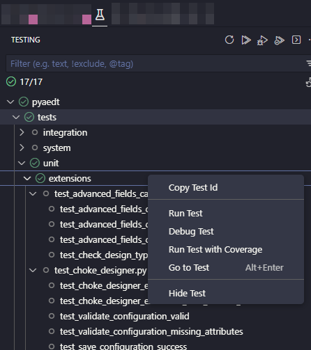
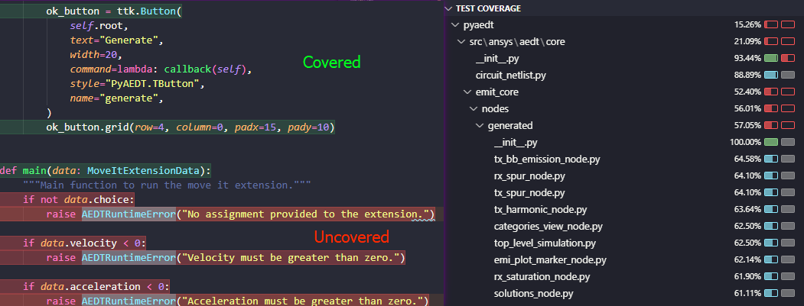
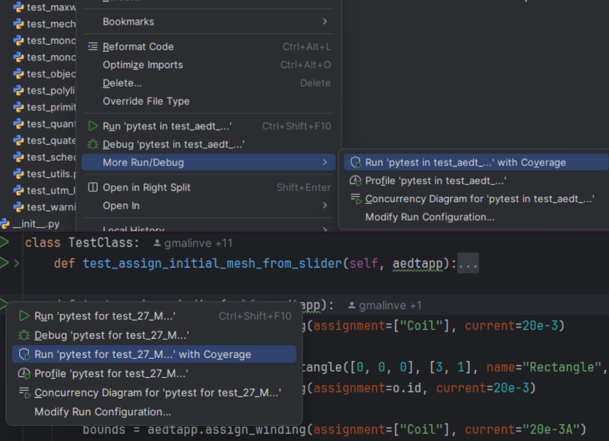

.. _contributing_aedt:

==========
Contribute
==========
Overall guidance on contributing to a PyAnsys repository appears in
`Contribute <https://dev.docs.pyansys.com/how-to/contributing.html>`_
in the *PyAnsys Developer's Guide*. Ensure that you are thoroughly familiar
with this guide, paying particular attention to `Guidelines and Best Practices
<https://dev.docs.pyansys.com/how-to/index.html>`_, before attempting
to contribute to PyAEDT.

The following contribution information is specific to PyAEDT.

Clone the repository
--------------------
To clone and install the latest version of PyAEDT in
development mode, run:

.. code::

    git clone https://github.com/ansys/pyaedt
    cd pyaedt
    python -m pip install --upgrade pip
    pip install -e .

Post issues
-----------
Use the `PyAEDT Issues <https://github.com/ansys/pyaedt/issues>`_
page to submit questions, report bugs, and request new features.

To reach the product support team, email `pyansys.core@ansys.com <pyansys.core@ansys.com>`_.

View PyAEDT documentation
-------------------------
Documentation for the latest stable release of PyAEDT is hosted at
`PyAEDT Documentation <https://aedt.docs.pyansys.com>`_.

In the upper right corner of the documentation's title bar, there is an option
for switching from viewing the documentation for the latest stable release
to viewing the documentation for the development version or previously
released versions.

Code style
----------
PyAEDT complies with the `PyAnsys code style
<https://dev.docs.pyansys.com/coding-style/index.html>`_.
`pre-commit <https://pre-commit.com/>`_ is applied within the CI/CD to ensure compliance.
The ``pre-commit`` Python package can be installed
and run as follows:

.. code:: bash

  pip install pre-commit
  pre-commit run --all-files

You can also install this as a pre-commit hook with:

.. code:: bash

  pre-commit install

This way, it's not possible for you to push code that fails the style checks.
For example::

  $ pre-commit install
  $ git commit -am "Add my cool feature."
  black....................................................................Passed
  isort (python)...........................................................Passed
  flake8...................................................................Passed
  codespell................................................................Passed
  debug statements (python)................................................Passed
  trim trailing whitespace.................................................Passed
  Validate GitHub Workflows................................................Passed
  blacken-docs.............................................................Passed

Naming conventions
~~~~~~~~~~~~~~~~~~
Consistency of names helps improve readability and
ease of use. Starting with release 0.8 a concerted effort
has been made to
improve consistency of naming and adherence to
:ref:`PEP-8<https://peps.python.org/pep-0008/>`_.

For example, methods used to create or access entities in
AEDT require that a name be passed to the method or function
as an argument.
It is tempting to
include context as part of that variable name. For example, while it is tempting to use
``setupname``
as an argument to :meth:`Hfss.create_setup`_,
the context "setup" is
explicitly defined by the method name. The variable ``name`` provides
a more compact
description of the variable in this context.

In previous PyAEDT versions, you can also find both ``setup_name`` and ``setupname`` used
for various methods or classes.
Improving naming consistency improves maintainability and readability.

The following table illustrates the recommended conventions:

.. list-table:: Keywords and object names
   :widths: 25 25 50
   :header-rows: 1

   * - Old name
     - New name
     - Example
   * - ``setupname``, ``setup_name``, ``sweepname``
     - ``name``
     - ``Hfss.create_setup()``, ``Hfss.create_linear_step_sweep()``
   * - ``usethickness``
     - ``thickness``
     - ``Hfss.assign_finite_conductivity()``
   * - ``entities``
     - ``assignment``
     - ``Maxwell.assign_current_density()``
   * - ``entity_list``
     - ``assignment``
     - ``Maxwell.assign_symmetry()``

Take care to use descriptive names for
variables and classes that adhere to PEP-8 and are consistent with conventions already
used in PyAEDT.

Log errors
~~~~~~~~~~
PyAEDT has an internal logging tool named ``Messenger``
and a log file that is automatically generated in the project
folder.

The following examples demonstrate how ``Messenger`` is used to
write both to the internal AEDT message windows and the log file:

.. code:: python

    self.logger.error("This is an error message.")
    self.logger.warning("This is a warning message.")
    self.logger.info("This is an info message.")

These examples demonstrate how to write messages only to the log file:

.. code:: python

    self.logger.error("This is an error message.")
    self.logger.warning("This is a warning message.")
    self.logger.info("This is an info message.")

Handle exceptions
~~~~~~~~~~~~~~~~~
PyAEDT uses a specific decorator, ``@pyaedt_function_handler``,
to handle exceptions caused by methods and by the AEDT API.
This exception handler decorator makes PyAEDT fault tolerant
to errors that can occur in any method.

For example:

.. code:: python

   @pyaedt_function_handler()
   def my_method(self, var):
       pass

Every method can return a value of ``True`` when successful or
``False`` when failed. When a failure occurs, the error
handler returns information about the error in both the console and
log file.

Here is an example of an error:

.. code::

   ----------------------------------------------------------------------------------
   PyAEDT error on method create_box:  General or AEDT error. Check again
   the arguments provided:
       position = [0, 0, 0]
       dimensions_list = [0, 10, 10]
       name = None
       material = None
   ----------------------------------------------------------------------------------

   (-2147352567, 'Exception occurred.', (0, None, None, None, 0, -2147024381), None)
     File "C:\GIT\repos\AnsysAutomation\PyAEDT\Primitives.py", line 1930, in create_box
       o.name = self.oeditor.createbox(vArg1, vArg2)

   ************************************************************
   Method Docstring:

   Create a box.

   Parameters
   ----------
   ...

Hard-coded values
~~~~~~~~~~~~~~~~~~
Do not write hard-coded values to the registry. Instead, use the Configuration service.

Maximum line length
~~~~~~~~~~~~~~~~~~~
Best practice is to keep the length at or below 120 characters for code,
and comments. Lines longer than this might not display properly on some terminals
and tools or might be difficult to follow.

Extension development guide
---------------------------

This section describes the steps to create and integrate a PyAEDT extension at the **project level**.
Extensions are modular components that add functionality to the AEDT environment via the PyAEDT API.
They follow a structured convention to ensure consistency, maintainability, and documentation.

.. note::

    To create an extension at an **application level**, for example Hfss, the process is similar.
    The main difference is that the extension file and documentation should be placed in the
    appropriate directory, for example ``src/ansys/aedt/core/extensions/hfss`` and
    ``doc/source/User_guide/pyaedt_extensions_doc/hfss`` respectively.

Step 1: Create the extension Python file
~~~~~~~~~~~~~~~~~~~~~~~~~~~~~~~~~~~~~~~~

Navigate to the directory ``src/ansys/aedt/core/extension/project`` and create a new Python file for
your extension. The file name should be descriptive and follow the format ``extension_name.py``, where
``extension_name`` is a lowercase, hyphen-separated name that describes the extension's functionality.
The extension file should follow the official
`template <https://github.com/ansys/pyaedt/blob/main/src/ansys/aedt/core/extensions/templates/template_get_started.py>`_
and contain at least two classes:

1. A class that inherits from ``ExtensionCommon`` and implements the extension's logic. By inheriting from
   ``ExtensionCommon``, the extension's theme and style are automatically set and can leverage standard
   extension methods like the theme button handling, access to the AEDT application, and more.
   The custom content of the extension should be defined in the ``add_extension_content`` method and
   should be called in the ``__init__`` method of the class. This method is where you can define the
   user interface (UI) elements, such as buttons, text fields, and other widgets to display. Below is
   an example of how to create a basic extension class:

.. code-block:: python

    from ansys.aedt.core.extensions import ExtensionCommon, ExtensionData

    class MyExtension(ExtensionCommon):
        def __init__(self, *args, **kwargs):
            super().__init__(*args, **kwargs)
            self.add_extension_content()

        def add_extension_content(self):
            # Define your UI elements here
            pass

2. A data class that inherits from ``ExtensionCommonData``. This class should define the data that is provided
and computed through the UI. Below is an example of how to create a data class for your extension:

.. code-block:: python

    from dataclasses import dataclass
    from dataclasses import field

    @dataclass
    class MyExtensionData(ExtensionCommonData):
        setup: str = ""
        assignments: list = field(default_factory=lambda: [])

Splitting the extension logic into two classes allows for better separation of concerns and makes it easier to
test and maintain the code. The first class handles the UI and user interactions, while the second class
manages the data and logic behind the extension. On top of those classes, the file should also define a
``main`` function that is used to run the core logic behind the extension. This function should ingest an
instance of the data class defined in the second step. Below is an example of how to define the ``main``
function:

.. code-block:: python

    def main(extension_data: MyExtensionData):
        if not data.setup:
            raise AEDTRuntimeError("No setup provided to the extension.")

        # Core logic of the extension goes here

Step 2: Add unit tests
~~~~~~~~~~~~~~~~~~~~~~

Create a test file in the ``tests/unit/extensions`` directory with the same name as your extension file, but with a
``test_`` prefix. For example, if your extension file is named ``my_extension.py``, the test file should be
``test_my_extension.py``. This file should mainly contain unit tests for your extension's UI components. For example
checking that clicking a button triggers the expected action or that the UI elements are correctly initialized.
If your extension requires AEDT to run, you should patch every method that requires AEDT to run, so that the test
can be run without an active AEDT instance. This is important because unit tests should be fast and not depend on
an external application like AEDT. You can use the `unittest.mock` library to patch methods and classes that
require AEDT. A good example of such a test file is the
`test_template_extension.py <https://github.com/ansys/pyaedt/blob/main/tests/unit/extensions/test_template_extension.py>`_
file where the instantiation of the ``Desktop`` class is patched to avoid the need for an active AEDT instance. Below
is an example of how to create a unit test for your extension:

.. code-block:: python

  from unittest.mock import patch
  from ansys.aedt.core.extensions.project.my_extension import MyExtension, MyExtensionData

  @patch("ansys.aedt.core.extensions.misc.Desktop")
  def test_my_extension(mock_desktop):
      extension = MyExtension()

      assert "My extension title" == extension.root.title()
      assert "light" == extension.root.theme
      assert "No active project" == extension.active_project_name

      extension.root.destroy()

Step 3: Add system tests
~~~~~~~~~~~~~~~~~~~~~~~~

Like the previous step, create a test file in the ``tests/system/extensions`` directory with the same name as your
extension file, but with a ``test_`` prefix. However, contrary to unit tests, system tests are meant to be run with
an active AEDT instance. These tests should validate the overall functionality of the extension, ensuring that it
behaves as expected when integrated into the AEDT environment.

.. code-block:: python

  from ansys.aedt.core.extensions.project.my_extension import MyExtension, MyExtensionData
  from ansys.aedt.core import Hfss

  def test_my_extension_system(add_app):

      # Create some data in AEDT to test the extension
      aedt_app = add_app(
          application=Hfss, project_name="my_project", design_name="my_design"
      )
      aedt_app["p1"] = "100mm"
      aedt_app["p2"] = "71mm"
      test_points = [
          ["0mm", "p1", "0mm"],
          ["-p1", "0mm", "0mm"],
          ["-p1/2", "-p1/2", "0mm"],
          ["0mm", "0mm", "0mm"],
      ]
      p = aedt_app.modeler.create_polyline(
          points=test_points,
          segment_type=PolylineSegment("Spline", num_points=4),
          name="spline_4pt",
      )

      # Create the extension and set its data by clicking on the "Generate" button
      extension = MyExtension()
      extension.root.nametowidget("generate").invoke()

      # Check that the extension logic executes correctly
      assert 2 == len(aedt_app.variable_manager.variables)
      assert main(extension.data)
      assert 7 == len(aedt_app.variable_manager.variables)

Run tests in VSCode and PyCharm
~~~~~~~~~~~~~~~~~~~~~~~~~~~~~~~~~~~~~~~~~~~~

This section explains how to run pytest unit and system tests in VSCode (Visual Studio Code) and PyCharm, and how to estimate coverage
using the "Run with coverage" feature or pytest-cov.

Prerequisites
~~~~~~~~~~~~~
- Install pytest and pytest-cov in your environment if you haven't already:

.. code:: bash

  pip install pytest pytest-cov

- Ensure your IDE is configured to use the Python interpreter where the packages are installed.

VSCode IDE
~~~~~~~~~~~~~~~~~~~~~~~

1. Use the Test Explorer (Python extension) to discover and run tests:
  - Open the Testing side bar (beaker icon).
  - Run or debug individual tests, test files, or test suites from the UI.

2. Run tests and view coverage using the GUI
  - VSCode:
    - Click the "Run Test with Coverage" button in the Test Explorer toolbar to run one or more tests with coverage.
    - After the tests complete, a coverage summary appears in the Test Explorer (coverage % by file), and covered/uncovered lines are highlighted in the editor.

Brief note
~~~~~~~~~~
You can also run tests with coverage from a terminal in VSCode using pytest-cov:
.. code:: bash

  pytest tests/unit --cov=src --cov-report=term-missing --cov-report=html

This is an example command to run unit tests with coverage. Adjust the path to your test files as needed.

PyCharm IDE
~~~~~~~~~~~~~~~~~~~

1. Configure pytest as the test runner:
   - Settings -> Tools -> Python Integrated Tools -> Default test runner -> pytest

2. Run tests from the IDE:
   - Right-click a test file, folder, or test function and choose Run or Debug.
   - Use the dedicated test runner UI to run and inspect results.

3. Run with coverage in PyCharm:
   - Right-click a test file or configuration and choose "Run 'pytest in' with Coverage".
   - PyCharm shows a coverage summary and highlights covered and uncovered lines in the editor.

4. Run with pytest-cov from a terminal in PyCharm (alternative):

.. code:: bash

  pytest tests/unit --cov=src --cov-report=term-missing --cov-report=html

Interpreting coverage results
~~~~~~~~~~~~~~~~~~~~~~~~~~~~~

- Coverage percentage shows the portion of executed lines compared to total executable lines in the source files.
- Higher coverage is generally better, but 100% coverage does not guarantee bug-free code. At least 85% coverage for all the new code added to the repository is required.
- Use ``--cov-report=term-missing`` to see which lines are not covered directly in the terminal.
- Use ``--cov-report=html`` and open ``htmlcov/index.html`` in a browser for an easy-to-navigate, per-file coverage report.
- Run unit and system tests separately to estimate their individual contributions:

Best practices
~~~~~~~~~~~~~~
- Aim to keep unit tests fast and isolated; use mocks for external systems like AEDT.
- Use the IDE "Run with coverage" feature for quick, visual feedback.

Step 4: Add the extension to the catalog
~~~~~~~~~~~~~~~~~~~~~~~~~~~~~~~~~~~~~~~~

Add your extension to the catalog by creating a new entry in the
``toolkits_catalog.toml`` file located in the ``src/ansys/aedt/core/extensions/project`` directory.
The entry should follow the format of existing entries, specifying the name, script, icon, and template.
For example, to add your extension, you would add an entry like this:

.. code-block::

    [MyExtension]
    name = "My Extension"
    script = "my_extension.py"
    icon = "images/large/my_extension_icon.png"
    template = "run_pyaedt_toolkit_script"

The path to the image is relative to the directory where your extension is located. For example, if
the extension is located in the ``src/ansys/aedt/core/extensions/project`` directory then, following
the previous code block information, the path to the icon should be
``src/ansys/aedt/core/extensions/project/images/large/my_extension_icon.png``.

Step 5: Add the extension to the documentation
~~~~~~~~~~~~~~~~~~~~~~~~~~~~~~~~~~~~~~~~~~~~~~

To ensure that your extension is documented, you need to add a new card to the
``doc/source/User_guide/extensions.rst`` file. This card links to the extension's documentation page.
The documentation page needs to be created in the ``doc/source/User_guide/pyaedt_extensions_doc/project``
directory and should contain a brief description of the extension, its functionality, and how to use it.
Also, another card should be added to the
``doc/source/User_guide/pyaedt_extensions_doc/project/index.rst`` file to link to the extension's documentation page.
This ensures that the extension is discoverable in the documentation from the multiple pages that list all the
extensions available in PyAEDT.

Local testing parameters
------------------------

Two configuration files control test behavior:

- ``tests/local_config.json``: Contains parameters intended for modification during local testing.
  These settings control test execution behavior such as desktop version, graphical mode, and feature flags.
  **This file does not exist by default and must be created manually** in the ``tests/`` directory.

- ``tests/pyaedt_settings.yaml``: Contains default PyAEDT settings applied to all tests.
  These settings are not intended for local modification.

Creating local_config.json
~~~~~~~~~~~~~~~~~~~~~~~~~~~

To customize local test execution, create a ``local_config.json`` file in the ``tests/`` directory
at the top level of the repository. Below is an example configuration with descriptions of each parameter:

.. code-block:: json

  {
      "desktopVersion": "2025.2",
      "NonGraphical": true,
      "NewThread": true,
      "skip_circuits": false,
      "use_grpc": true,
      "close_desktop": true,
      "use_local_example_data": false,
      "local_example_folder": "",
      "skip_modelithics": true
      "use_pyedb_grpc": true
  }

Parameter descriptions:

- ``desktopVersion``: AEDT version to use for testing (for example, "2025.2," "2024.1").
- ``NonGraphical``: When ``true``, runs AEDT in non-graphical mode (headless).
- ``NewThread``: Opens AEDT in a new thread.
- ``skip_circuits``: When ``true``, skips Circuit-related tests.
- ``use_grpc``: When ``true``, uses gRPC API for communication with AEDT.
- ``close_desktop``: When ``true``, closes AEDT after tests complete.
- ``use_local_example_data``: When ``true``, uses local example data for tests.
- ``local_example_folder``: Path to the local example data folder.
- ``skip_modelithics``: When ``true``, skips Modelithics-related tests.
- ``use_pyedb_grpc``: When ``true``, use use PyEDB with gRPC for database access.

Replicating CI/CD environment
~~~~~~~~~~~~~~~~~~~~~~~~~~~~~~

The CI/CD pipeline loads ``pyaedt_settings.yaml`` via the environment variable:

.. code:: bash

  PYAEDT_LOCAL_SETTINGS_PATH='tests/pyaedt_settings.yaml'

To replicate the CI/CD environment locally, set this environment variable on your machine:

- **Windows (PowerShell)**:

.. code:: powershell

  $env:PYAEDT_LOCAL_SETTINGS_PATH='tests/pyaedt_settings.yaml'

- **Linux (Bash)**:

.. code:: bash

  export PYAEDT_LOCAL_SETTINGS_PATH='tests/pyaedt_settings.yaml'
