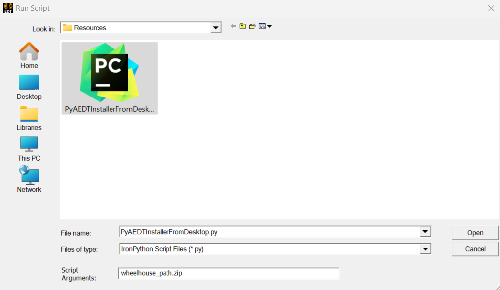
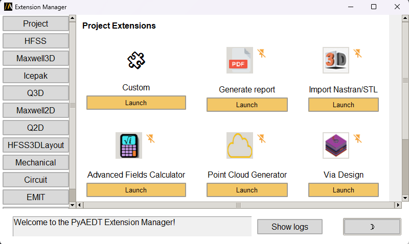
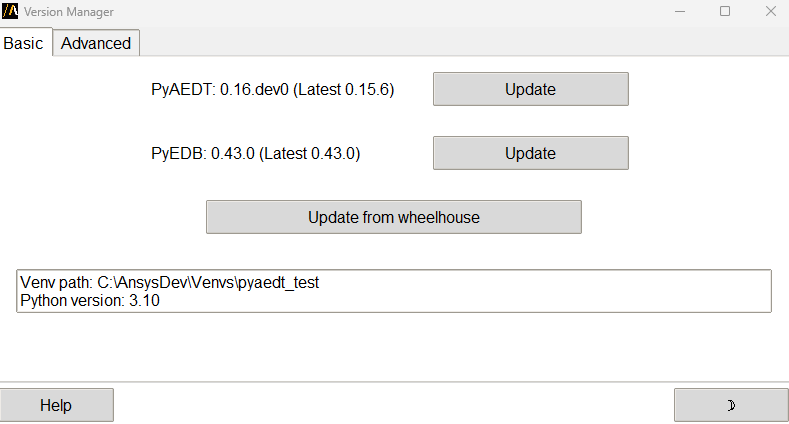

Installation
============
PyAEDT consolidates and extends all existing capital around scripting for AEDT,
allowing re-use of existing code, sharing of best practices, and collaboration.

This PyAnsys library has been tested on HFSS, Icepak, and Maxwell 3D. It also provides
basic support for EDB and Circuit (Nexxim).

Requirements
~~~~~~~~~~~~
In addition to the runtime dependencies listed in the installation information, PyAEDT
requires Ansys Electronics Desktop (AEDT) 2022 R1 or later. The AEDT Student Version is also supported.

Install from PyAEDT installer
~~~~~~~~~~~~~~~~~~~~~~~~~~~~~
The following Python script automatically installs PyAEDT from AEDT,
using the CPython interpreter included in the AEDT installation.

In order to do that you can:

- Download the following file: :download:`PyAEDT Installer Python file <../Resources/pyaedt_installer_from_aedt.py>`

- Open an Electronics Desktop Session and click on Tools->Run Script and execute the file.

- Offline installation is also possible using wheelhouses.

.. note::
    A wheelhouse is a zip containing all needed packages that can be installed offline.
    PyAEDT wheelhouse can be found at `Releases <https://github.com/ansys/pyaedt/releases>`_.
    After downloading the wheelhouse zip specific for your distribution and Python release,
    run the script from Electronics Desktop using the zip full path as argument.
    Please note that AEDT 2023 R1 and lower requires Python 3.7 wheelhouse while AEDT 2023 R2
    and higher requires the Python 3.10 wheelhouse.

Starting from 2023R2, buttons are available in the Automation Tab as in the example below.

.. image:: ../Resources/toolkits_ribbon.png
  :width: 800
  :alt: PyAEDT toolkit buttons available in AEDT

If you have installation problems, visit :ref:`Troubleshooting<panel_error>`.

You can watch the following video to see how to install PyAEDT:

.. raw:: html

  <iframe width="560" height="315" src="https://www.youtube.com/embed/c-zl8iMjP4M?si=zpdREiZhzODW-kW1" title="YouTube video player" frameborder="0" allow="accelerometer; autoplay; clipboard-write; encrypted-media; gyroscope; picture-in-picture; web-share" referrerpolicy="strict-origin-when-cross-origin" allowfullscreen></iframe>

Extension manager
~~~~~~~~~~~~~~~~~

The **PyAEDT Extension Manager** provides a centralized interface for accessing, launching, and managing automation workflows directly within AEDT.

From this window, you can:

- Browse and launch **project-level toolkits** organized by design type.
- Add **custom extensions** from your local environment.
- Control whether extensions appear in the **AEDT Automation ribbon** for quick access.

There are three types of extensions supported:

- **Pre-installed extensions** already available in the PyAEDT library.

- **Open source PyAEDT toolkits** described in the `PyAEDT Common Toolkit documentation <https://aedt.common.toolkit.docs.pyansys.com/>`_.

- **Custom PyAEDT extensions**.

See `Extension Manager <https://aedt.docs.pyansys.com/version/stable/User_guide/extensions.html>`_ for more information.

Each extension tile shows its name, icon, and a **Launch** button.
Extensions that are not currently linked to the AEDT ribbon show a muted icon.
Pinned extensions are marked and appears in the corresponding AEDT design ribbon tab.

Selecting the **Custom** tile in the Extension Manager opens a dialog where you can add your own PyAEDT-based extension.

.. image:: ../Resources/extension_manager_2.png
  :width: 400
  :alt: PyAEDT toolkit manager 2

In the dialog, you can:

- **Browse for a Python script** that implements the extension behavior.
- **Optionally leave the script path empty**. If no script is provided, a default extension script is automatically generated using a predefined template.

You must also specify an **Extension Name**, which appears in the AEDT Automation.

Once configured, click **OK** to register the extension. It then appears alongside other extensions in the manager interface.

A message bar at the bottom provides real-time feedback about actions, such as launching extensions or errors.

For additional information about AEDT extensions, 
see `Extensions <https://aedt.docs.pyansys.com/version/stable/User_guide/extensions.html>`_.

.. raw:: html

  <iframe width="560" height="315" src="https://www.youtube.com/embed/Et-mLCzaGno?si=TBzxvkhqg6Ep0_yR" title="YouTube video player" frameborder="0" allow="accelerometer; autoplay; clipboard-write; encrypted-media; gyroscope; picture-in-picture; web-share" referrerpolicy="strict-origin-when-cross-origin" allowfullscreen></iframe>

Version manager
~~~~~~~~~~~~~~~
The **Version manager** extension allows users to manage and update **PyAEDT** and **PyEDB** installations.

There are several available options:

- **Display environment details**:
  - Python virtual environment path
  - Python version
  - Installed versions of PyAEDT and PyEDB

- **Check latest releases on PyPI**:
  - View the most recent versions of PyAEDT and PyEDB available on PyPI

- **Update from PyPI**:
  - Install the latest official release of PyAEDT and PyEDB from PyPI

- **Install from a GitHub branch**:
  - Uses the `main` development branch by default
  - Other existing branch names can be specified

- **Update from a local wheelhouse**:
  - Automatically checks compatibility before installation

- **Reset and update PyAEDT panels in AEDT**:
  - Direct access to reset and update options within the AEDT interface

Install on CPython from PyPI
~~~~~~~~~~~~~~~~~~~~~~~~~~~~
You can install PyAEDT on CPython from PyPI:

.. code:: python

    pip install pyaedt

You can also install PyAEDT from Conda-Forge:

.. code:: python

    conda install -c conda-forge pyaedt

To ensure you have all the necessary dependencies, including optional components, use the following command:

.. code:: python

    pip install pyaedt[all]

If you are not utilizing gRPC, you can install the required dotnet dependencies separately:

.. code:: python

    pip install pyaedt[dotnet]

Finally, in the Python console, run the following commands:

.. code::

     from ansys.aedt.core.extensions.installer.pyaedt_installer import add_pyaedt_to_aedt
     add_pyaedt_to_aedt(“your_aedt_version", r“path_to_aedtlib")

- Replace "your_aedt_version" with the version of AEDT you are using (for example, "2025.2").
- Replace "path_to_aedtlib" with the full path of your PersonalLib or syslib as specified in AEDT.
- If you use your PersonalLib, the PyAEDT icons are installed at user level in the AEDT ribbon.
- If you use the syslib, the PyAEDT icons are installed at application level in the AEDT ribbon.
- You can skip the installation of the version manager by specifying the extra argument skip_version_manager=True:

  .. code::

      add_pyaedt_to_aedt(“your_aedt_version", r“path_to_aedtlib", skip_version_manager=True)

.. note::
  If you created your own virtual environment and you are managing a centralized installation of pyAEDT,
  it is better to do not install the version manager.

Linux support
~~~~~~~~~~~~~

PyAEDT works with CPython 3.10 through 3.13 on Linux in AEDT 2022 R2 and later.
However, you must set up the following environment variables:

.. code::

    export ANSYSEM_ROOT222=/path/to/AedtRoot/AnsysEM/v222/Linux64
    export LD_LIBRARY_PATH=$ANSYSEM_ROOT222/common/mono/Linux64/lib64:$ANSYSEM_ROOT222/Delcross:$LD_LIBRARY_PATH

Install offline from a wheelhouse
~~~~~~~~~~~~~~~~~~~~~~~~~~~~~~~~~
Using a wheelhouse can be helpful if you work for a company that restricts access to external networks.

Wheelhouses for CPython 3.10, 3.11, 3.12 and 3.13 are available in the releases for both Windows and Linux.
From the `Releases <https://github.com/ansys/pyaedt/releases>`_
page in the PyAEDT repository, you can find the wheelhouses for a particular release in its
assets and download the wheelhouse specific to your setup.

There are two kinds of wheelhouses: `all` and `installer`.

The `all` wheelhouse contains all PyAEDT dependencies. And the `installer` one includes `ipython` and `jupyter lab`.

You can then install PyAEDT and all of its dependencies from one single entry point that can be shared internally,
which eases the security review of the PyAEDT package content.

For example, on Windows with Python 3.10, install PyAEDT and all its dependencies from a wheelhouse with code like this:

.. code::

    pip install --no-cache-dir --no-index --find-links=file:///<path_to_wheelhouse>/PyAEDT-v<release_version>-wheelhouse-Windows-3.10 pyaedt[all]

Finally, in the Python console, run the following commands:

.. code::

     from ansys.aedt.core.extensions.installer.pyaedt_installer import add_pyaedt_to_aedt
     add_pyaedt_to_aedt(“your_aedt_version", r“path_to_aedtlib")

- Replace "your_aedt_version" with the version of AEDT you are using (for example, "2025.2").
- Replace "path_to_aedtlib" with the full path of your PersonalLib or syslib as specified in AEDT, depending if you want to install the PyAEDT icons at user level or application level.
- You can skip the installation of the version manager by specifying the extra argument skip_version_manager=True:

  .. code::

      add_pyaedt_to_aedt(“your_aedt_version", r“path_to_aedtlib", skip_version_manager=True)

Using uv to manage virtual environments
~~~~~~~~~~~~~~~~~~~~~~~~~~~~~~~~~~~~~~~
The project and the PyAEDT installer support using the `uv` tool to manage
package installation and speed up installs.
`uv` can be used inside a virtual environment to perform pip installs, to
install from local wheelhouses, and to improve reliability for long-running
package downloads.

You can use `uv` to install PyAEDT into your own virtual environment. The
steps below show how to create a virtual environment, activate it, install `uv`, and then
install PyAEDT. Examples are provided for Windows (PowerShell) and Linux (bash).

Create and activate a virtual environment (Windows - PowerShell)
~~~~~~~~~~~~~~~~~~~~~~~~~~~~~~~~~~~~~~~~~~~~~~~~~~~~~~~~~~~~~~~~
.. code:: powershell

    python -m venv C:\path\to\pyaedt_venv
    C:\path\to\pyaedt_venv\Scripts\Activate.ps1
    python -m pip install --upgrade pip
    pip install uv
    uv pip install pyaedt[all]

Create and activate a virtual environment (Linux)
~~~~~~~~~~~~~~~~~~~~~~~~~~~~~~~~~~~~~~~~~~~~~~~~~~~~~~~~~~~~~~~~~
.. code:: bash

    python3 -m venv ~/pyaedt_venv
    source ~/pyaedt_venv/bin/activate
    python -m pip install --upgrade pip
    pip install uv
    uv pip install pyaedt[all]

.. note::
  Virtual environments should be created with `venv` and not directly with `uv` to avoid potential issues.

Installing from a wheelhouse using uv
~~~~~~~~~~~~~~~~~~~~~~~~~~~~~~~~~~~~~
If you need to install from an offline wheelhouse, install `uv` and then use
it to perform an offline install from the wheelhouse directory. Example (Windows):

.. code:: powershell

    pip install --no-cache-dir --no-index --find-links=file:///<path_to_wheelhouse> uv
    uv pip install --no-cache-dir --no-index --find-links=file:///<path_to_wheelhouse> pyaedt[all]

Example (Linux):

.. code:: bash

    pip install --no-cache-dir --no-index --find-links=file:///<path_to_wheelhouse> uv
    uv pip install --no-cache-dir --no-index --find-links=file:///<path_to_wheelhouse> pyaedt[all]

After installation
~~~~~~~~~~~~~~~~~~
Once PyAEDT is installed in your virtual environment, you can run the
`add_pyaedt_to_aedt` helper to register the toolkits in AEDT (if applicable):

.. code:: python

    from ansys.aedt.core.extensions.installer.pyaedt_installer import add_pyaedt_to_aedt
    add_pyaedt_to_aedt("your_aedt_version", r"path_to_aedtlib")

Note
~~~~
- Using `uv` inside a virtual environment improves installation reliability and
  supports installation from offline wheelhouses.
- If you manage a centralized installation or custom virtual environments, you
  may choose to skip installing the Version Manager when linking PyAEDT into
  AEDT (see `add_pyaedt_to_aedt` options).

Install PyAEDT in Conda virtual environment
~~~~~~~~~~~~~~~~~~~~~~~~~~~~~~~~~~~~~~~~~~~~
Create virtual environment

.. code:: bash

    conda create --name pyaedt_py310 python=3.10

Activate virtual environment

.. code:: bash

    conda activate pyaedt_py310

You can also install PyAEDT from Conda-Forge with this command:

.. code:: bash

    conda install -c conda-forge pyaedt

Upgrade PyAEDT to the latest version
~~~~~~~~~~~~~~~~~~~~~~~~~~~~~~~~~~~~

.. code:: bash

    pip install -U pyaedt
