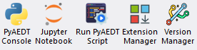

Installation
============
PyAEDT consolidates and extends all existing capital around scripting for AEDT,
allowing re-use of existing code, sharing of best practices, and collaboration.

This PyAnsys library has been tested on HFSS, Icepak, and Maxwell 3D. It also provides
basic support for EDB and Circuit (Nexxim).

Requirements
~~~~~~~~~~~~
In addition to the runtime dependencies listed in the installation information, PyAEDT
requires Ansys Electronics Desktop (AEDT) 2022 R1 or later. The AEDT Student Version is also supported.

Install from PyAEDT installer
~~~~~~~~~~~~~~~~~~~~~~~~~~~~~
The following Python script automatically installs PyAEDT from AEDT,
using the CPython interpreter included in the AEDT installation.

In order to do that you can:

- Download the following file: :download:`PyAEDT Installer Python file <../Resources/pyaedt_installer_from_aedt.py>`

- Open an Electronics Desktop Session and click on Tools->Run Script and execute the file.

- Offline installation is also possible using wheelhouses.

.. note::
    A wheelhouse is a zip containing all needed packages that can be installed offline.
    PyAEDT wheelhouse can be found at `Releases <https://github.com/ansys/pyaedt/releases>`_.
    After downloading the wheelhouse zip specific for your distribution and Python release,
    run the script from Electronics Desktop using the zip full path as argument.
    Please note that AEDT 2023 R1 and lower requires Python 3.7 wheelhouse while AEDT 2023 R2
    and higher requires the Python 3.10 wheelhouse.

.. image:: ../Resources/wheelhouse_installation.png
  :width: 800
  :alt: PyAEDT run script

Starting from 2023R2, buttons are available in the Automation Tab as in the example below.

Extension manager
~~~~~~~~~~~~~~~~~
The user can install or uninstall automated workflows using the extension manager.
There are three options:

- **Pre-installed extensions** already available in the PyAEDT library.

- **Open source PyAEDT toolkits** described in the `PyAEDT Common Toolkit documentation <https://aedt.common.toolkit.docs.pyansys.com/>`_.

- **Custom PyAEDT extensions**.

See `Extension Manager <https://aedt.docs.pyansys.com/version/stable/User_guide/extensions.html>`_ for more information.

.. image:: ../Resources/toolkit_manager_1.png
  :width: 800
  :alt: PyAEDT toolkit manager 1

The user can select the AEDT application to install the specific workflow.

.. image:: ../Resources/toolkit_manager_2.png
  :width: 400
  :alt: PyAEDT toolkit manager 2

For additional information about AEDT extensions, 
see `Extensions <https://aedt.docs.pyansys.com/version/stable/User_guide/extensions.html>`_.

Install on CPython from PyPI
~~~~~~~~~~~~~~~~~~~~~~~~~~~~
You can install PyAEDT on CPython from PyPI:

.. code:: python

    pip install pyaedt

You can also install PyAEDT from Conda-Forge:

.. code:: python

    conda install -c conda-forge pyaedt

To ensure you have all the necessary dependencies, including optional components, use the following command:

.. code:: python

    pip install pyaedt[all]

If you are not utilizing gRPC, you can install the required dotnet dependencies separately:

.. code:: python

    pip install pyaedt[dotnet]

Finally, in the Python console, run the following commands:

.. code::

     from ansys.aedt.core.workflows.installer.pyaedt_installer import add_pyaedt_to_aedt
     add_pyaedt_to_aedt(“your_aedt_version", r“path_to_personalib")

You can also install the PyAEDT panels using the following steps, this is also useful if you have a centralized PyAEDT installation:

- Download the following file: :download:`PyAEDT panel Installer Python file <../Resources/toolkit_installer_from_aedt.py>`

- Define an environment variable called `PYAEDT_INTERPRETER` with the path of the Python interpreter in which PyAEDT is installed.

- Open an Electronics Desktop Session and click on Tools->Run Script and execute the file. You do not need the previous step if
you pass as an argument the path of the Python interpreter.

Linux support
~~~~~~~~~~~~~

PyAEDT works with CPython 3.8 through 3.12 on Linux in AEDT 2022 R2 and later.
However, you must set up the following environment variables:

.. code::

    export ANSYSEM_ROOT222=/path/to/AedtRoot/AnsysEM/v222/Linux64
    export LD_LIBRARY_PATH=$ANSYSEM_ROOT222/common/mono/Linux64/lib64:$ANSYSEM_ROOT222/Delcross:$LD_LIBRARY_PATH

Install offline from a wheelhouse
~~~~~~~~~~~~~~~~~~~~~~~~~~~~~~~~~
Using a wheelhouse can be helpful if you work for a company that restricts access to external networks.

Wheelhouses for CPython 3.8, 3.9, 3.10, 3.11, and 3.12 are available in the releases for both Windows and Linux.
From the `Releases <https://github.com/ansys/pyaedt/releases>`_
page in the PyAEDT repository, you can find the wheelhouses for a particular release in its
assets and download the wheelhouse specific to your setup.

There are two kinds of wheelhouses: `all` and `installer`.

The `all` wheelhouse contains all PyAEDT dependencies. And the `installer` one includes `ipython` and `jupyter lab`.

You can then install PyAEDT and all of its dependencies from one single entry point that can be shared internally,
which eases the security review of the PyAEDT package content.

For example, on Windows with Python 3.10, install PyAEDT and all its dependencies from a wheelhouse with code like this:

.. code::

    pip install --no-cache-dir --no-index --find-links=file:///<path_to_wheelhouse>/PyAEDT-v<release_version>-wheelhouse-Windows-3.10 pyaedt[all]

Finally, in the Python console, run the following commands:

.. code::

     from ansys.aedt.core.workflows.installer.pyaedt_installer import add_pyaedt_to_aedt
     add_pyaedt_to_aedt(“your_aedt_version", r“path_to_personalib")

Install PyAEDT in Conda virtual environment
~~~~~~~~~~~~~~~~~~~~~~~~~~~~~~~~~~~~~~~~~~~~
Create virtual environment

.. code:: bash

    conda create --name pyaedt_py310 python=3.10

Activate virtual environment

.. code:: bash

    conda activate pyaedt_py310

You can also install PyAEDT from Conda-Forge with this command:

.. code:: bash

    conda install -c conda-forge pyaedt

Upgrade PyAEDT to the latest version
~~~~~~~~~~~~~~~~~~~~~~~~~~~~~~~~~~~~

.. code:: bash

    pip install -U pyaedt
