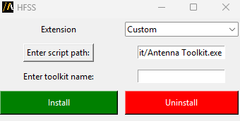

Troubleshooting
===============
This section contains common issues and suggestions related to installation and use of PyAEDT.

Installation
~~~~~~~~~~~~

Error installing Python or Conda
--------------------------------
Sometimes companies do not allow installation of a Python interpreter.
In this case, you can use the Python interpreter available in the AEDT installation.

.. note::

   Python 3.7 is available in AEDT 2023 R1 and earlier. Python 3.10 is available in AEDT 2023 R2.

Here is the path to the Python 3.10 interpreter for the 2025 R1 installation:

.. code:: bash

   path\to\AnsysEM\v251\commonfiles\CPython\3_10\winx64\Release\python"

Error installing PyAEDT using pip
---------------------------------
- **Proxy server**: If your company uses a proxy server, you may have to update proxy
  settings at the command line. For more information, see the `Using a Proxy
  Server <https://pip.pypa.io/en/stable/user_guide/#using-a-proxy-server>`_ in the pip
  documentation.
- **Install permission**: Make sure that you have write access to the directory where the
   Python interpreter is
   installed. The use of a `virtual environment <https://docs.python.org/3/library/venv.html>`_ helps
   mitigate this issue by placing the Python interpreter and dependencies in a location that is owned
   by the user.
- **Firewall**: Some corporate firewalls may block pip. If you face this issue, you'll have to work with your IT
   administrator to enable pip. The proxy server settings (described earlier) allow you to explicitly define
   the ports used by pip.

If downloads from `pypi <https://pypi.org/>`_ are not allowed, you may use a
`wheelhouse <https://pypi.org/project/Wheelhouse/>`_.
The wheelhouse file contains all dependencies for PyAEDT and allows full installation without a need to
download additional files.
The wheelhouse for PyAEDT can be found `here <https://github.com/ansys/pyaedt/releases>`_.
After downloading the wheelhouse for your distribution and Python release, unzip the file to a folder and
run the Python command:

.. code:: bash

    pip install --no-cache-dir --no-index --find-links=/path/to/pyaedt/wheelhouse pyaedt

Another option to install PyAEDT from the wheelhouse is to download the following file
:download:`PyAEDT Installer Python file <../Resources/pyaedt_installer_from_aedt.py>`.
Run this script directly from AEDT and pass the wheelhouse file name as an argument.

.. _panel_error:

Error installing PyAEDT panels in AEDT
--------------------------------------

Sometimes, the PyAEDT installer may fail when adding panels to AEDT.

This is typically caused by insufficient write permissions to your PersonalLib directory.

If the virtual environment was successfully created, you can manually register the toolkit panels using the CLI command after activating it:

.. code:: bash

    pyaedt panels add --version your_aedt_version --personal-lib "path_to_personalib"

Alternatively, you can use the Python API directly:

.. code:: python

     from ansys.aedt.core.extensions.installer.pyaedt_installer import add_pyaedt_to_aedt

     add_pyaedt_to_aedt("your_aedt_version", r"path_to_personalib")

If the issue persists, try installing all required dependencies, including the optional components, by running the following command:

.. code:: bash

    uv pip install pyaedt[all]

Or if you prefer to use pip:
.. code:: bash

    pip install pyaedt[all]

If you need to restart the setup from scratch, follow these steps:

- Delete the virtual environment folder. On Windows: located in your APPDATA directory. On Linux: located in your HOME directory.

- Delete the Toolkits directory in your PersonalLib folder.

These steps remove any existing configurations and allow you to perform a clean installation.

Run PyAEDT
~~~~~~~~~~

COM and gRPC
------------
Prior to the 2022 R2 release, CPython automation in AEDT used
`COM <https://learn.microsoft.com/en-us/windows/win32/com/com-objects-and-interfaces>`_ , which
requires all interfaces to be registered in the Windows Registry.
Communication between Python and the AEDT API were translated through an intermediate layer using
`pywin32 <https://github.com/mhammond/pywin32>`_ and  `PythonNET <https://pythonnet.github.io/pythonnet/>`_.

`gRPC <https://grpc.io/>`_ is a modern open source high performance Remote Procedure Call (RPC)
framework that can run in any environment and supports client/server remote calls.
Starting from 2022R2 the AEDT API has replaced the COM interface with a gRPC interface.

.. list-table:: *gRPC Compatibility:*
   :widths: 65 65 65
   :header-rows: 1

   * - < 2022 R2
     - 2022 R2
     - > 2022 R2
   * - Only ``Python.NET``
     - | ``Python.NET``: *Default*
       | Enable gRPC: ``ansys.aedt.core.settings.use_grpc_api = True``
     - | gRPC: *Default*
       | Enable ``Python.NET``: ``ansys.aedt.core.settings.use_grpc_api = False``

The options shown here apply only to the Windows platform.
On Linux, the Python interface to AEDT uses gRPC for all versions.

.. _GRPC ref:

Check the AEDT API configuration
--------------------------------
Run the following command to start AEDT as a gRPC server:

*Windows:*

.. code:: console

   path\to\AnsysEM\v251\Win64\ansysedt.exe -grpcsrv 50001

**On Linux:**

.. code:: console

   path\to\AnsysEM\v251\Lin64\ansysedt -grpcsrv 50352

The server port number is used by AEDT to listen and receive
commands from the PyAEDT client. This configuration
supports multiple sessions of AEDT running on a single server
and listening on the same port.

Check the gRPC interface
------------------------
The native Electronics Desktop API can be used to launch
AEDT from the command line.
PyAEDT is not required to verify the setup for the server and ensure that
all environment
variables have been defined correctly.

.. code:: python

    import sys

    sys.path.append(r"ANSYSEM_ROOT252\PythonFiles\DesktopPlugin")
    import ScriptEnv

    print(dir())
    ScriptEnv.Initialize("", False, "", 50051)
    print(dir())

Failure connecting to the gRPC server
-------------------------------------
On Linux, PyAEDT may fail to initialize a new instance of the gRPC server
or connect to an existing server session.
This may be due to:

- Firewall
- Proxy
- Permissions
- License
- Scheduler (for example if the gRPC server was started from LSF or Slurm)

For issues related to use of a proxy server, you may set the following environment variable to
disable the proxy server for the *localhost*.

.. code:: console

    export no_proxy=localhost,127.0.0.1

Run your PyAEDT script.

If it still fails, you can disable the proxy server:

.. code:: console

    export http_proxy=

Run your PyAEDT script. If the errors persist, perform these steps:

1. Check that AEDT starts correctly from the command line by
   starting the :ref:`gRPC server<GRPC ref>`.
2. Enable debugging.

.. code:: console

    export ANSOFT_DEBUG_LOG=/tmp/testlogs/logs/lg
    export ANSOFT_DEBUG_LOG_SEPARATE=1
    export ANSOFT_DEBUG_LOG_TIMESTAMP=1
    export ANSOFT_DEBUG_LOG_THREAD_ID=1
    export ANSOFT_DEBUG_MODE=3

Enable the gRPC trace on the server:

.. code:: console

    export GRPC_VERBOSITY=DEBUG
    export GRPC_TRACE=all

Then run ansysedt.exe as a gRPC server and redirect the output.

.. code:: console

    ansysedt -grpcsrv 50051 > /path/to/file/server.txt

The preceding command redirects the gRPC trace
to the file ``server.txt``.

Open another terminal window to trace the
gRPC calls on the client where the Python script is to be run.

.. code:: console

    export GRPC_VERBOSITY=DEBUG
    export GRPC_TRACE=all

Now run the PyAEDT script, (making sure it connects to the same port as the gRPC server - 50051).
Capture the output in a file. For example *client.txt*. Then send all the logs
to `Ansys Support <https://www.ansys.com/it-solutions/contacting-technical-support>`_.

Numpy compatibility
-------------------
If you use Numpy 2.Y.Z, you may encounter compatibility issues with PyAEDT or PyEDB.

This kind of problem can occur when a user is in a Linux environment and wants to use .NET.
If you encounter such issue, you can try patching it by importing PyAEDT or PyEDB before any import of Numpy as below

.. code-block:: python

    import ansys.aedt.core
    import numpy

.. note::

    If you use gRPC or previous Numpy releases, you shouldn't be impacted by this issue.

Extensions and panels
---------------------
If you update PyAEDT from version **≤ 0.18.0 to a newer version**, you may need to recreate the virtual environment.

The management of extensions in AEDT has changed. Previously, extensions were copied to the _PersonalLib_ folder, which led to inconsistencies when updating PyAEDT extensions. This was because old extensions were not replaced until panels were reset, at which point the extension were copied from the virtual environment back into the _PersonalLib_ folder. Now, Extensions are loaded directly from the virtual environment, ensuring they remain up to date when PyAEDT is updated.

If issues occur with the extensions, follow these steps:

- Delete the virtual environment folder. On Windows: located in your APPDATA directory. On Linux: located in your HOME directory.
- Delete the Toolkits directory in your PersonalLib folder.
- Reinstall PyAEDT from scratch, following the instructions in the `Installation <../Getting_started/Installation.rst>`_ section.

Error with uv-created virtual environments on Windows
-----------------------------------------------------
When using `uv <https://github.com/astral-sh/uv>`_ to create virtual environments on Windows, you may
encounter SSL-related errors when using PyAEDT or PyEDB:

.. code:: text

    legacy Provider loading failed
    EVP_DecryptInit. could not load the shared library

**Root cause**

This issue stems from a DLL naming conflict in OpenSSL libraries on Windows. When CPython distributes
OpenSSL 3.0.X using the DLL name ``libssl-3.dll``, and a CPython extension module (such as PyAEDT or
PyEDB) links against OpenSSL 3.0.Y using a different DLL name ``libssl-3-x64.dll``, both versions
coexist without conflict because they have different names.

However, when using ``uv`` created virtual environments with Python from
`python-build-standalone <https://github.com/astral-sh/python-build-standalone>`_, the Python distribution
uses the same DLL name ``libssl-3-x64.dll`` as the extension modules. This creates a conflict in Windows:
only one version of ``libssl-3-x64.dll`` can be loaded into the process at a time. For more details, see
`python-build-standalone #596 <https://github.com/astral-sh/python-build-standalone/issues/596>`_

**Workaround**

To avoid this issue, create the virtual environment manually using the standard Python ``venv`` module
instead of ``uv venv``. You can then install ``uv`` inside the environment and continue using it for
package management:

.. code:: bash

    # Create virtual environment with standard Python
    python -m venv .venv

    # Activate the virtual environment
    .venv\Scripts\activate

    # Install uv inside the environment
    pip install uv

    # Now you can use uv for package management
    uv pip install pyaedt
