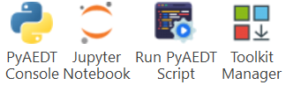

AEDT panels
===========

PyAEDT provides several panels that integrate directly into the AEDT interface, accessible from the **Automation** tab.
These panels provide convenient graphical interfaces for common PyAEDT operations without requiring manual scripting.

Starting from AEDT 2023 R2, PyAEDT panels are available in the Automation Tab.

Installation
~~~~~~~~~~~~

You can install PyAEDT panels using any of the following methods:

**Method 1: Using the CLI**

The recommended way to install panels is using the PyAEDT command line interface:

.. code-block:: bash

    pyaedt panels add --personal-lib "C:\\Users\\username\\AppData\\Roaming\\Ansoft\\PersonalLib"

For more details on CLI usage, see :doc:`cli`.

**Method 2: Using Python**

You can also install panels programmatically:

.. code-block:: python

    from ansys.aedt.core.extensions.installer.pyaedt_installer import add_pyaedt_to_aedt

    add_pyaedt_to_aedt(r"C:\Users\username\AppData\Roaming\Ansoft\PersonalLib")

**Reset Option**

If you need to perform a clean installation (removing existing panels before installing), use the ``--reset`` option:

.. code-block:: bash

    pyaedt panels add --personal-lib "path/to/PersonalLib" --reset

This deletes the existing ``Toolkits`` directory inside PersonalLib before installing fresh panels.
This is useful for troubleshooting installation issues or cleaning up corrupted installations.

Available panels
~~~~~~~~~~~~~~~~

The following panels are installed when you add PyAEDT to AEDT:

PyAEDT utilities
----------------

A group panel containing three essential tools:

**Console**

Opens an interactive Python console connected to the current AEDT session. This allows you to:

- Execute Python commands interactively
- Access and manipulate the current design
- Test PyAEDT code snippets
- Debug automation workflows

**CLI**

Provides access to the PyAEDT command line interface from within AEDT. You can:

- Run CLI commands without opening a separate terminal
- Manage AEDT processes
- Configure test settings
- Access documentation

**Jupyter**

Launches a Jupyter notebook server connected to the current AEDT session. Benefits include:

- Interactive notebook environment
- Visualization of results inline
- Documentation of workflows with markdown
- Sharing of analysis notebooks

Run script
----------

Executes Python scripts from the AEDT interface. This panel allows you to:

- Browse and select a Python script file
- Run automation workflows without leaving AEDT
- Execute batch operations
- Test custom scripts

Extension manager
-----------------

Provides a centralized interface for managing PyAEDT extensions and toolkits. Features include:

- Browse and launch project-level extensions
- Add custom extensions
- Manage extension visibility in the AEDT ribbon
- Install open source PyAEDT toolkits

For detailed information about extensions, see :doc:`../User_guide/extensions`.

Version manager
---------------

Manages PyAEDT and PyEDB installations. Available features:

- Display current Python environment details
- Check for latest PyAEDT/PyEDB releases on PyPI
- Update packages from PyPI
- Install from GitHub branches
- Update from local wheelhouses
- Reset and update PyAEDT panels

.. note::
    The Version manager panel is optional and can be skipped during installation using the
    ``--skip-version-manager`` flag or ``skip_version_manager=True`` parameter.

Troubleshooting
~~~~~~~~~~~~~~~

**Panels not appearing**

If panels don't appear after installation:

1. Ensure you restarted AEDT after installation
2. Check that the correct PersonalLib path was used
3. Verify that the Toolkits directory exists in PersonalLib
4. Try a clean installation using the ``--reset`` option

**Permission Errors**

If you encounter permission errors:

- Ensure AEDT is closed during installation
- Check that you have write permissions to the PersonalLib directory
- Run the installation command with appropriate privileges

**Corrupted Installation**

To fix a corrupted installation:

.. code-block:: bash

    pyaedt panels add --personal-lib "path/to/PersonalLib" --reset

This removes the old installation and installs fresh panels.

Video tutorial
~~~~~~~~~~~~~~

Watch the following video to see how to install PyAEDT panels:

.. raw:: html

  <iframe width="560" height="315" src="https://www.youtube.com/embed/c-zl8iMjP4M?si=zpdREiZhzODW-kW1" title="YouTube video player" frameborder="0" allow="accelerometer; autoplay; clipboard-write; encrypted-media; gyroscope; picture-in-picture; web-share" referrerpolicy="strict-origin-when-cross-origin" allowfullscreen></iframe>

