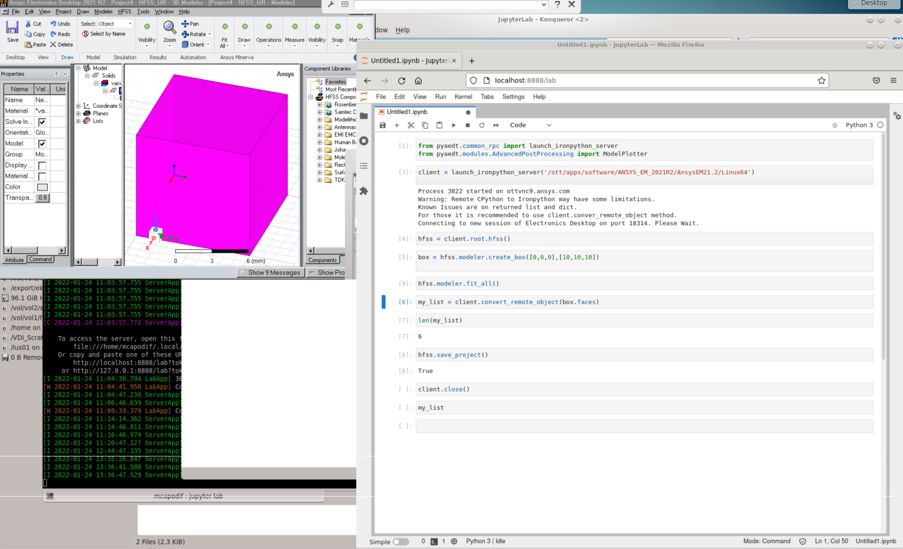

Client/Server
-------------

You can launh PyAEDT on a remote machine if these conditions are met:

#. PyAEDT is installed on client and server machines. (There is no need to have AEDT
   installed on the the client machine.)
#. The same Python version is used on the client and server. (CPython 3.6+ or
   IronPython is embedded in the AEDT installation.)

New Grpc Connection with AEDT 2022R2
~~~~~~~~~~~~~~~~~~~~~~~~~~~~~~~~~~~~
With AEDT 2022 R2 and later, PyAEDT fully supports the gRPC API (except for EDB).
To use it:

.. code:: python

    # Launch the latest installed version of AEDT in graphical mode.
    from pyaedt import Hfss
    from pyaedt import settings
    settings.use_grpc_api=True
    hfss = Hfss(machine="fullmachinename", port=portnumber)

If the ``machine`` argument is provided and the machine is a remote machine, AEDT
must be up and running on the remote server listening on the specified port.

To start AEDT in listening mode on the remote machine:

.. code::

   path/to/aedt/ansysedt.exe -grpcsrv portnumber  #windows
   path/to/aedt/ansysedt -grpcsrv portnumber   #linux

If the connection is local, the ``machine`` argument can be kept empty. The AEDT session is then started automatically by PyAEDT.
Machine and port arguments are available to all applications except EDB.

Legacy Approach
~~~~~~~~~~~~~~~

Windows Server
==============

Here is a usage example for a Windows server:

.. code:: python

    # Launch the latest installed version of AEDT in graphical mode.

    from pyaedt.common_rpc import launch_server
    launch_server()

Linux and Windows Clients
=========================

Here is a usage example for the client side:

.. code:: python

    # Launch the latest installed version of AEDT in graphical mode.

    from pyaedt.common_rpc import client
    my_client = client("full_name_of_server", port=18000)
    circuit = my_client.root.circuit(specified_version="2022.1", non_graphical=True)
    ...
    # code like locally
    ...

Linux Server
============

To bypass current IronPython limits, you can launch PyAEDT on a Linux machine:

#. Using ``pip``, install PyAEDT 0.4.23 or later on a Linux machine.
#. Launch CPython and run PyAEDT on the same machine.

   .. code:: python

      # Launch the latest installed version of PyAEDT in non-graphical mode.

      from pyaedt.common_rpc import launch_ironpython_server
      client = launch_ironpython_server(aedt_path="/path/to/ansys/executable/folder", non_graphical=True, port=18000)
      hfss = client.root.hfss()
      # put your code here

#. Launch CPython Server on a machine and connect to the server from anaother machinee.

   .. code:: python

      # Launch the latest installed version of PyAEDT in non-graphical mode.

      from pyaedt.common_rpc import launch_ironpython_server
      launch_ironpython_server(aedt_path="/path/to/ansys/executable/folder",
                               launch_client=False,
                               non_graphical=True,
                               port=18000)
      # connect to the port 18000 from the client machine

#. If the method returns a list or dictionary, use this method to work around an
   issue with CPython handling:

   .. code:: python

      box1 = hfss.modeler.create_box([0,0,0],[1,1,1])
      # convert_remote_object method convert remote ironpython list to local cpython.
      faces = client.convert_remote_object(box1.faces)

