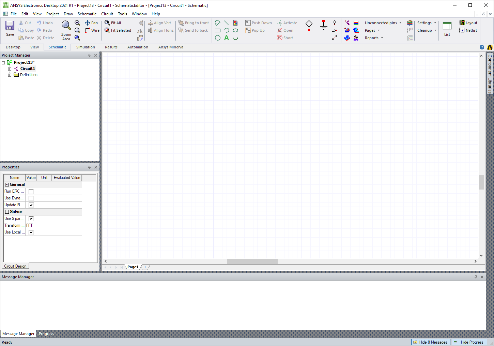
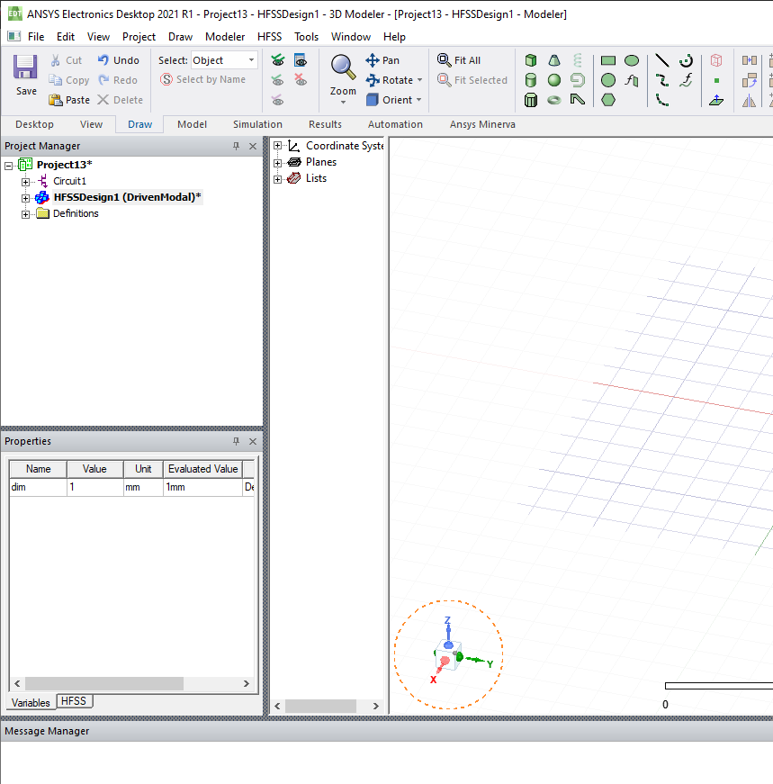
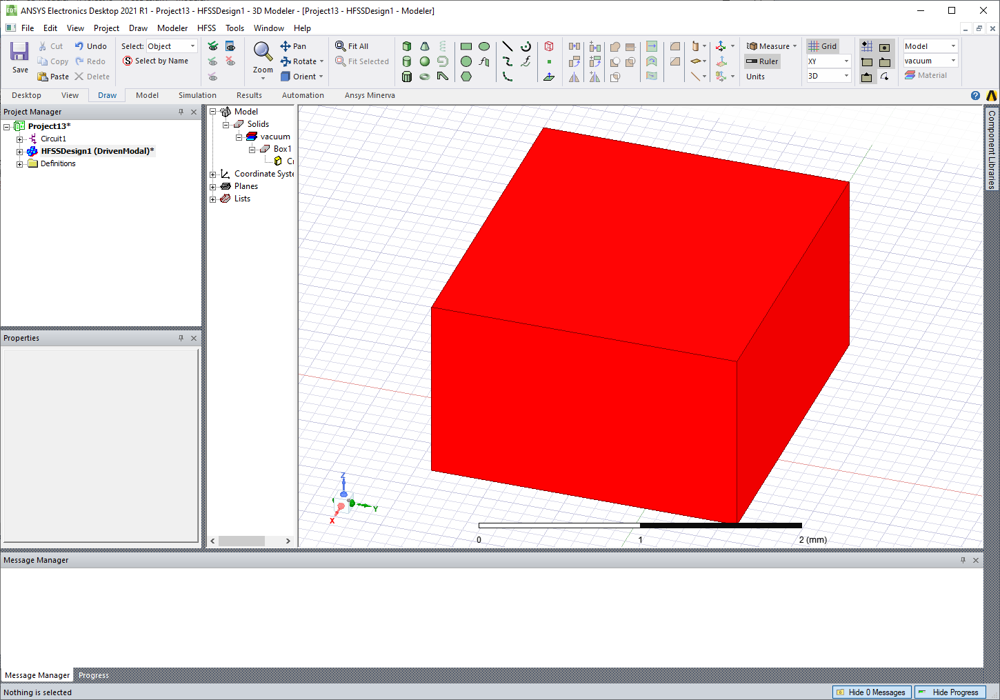

User Guide
---------

PyAEDT works both inside AEDT and as a standalone application.
It automatically detects whether it is running in an IronPython or CPython
environment and initializes AEDT accordingly. PyAEDT also provides
advanced error management.

AEDT can be started from Python in the non-graphical mode using AEDT.

.. code:: python

    Launch AEDT 2021 R1 in Non-Graphical mode

    from pyaedt import Desktop, Circuit
    with Desktop("2021.1", NG=True):
        circuit = Circuit()
        ...
        # Any error here will be caught by Desktop.
        ...

    # Desktop is automatically released here.

The previous command launches AEDT and initializes a new Circuit design.

The same result can be obtained with the following code:

.. code:: python

    # Launch the latest installed version of AEDT in graphical mode.

    from pyaedt import Circuit
    with Circuit(specified_version="2021.1", NG=False) as circuit:
        ...
        # Any error here will be caught by Desktop.
        ...

    # Desktop is automatically released here.

Variables
~~~~~~~~~
PyAEDT provides a simplified interface for getting and setting variables inside a project or a design.
You simply need to initialize a variable as a dictionary key. If you use ``$`` as the prefix 
for the variable name, a project-wide variable is created.

.. code:: python

    from pyaedt import Hfss
    with Hfss as hfss:
         hfss["dim"] = "1mm"   # design variable
         hfss["$dim"] = "1mm"  # project variable

Modeler
~~~~~~~
Object-oriented programming is used to create and manage objects in the AEDT 3D and 2D Modelers. 
You can create an object and change properties using getters and setters.

.. code:: python

    Create a box, assign variables, and assign materials.

    from pyaedt.hfss import Hfss
    with Hfss as hfss:
         box = hfss.modeler.primitives.create_box([0, 0, 0], [10, "dim", 10],
                                                  "mybox", "aluminum")
         print(box.faces)
         box.material_name = "copper"
         box.color = "Red"

