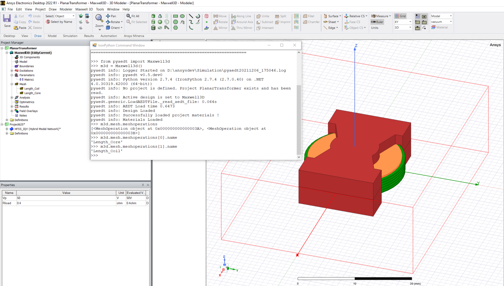
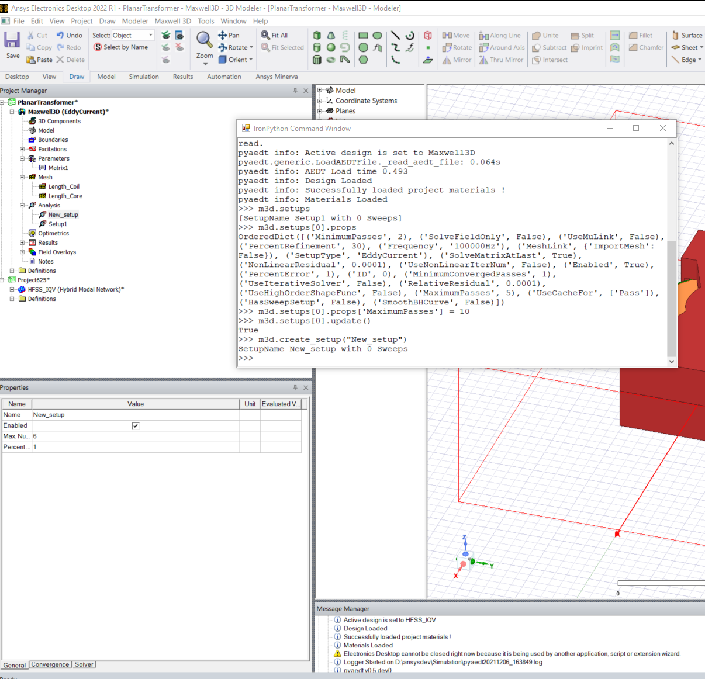

User guide
----------

PyAEDT works both inside AEDT and as a standalone application.
It automatically detects whether it is running in an IronPython or CPython
environment and initializes AEDT accordingly. PyAEDT also provides
advanced error management.

You can start AEDT in non-graphical mode from Python:

.. code:: python

    Launch AEDT 2022 R1 in non-graphical mode

    from pyaedt import Desktop, Circuit
    with Desktop(specified_version="2022.1", non_graphical=True, new_desktop_session=True, close_on_exit=True,
                 student_version=False):
        circuit = Circuit()
        ...
        # Any error here will be caught by Desktop.
        ...

    # Desktop is automatically closed here.

The preceding code launches AEDT and initializes a new Circuit design.

.. image:: ./aedt_first_page.png
  :width: 800
  :alt: Electronics Desktop Launched

You can obtain the same result with:

.. code:: python

    # Launch the latest installed version of AEDT in graphical mode.

    from pyaedt import Circuit
    with Circuit(specified_version="2022.1", non_graphical=False) as circuit:
        ...
        # Any error here will be caught by Desktop.
        ...

    # Desktop is automatically released here.

Variables
~~~~~~~~~
PyAEDT provides a simplified interface for getting and setting variables inside a project or a design.
You simply need to initialize a variable as a dictionary key. If you use ``$`` as the prefix 
for the variable name, a project-wide variable is created:

.. code:: python

    from pyaedt import Hfss
    with Hfss as hfss:
         hfss["dim"] = "1mm"   # design variable
         hfss["$dim"] = "1mm"  # project variable

.. image:: ./aedt_variables.png
  :width: 800
  :alt: Variable Management

With Variable Manager, you can create advanced equations and manage them through PyAEDT.

While you can set or get the variable value using the app's setter and getter, you can
access the ``variable_manager`` object for a more comprehensive set of functions:

.. code:: python

        >>> hfss["$PrjVar1"] = "2*pi"
        >>> hfss["$PrjVar2"] = "100Hz"
        >>> hfss["$PrjVar3"] = "34 * $PrjVar1/$PrjVar2"
        >>> hfss["$PrjVar3"]
        2.13628300444106
        >>> hfss["$PrjVar3"].value
        2.13628300444106
        hfss.variable_manager["$PrjVar3"].expression
        '34 * $PrjVar1/$PrjVar2'

.. image:: ./variables_advanced.png
  :width: 600
  :alt: Variable Management

Modeler
~~~~~~~
In the AEDT 3D and 2D Modelers, object-oriented programming is used to create and manage objects. 
You can use getters and setters to create an object and change its properties:

.. code:: python

    Create a box, assign variables, and assign materials.

    from pyaedt.hfss import Hfss
    with Hfss as hfss:
         box = hfss.modeler.create_box([0, 0, 0], [10, "dim", 10],
                                       "mybox", "aluminum")
         print(box.faces)
         box.material_name = "copper"
         box.color = "Red"

.. image:: ./aedt_box.png
  :width: 800
  :alt: Modeler Object

Once an object is created or is present in the design (from a loaded project), you can
use a getter to get the related object. A getter works either with an object ID or
object name. The object returned has all features, even if it has not been created in PyAEDT.

This example shows how easily you can go deeper into edges and vertices of faces or 3D objects:

.. code:: python

     box = hfss.modeler["mybox2"]
     for face in box.faces:
        print(face.center)
        for edge in face:
            print(edge.midpoint)
            for vertice in edge.vertices:
                print(edge.position)
     for vertice in box.vertices:
        print(edge.position)

All objects support executing any modeler operation, such as union or subtraction:

.. code:: python

     box = hfss.modeler["mybox2"]
     cyl = hfss.modeler["mycyl"]
     box.unit(cyl)

.. image:: ./objects_operations.gif
  :width: 800
  :alt: Object Modeler Operations

Mesh
~~~~
Mesh operations are very important in engineering simulation. PyAEDT can read all mesh
operations already present in a design, edit them, and create them. All mesh operations
are listed in the mesh object:

.. code:: python

    from pyaedt import Maxwell3d
    m3d = Maxwell3d()
    all_mesh_ops = m3d.mesh.meshoperations
    my_mesh_op = all_mesh_ops[0]
    # all properties are in props dictionary.
    my_mesh_op.props["my_prop"] = "my_value"
    my_mesh_op.update()

Setup
~~~~~
Setup, optimetrics, and sweeps are the last operations before running analysis.
PyAEDT can read all setups, optimetrics, and sweeps already present in a design,
edit them, and create them. All setup operations are listed in the setups list:

.. code:: python

    from pyaedt import Maxwell3d
    m3d = Maxwell3d()
    all_setups = m3d.setups
    my_setup = all_setups[0]
    # all properties are in props dictionary.
    my_setup.props['MaximumPasses'] = 10

    new_setup = m3d.create_setup("New_Setup")

Optimetrics
~~~~~~~~~~~
Optimetrics allow you to set up parametric analysis, sensitivity analysis, optimization,
and Design of Experients (DOE). PyAEDT can read all optimetric setups already
present in a design, edit them, and create them:

.. code:: python

    from pyaedt import Maxwell3d
    m3d = Maxwell3d()
    m3d.parametrics.add("Rload", 0.1, 1, 0.1)

.. image:: ./Optimetrics_Parametric.png
  :width: 800
  :alt: Optimetrics Creation

Postprocessing
~~~~~~~~~~~~~~
Postprocessing is essential in simulation. PyAEDT can read all solutions and plot results in AEDT or
outside it using `pyvista <https://www.pyvista.org/>`_ and `matplotlib <https://matplotlib.org/>_` packages:

.. code:: python

    from pyaedt import Hfss
    hfss = Hfss()
    hfss.analyze_nominal()
    cutlist = ["Global:XY"]
    setup_name = self.aedtapp.existing_analysis_sweeps[0]
    quantity_name = "ComplexMag_E"
    intrinsic = {"Freq": "5GHz", "Phase": "180deg"}

    # create a field plot
    plot1 = hfss.post.create_fieldplot_cutplane(cutlist, quantity_name, setup_name, intrinsic)

    # create a 3d far field
    new_report = hfss.post.reports_by_category.far_field("db(RealizedGainTotal)", hfss.nominal_adaptive)

    # create a rectangular plot
    report = hfss.post.reports_by_category.modal_solution("dB(S(1,1))")
    report.create()

    solutions = report.get_solution_data()

.. image:: ./field_plot.png
  :width: 800
  :alt: Post Processing features
