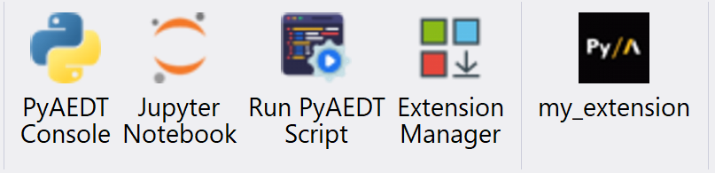

Extension Manager
=================

Extensions provide a simplified interface to perform automated workflows in AEDT, they are generally tool-specific and are therefore only accessible given the appropriate context.
In AEDT, you can use the Extension Manager to add or remove extensions.
The `Extension Manager <https://aedt.docs.pyansys.com/version/stable/Getting_started/Installation.html#extension-manager>`_ allows the user to install three different types of extensions:

- **Custom extensions** installable both at project and application level.
- **Pre-installed extensions** available at project level.
- **Open source PyAEDT toolkits** available at application level.

The following sections provide further clarification.

You can launch extensions in standalone mode from the console or a Python script.

Custom extensions
~~~~~~~~~~~~~~~~~

Custom extensions are custom workflows (Python script) that can be installed both at project and application level.
From the Extension Manager select the target destination:

.. image:: ../Resources/toolkit_manager_1.png
  :width: 800
  :alt: PyAEDT toolkit manager 1

Select `Custom` as the extension type.
Provide the path of the Python script containing the workflow.
Enter the extension name. This is the name that appears beneath the button in the Automation tab after a successful installation.

.. image:: ../Resources/my_custom_extension.png
  :width: 800
  :alt: Custom Extension

After the normal completion of the installation a new button appears:

The example below is a simple example of custom extension.
The Python script requires a common initial part to define the port and the version of the AEDT session to connect to.

.. code:: python

    import ansys.aedt.core
    import os

    # common part
    if "PYAEDT_SCRIPT_PORT" in os.environ and "PYAEDT_SCRIPT_VERSION" in os.environ:
        port = os.environ["PYAEDT_SCRIPT_PORT"]
        version = os.environ["PYAEDT_SCRIPT_VERSION"]
    else:
        port = 0
        version = "2024.2"

    # your pyaedt script
    app = ansys.aedt.core.Desktop(new_desktop_session=False, specified_version=version, port=port)

    active_project = app.active_project()
    active_design = app.active_design(active_project)

    # no need to hardcode you application but get_pyaedt_app will detect it for you
    aedtapp = ansys.aedt.core.get_pyaedt_app(design_name=active_design.GetName(), desktop=app)

    # your workflow
    aedtapp.modeler.create_sphere([0, 0, 0], 20)

    app.release_desktop(False, False)

Pre-installed extensions
~~~~~~~~~~~~~~~~~~~~~~~~

Pre-installed extensions are available at project level so they are available for all AEDT applications.
They are small automated workflow with a simple UI.

.. grid:: 2

   .. grid-item-card:: Import Nastran
            :link: pyaedt_extensions_doc/project/import_nastran
            :link-type: doc

            Import a Nastran or STL file in any 3D modeler application.

   .. grid-item-card:: Configure Layout
            :link: pyaedt_extensions_doc/project/configure_edb
            :link-type: doc

            Configure layout for PCB & package analysis.

   .. grid-item-card:: Advanced Fields Calculator
            :link: pyaedt_extensions_doc/project/advanced_fields_calculator
            :link-type: doc

            Lear how to use the Advanced Fields Calculator.

   .. grid-item-card:: Kernel converter
            :link: pyaedt_extensions_doc/project/kernel_convert
            :link-type: doc

            Lear how to convert projects from 2022R2 to newer versions.

   .. grid-item-card:: Parametrize Layout
            :link: pyaedt_extensions_doc/hfss3dlayout/parametrize_edb
            :link-type: doc

            Learn how to parametrize a full aedb.

.. toctree::
   :hidden:
   :maxdepth: 2

   pyaedt_extensions_doc/project

HFSS extensions
---------------

HFSS 3D Layout extensions
-------------------------

Open Source Toolkits
~~~~~~~~~~~~~~~~~~~~

Open source toolkits are available at application level.
They are complex workflows where backend and frontend are split.
They are also fully documented and unit tested.

Find the links below:
- Hfss: `Antenna Wizard <https://github.com/ansys/pyaedt-toolkits-antenna>`_.
- Maxwell 3D: `Magnet Segmentation Wizard <https://github.com/ansys/magnet-segmentation-toolkit>`_.
