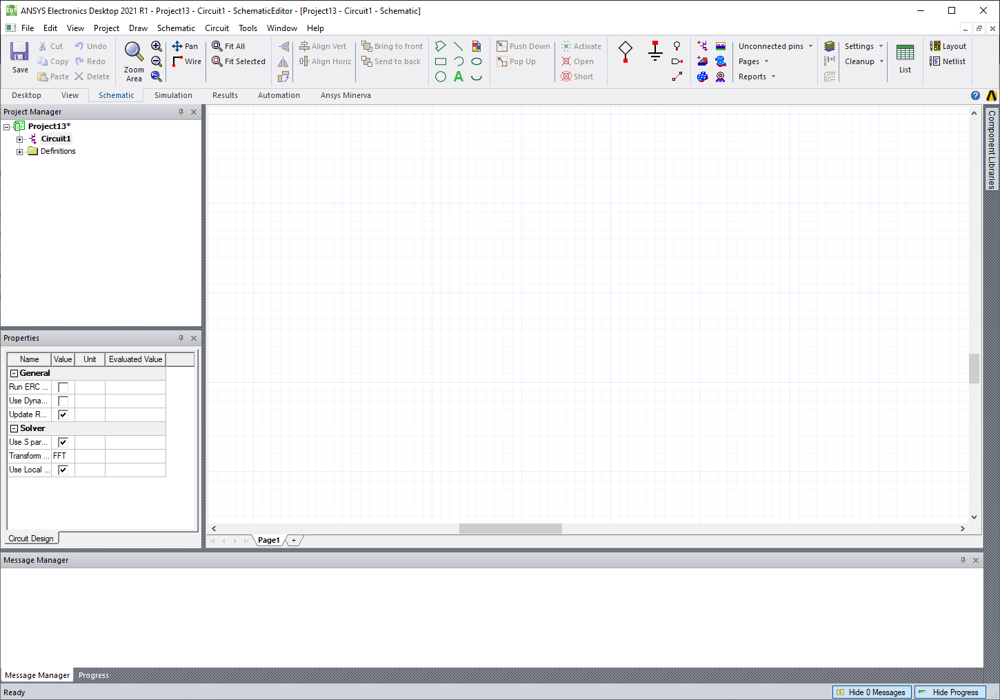

Basic tutorial
==============

You can initiate AEDT in non-graphical mode from Python using this code:

.. code:: python

    # Launch AEDT 2025 R1 in non-graphical mode
    import ansys.aedt.core
    with ansys.aedt.core.Desktop(specified_version="2025.1", non_graphical=True, new_desktop_session=True, close_on_exit=True,
                 student_version=False):
        circuit = ansys.aedt.core.Circuit()
        ...
        # Any error here is caught by AEDT.
        ...
    # AEDT is automatically closed here.

The preceding code launches AEDT and initializes a new Circuit design.

This code creates a project and saves it with PyAEDT:

.. code:: python

    # Launch the latest installed version of AEDT in graphical mode.
    import ansys.aedt.core
    cir =  ansys.aedt.core.Circuit(non_graphical=False)
    cir.save_project(my_path)
    ...
    cir.release_desktop(close_projects=True, close_desktop=True)
    # Desktop is released here.

This code uses PyAEDT to access the Ansys EDB proprietary layout format:

.. code:: python

    # Launch the latest installed version of EDB.
    import ansys.aedt.core
    edb = ansys.aedt.core.Edb("mylayout.aedb")

    # User can launch EDB directly from the PyEDB class.

    import pyedb
    edb = pyedb.Edb("mylayout.aedb")
