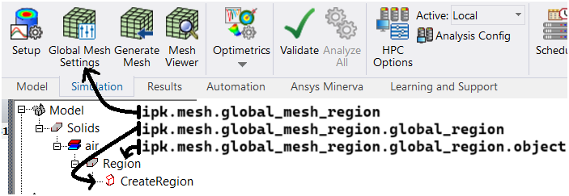

Mesh
====

Mesh operations are very important in engineering simulation.
PyAEDT can read existing mesh operations in a design, make edits, and create new operations.
All mesh operations are conveniently listed within the mesh object:

.. code:: python

    from ansys.aedt.core import Maxwell3d
    m3d = Maxwell3d()
    all_mesh_ops = m3d.mesh.meshoperations
    my_mesh_op = all_mesh_ops[0]
    # All properties are in props dictionary.
    my_mesh_op.props["my_prop"] = "my_value"
    my_mesh_op.update()

.. image:: ../Resources/Mesh_Operations.png
  :width: 800
  :alt: Mesh object List

Mesh in Icepak
--------------

Icepak employs a unique approach to mesh operations, managed through mesh regions, which can be edited directly from the PyAEDT object.

**Global mesh region**

This code accesses the global mesh region object:

.. code:: python

    glob_msh = ipk.mesh.global_mesh_region

This object allows for the editing of global mesh settings through its ``settings`` property, which behaves like a dictionary.

.. code:: python

    glob_msh.settings["MeshRegionResolution"] = 3

The keys available depend on whether manual or automatic settings are used. You can use the ``manual_settings`` Boolean property of the global mesh region object to change the setting.

To modify the global region dimensions, access the '`global_region'` property and modify its attributes:

.. code:: python

    glob_msh.global_region.positive_z_padding_type = "Absolute Offset"
    glob_msh.global_region.positive_z_padding = "5 mm"

To modify the properties of the ``Region`` object (for example the gas inside the region), access the ``object`` property of the ``global_region`` object:

.. code:: python

    glob_reg = glob_msh.global_region
    glob_reg.object.material_name = "Carbon Monoxide"

This is a pointer to the same object accessible from ``ipk.modeler["Region"]``.

The following image summarizes these three objects:

This code provides a complete example using the global mesh region:

.. code:: python

    ipk = Icepak()
    glob_msh = ipk.mesh.global_mesh_region
    glob_msh.manual_settings = True
    glob_msh.settings["MaxElementSizeX"] = "2mm"
    glob_msh.settings["MaxElementSizeY"] = "3mm"
    glob_msh.settings["MaxElementSizeZ"] = "4mm"
    glob_msh.settings["MaxSizeRatio"] = 2
    glob_msh.settings["UserSpecifiedSettings"] = True
    glob_msh.settings["UniformMeshParametersType"] = "XYZ Max Sizes"
    glob_msh.settings["MaxLevels"] = 2
    glob_msh.settings["BufferLayers"] = 1
    glob_msh.update()

**Local mesh regions**

To create a mesh region, use the ``assign_mesh_region()`` method:

.. code:: python

    mesh_region = ipk.mesh.assign_mesh_region(name=object_name)

You can modify the settings of the returned object using the same approach as with the global mesh region object.

This code accesses the subregion that defines the local mesh region and modifies its dimensions:

.. code:: python

    subregion = mesh_region.assignment
    subregion.positive_z_padding_type = "Absolute Offset"
    subregion.positive_z_padding = "5 mm"

This code accesses the parts included in the subregion:

.. code:: python

    subregion.parts

AEDT 2024 R1 introduced a significant revamp of the mesh region paradigm, resulting in limited support for older versions. To use the same methods in older versions, you must define the region box first and pass it as the first argument of the ``assign_mesh_region()`` method.

**Mesh operations**

- To assign a mesh level to some objects, use the ``assign_mesh_level()`` method:

  .. code:: python

    ipk.mesh.assign_mesh_level(mesh_order={"Box1": 2, "Cylinder1": 4})

- To assign a mesh file for reuse to some objects, use the ``assign_mesh_reuse()`` method:

  .. code:: python

    ipk.mesh.assign_mesh_reuse(assignment=["Box1", "Cylinder1"], level=mesh_path)

Mesh in HFSS 3D Layout
----------------------

In HFSS 3D Layout, you add mesh operations to nets and layers like this:

.. code:: python

    from pyedt import Hfss3dLayout

    h3d = Hfss3dLayout("myproject.aedt")
    setup = h3d.create_setup("HFSS")
    mop1 = h3d.mesh.assign_length_mesh("HFSS", layer_name="PWR", net_name="GND")
    mop2 = h3d.mesh.assign_skin_depth("HFSS",  layer_name="LAY2", net_name="VCC")