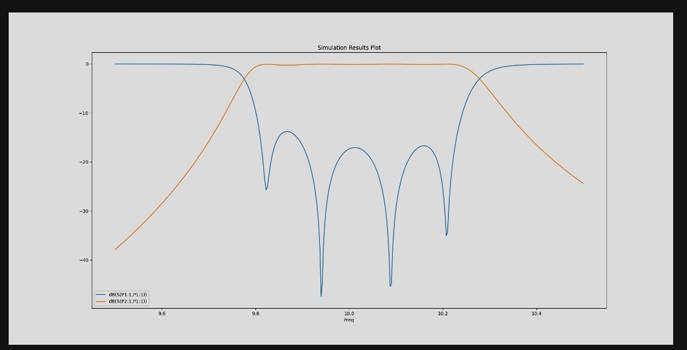

Postprocessing
==============
Postprocessing is essential in simulation. PyAEDT can read all solutions and plot results in AEDT or
outside it using the `pyvista <https://www.pyvista.org/>`_ and `matplotlib <https://matplotlib.org/>`_
packages.

Create a report in AEDT

.. code:: python

    from pyaedt import Hfss
    hfss = Hfss()
    hfss.analyze_nominal()
    hfss.post.create_report(["db(S11)", "db(S12)"])

.. image:: ../Resources/sparams.jpg
  :width: 800
  :alt: AEDT Report

Create a report in matplotlib

.. code:: python

    from pyaedt import Hfss
    hfss = Hfss()
    hfss.analyze_nominal()

    traces_to_plot = hfss.get_traces_for_plot(second_element_filter="P1*")
    report = hfss.post.create_report(traces_to_plot)  # Creates a report in HFSS
    solution = report.get_solution_data()
    plt = solution.plot(solution.expressions)  # Matplotlib axes object.

PyAEDT can be used to plot any kind of report you can plot in the Electronics Desktop interface.
All available category can be accessed using ``reports_by_category`` class.

.. code:: python

    from pyaedt import Hfss
    hfss = Hfss()
    hfss.analyze_nominal()

    # create a 3d far field
    new_report = hfss.post.reports_by_category.far_field(expressions="db(RealizedGainTotal)",
                                                         setup_name=hfss.nominal_adaptive)

Field plot can be plot directly in HFSS and can be exported to image files.

.. code:: python

    from pyaedt import Hfss
    hfss = Hfss()
    hfss.analyze_nominal()

    cutlist = ["Global:XY"]
    setup_name = hfss.existing_analysis_sweeps[0]
    quantity_name = "ComplexMag_E"
    intrinsic = {"Freq": "5GHz", "Phase": "180deg"}

    # create a field plot
    plot1 = hfss.post.create_fieldplot_cutplane(objlist=cutlist,
                                                quantityName=quantity_name,
                                                setup_name=setup_name,
                                                intrinsincDict=intrinsic)

.. image:: ../Resources/field_plot.png
  :width: 800
  :alt: Post Processing features

PyAEDT can use the power of PyVista to export and plot fields outise AEDT.
It can generate jpeg images and animation (gif).

.. code:: python

    from pyaedt import Hfss
    hfss = Hfss()
    hfss.analyze_nominal()

    cutlist = ["Global:XY"]
    setup_name = hfss.existing_analysis_sweeps[0]
    quantity_name = "ComplexMag_E"
    intrinsic = {"Freq": "5GHz", "Phase": "180deg"}

    hfss.logger.info("Generating the image")
    plot_obj = hfss.post.plot_field(
            quantity="Mag_E",
            objects_list=cutlist,
            plot_type="CutPlane",
            setup_name=setup_name,
            intrinsics=intrinsic
        )

.. image:: ../Resources/pyvista_plot.jpg
  :width: 800
  :alt: Post Processing features
