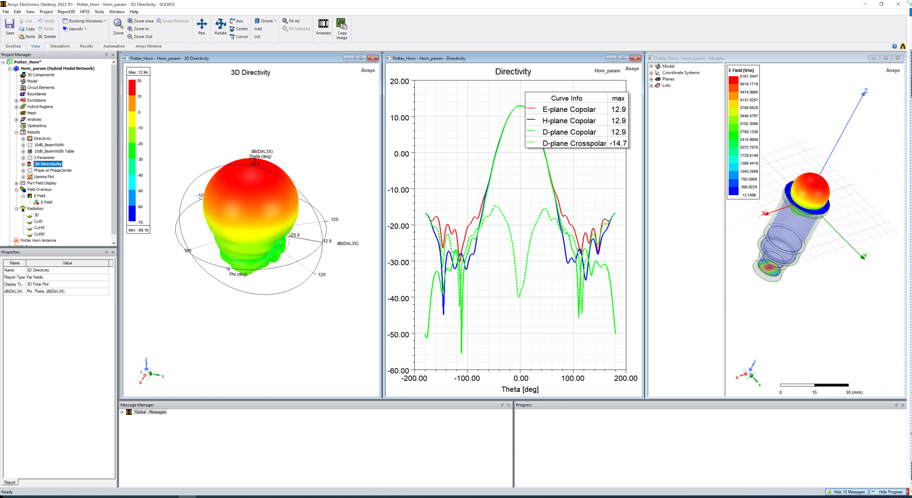

Postprocessing
==============

Postprocessing is essential in simulation. PyAEDT offers the capability to read solutions and visualize results
both within AEDT and externally using the `pyvista <https://www.pyvista.org/>`_
and `matplotlib <https://matplotlib.org/>`_ packages.

To create a report in AEDT using PyAEDT, you can follow a general structure like the one below:

.. code:: python

    from pyaedt import Hfss
    hfss = Hfss()
    hfss.analyze_nominal()
    hfss.post.create_report(["db(S11)", "db(S12)"])

.. image:: ../Resources/sparams.jpg
  :width: 800
  :alt: AEDT Report

You can also generate reports in Matplotlib:

.. code:: python

    from pyaedt import Hfss
    hfss = Hfss()
    hfss.analyze_nominal()

    traces_to_plot = hfss.get_traces_for_plot(second_element_filter="P1*")
    report = hfss.post.create_report(traces_to_plot)  # Creates a report in HFSS
    solution = report.get_solution_data()
    plt = solution.plot(solution.expressions)  # Matplotlib axes object.

.. image:: ../Resources/sparams_w_matplotlib.jpg
  :width: 800
  :alt: S-Parameters report created with matplotlib

PyAEDT can be used to plot any kind of report available in the Electronics Desktop interface.
All available category can be accessed using ``reports_by_category`` class.

.. code:: python

    from pyaedt import Hfss
    hfss = Hfss()
    hfss.analyze_nominal()
    # Create a 3d far field
    new_report = hfss.post.reports_by_category.far_field(expressions="db(RealizedGainTotal)",
                                                         setup_name=hfss.nominal_adaptive)

Field plot can be plot directly in HFSS and can be exported to image files.

.. code:: python

    from pyaedt import Hfss
    hfss = Hfss()
    hfss.analyze_nominal()

    cutlist = ["Global:XY"]
    setup_name = hfss.existing_analysis_sweeps[0]
    quantity_name = "ComplexMag_E"
    intrinsic = {"Freq": "5GHz", "Phase": "180deg"}
    # Create a field plot
    plot1 = hfss.post.create_fieldplot_cutplane(objlist=cutlist,
                                                quantityName=quantity_name,
                                                setup_name=setup_name,
                                                intrinsincDict=intrinsic)

PyAEDT leverages PyVista to export and plot fields outside AEDT, generating images and animations:

.. code:: python

    from pyaedt import Hfss
    hfss = Hfss()
    hfss.analyze_nominal()
    cutlist = ["Global:XY"]
    setup_name = hfss.existing_analysis_sweeps[0]
    quantity_name = "ComplexMag_E"
    intrinsic = {"Freq": "5GHz", "Phase": "180deg"}
    hfss.logger.info("Generating the image")
    plot_obj = hfss.post.plot_field(
            quantity="Mag_E",
            objects_list=cutlist,
            plot_type="CutPlane",
            setup_name=setup_name,
            intrinsics=intrinsic
        )

.. image:: ../Resources/pyvista_plot.jpg
  :width: 800
  :alt: Post Processing features

PyAEDT includes a powerful class to generate pdf report that is based on python package ``fpdf2``.

As an illustration of the capabilities offered by PyAEDT,
you can explore a sample PDF report generated using this class:

:download:`PDF Report Example: <../Resources/report_example.pdf>`

Previous file was created with the following code:

.. code:: python

    from pyaedt.generic.pdf import AnsysReport
    import os
    report = AnsysReport()
    report.aedt_version = "2024R1"
    report.template_name = "AnsysTemplate"
    report.project_name = "Coaxial1"
    report.design_name = "Design2"
    report.template_data.font = "times"
    report.create()
    report.add_chapter("Chapter 1")
    report.add_sub_chapter("C1")
    report.add_text("Hello World.\nlorem ipsum....")
    report.add_text("ciao2", True, True)
    report.add_empty_line(2)
    report.add_page_break()
    report.add_chapter("Chapter 2")
    report.add_sub_chapter("Charts")
    local_path = r'C:\result'
    report.add_section(portrait=False, page_format="a3")
    report.add_image(os.path.join(local_path, "return_loss.jpg"), width=400, caption="S-Parameters")
    report.add_section(portrait=False, page_format="a5")
    report.add_table("MyTable", [["x", "y"], ["0", "1"], ["2", "3"], ["10", "20"]])
    report.add_section()
    report.add_chart([0, 1, 2, 3, 4, 5], [10, 20, 4, 30, 40, 12], "Freq", "Val", "MyTable")
    report.add_toc()
    report.save_pdf(r'c:\temp', "report_example.pdf")

.. image:: ../Resources/pdf_report.jpg
  :width: 800
  :alt: Pdf report output example
