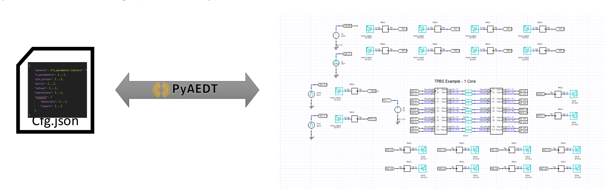
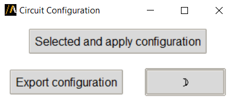

Circuit configuration
====================

------------
Introduction
------------

This extension allows to easily:

- Apply simulation configuration to a Circuit design.
- Export simulation configuration as a text file from Circuit, containing all the information in the form of a dictionary.

The simulation configuration file is a text file in json or toml format. It contains information like component definitions, connections, ports, and more. This configuration file can be used to fully automate the creation of
a circuit design, or to easily make changes on the assembly or any other properties without the risk of an error in your design. For example short circuit is a common struggle when manually manipulating the design,
which is efficiently avoided when using the circuit configuration. It contains an exporter, as well as an importer, allowing to easily retrieve all the information of a design, when using the former, and re-import
with the applied changes using the latter.

--------------------------------------------------------------------------
A  description of the options defined in the configuration file
--------------------------------------------------------------------------
Circuit configuration files are segmented in four sections, namely models, refdes,
pin_mapping, and ports. Each of these sections contains specific information about the design,
ultimately allowing to compactly display and easily manipulate all the data of the design.

1. models.
    The models section, contains the information of all component definitions used in the design,
    and more specifically the type of the component and the path to its file. In cases of nexxim state
    components, the number of ports and the port names (optional) should be given. It supports all types
    files available in AEDT Circuit.

2. refdes.
    The refdes section, contains information regarding the component instances in the design. Each instance,
    is linked to a definition of the previous models sections, while it contains additional properties information
    that are useful for the user. For example for a resistor, its resistance value is displayed, and can be changed
    from the configuration.

3. pin_mapping.
    The pin_mapping section, contains information regarding the connections in the design, namely for each net all the
    terminals (instance name, and pin name), connected to it are displayed. The ground terminals in the design are under
    the reserved net name: gnd.

4. ports.
    In the last section, the ports are populated based on the terminals of the component instances that each one is assigned to.

----------
How to use
----------

~~~~~~~~~~~~~~~~~~~~~~~~~~~~~~~~~~~~~~~~~~~~~~~~~~~~~~~~~
Configure Circuit design in active AEDT project
~~~~~~~~~~~~~~~~~~~~~~~~~~~~~~~~~~~~~~~~~~~~~~~~~~~~~~~~~

1, Select ``Active Design`` in GUI.

2, Make sure the ``Circuit`` design is open and active in AEDT.

3, Click ``Select and Apply Configuration`` and browse to your configuration files.

~~~~~~~~~~~~~~~~~~~~~~~~~~~~~~~~~~~~~~~~~~~~~~~~~
Configure Circuit design in an AEDT project
~~~~~~~~~~~~~~~~~~~~~~~~~~~~~~~~~~~~~~~~~~~~~~~~~

1, Select ``Circuit`` in GUI.

2, Click ``Select Project File`` and browse to .aedt file.

3, Click ``Select and Apply Configuration`` and browse to your configuration files.

4, In the second pop-up window. Specify where to save the new project.
