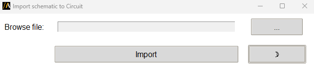

Import schematic
================

Import different schematic files (.asc, .sp, .cir, .qcv) into Circuit.

The extension provides a graphical user interface for configuration,
or it can be used in batch mode via command line arguments.

The following image shows the extension user interface:

Using the extension
--------------------

1. Open the **Automation** tab in the Circuit interface.
2. Locate and click the **Import Schematic** icon under the Extension Manager.
3. In the user interface:
   - Browse for a supported schematic file.
   - Select the file and ensure its path appears in the text field.
   - Click **Import** to load the schematic into Circuit.
4. Toggle between light and dark themes using the button in the bottom-right corner.

Command line
------------

You can also launch the extension directly from the terminal.

The script accepts the following argument:

- ``**asc_file**``:
  Specifies the path to the schematic file to be imported.
  The file must exist and should have one of the supported extensions.
  Example: `"C:/schematics/example.asc"`

Use the following command syntax:

.. toctree::
   :maxdepth: 2

   ../commandline

Supported file types
--------------------

The following schematic file formats are supported:
- **.asc**: Schematic files
- **.sp**: SPICE netlist files
- **.cir**: Circuit schematic files
- **.qcv**: QCV-specific files

Each file type can be imported using the user interface or through the command line.
Ensure that the file exists at the specified path and is properly formatted.