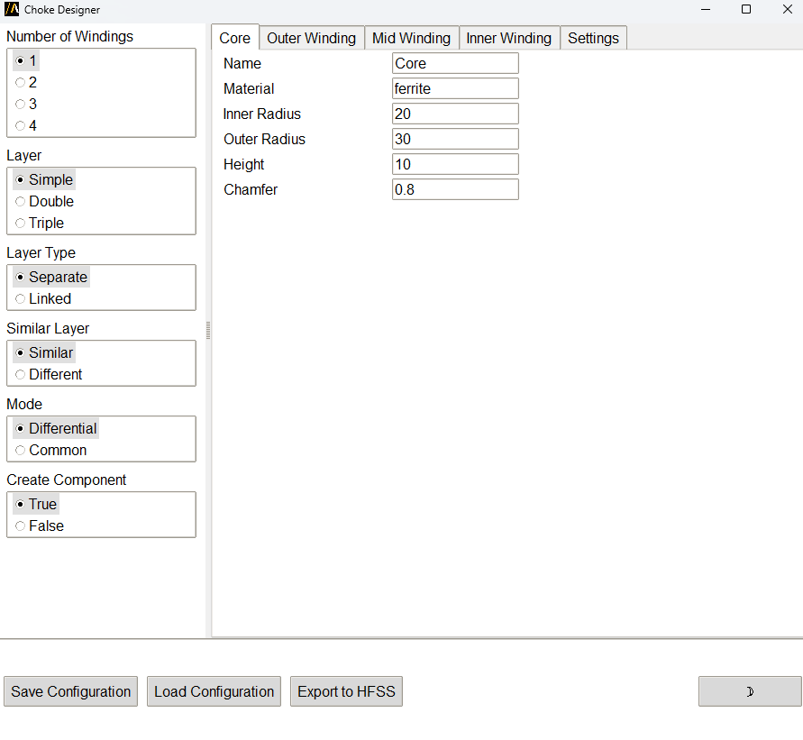

Choke designer
==============

The **Choke designer** extension enables users to create and customize choke configurations and export the generated
geometry to HFSS.

The extension provides a graphical user interface for configuration,
or it can be used in batch mode via command line arguments.

The following image shows the extension user interface:

Features
--------

- Configuring choke parameters including core dimensions, windings, layers, and material properties.
- Exporting designs to HFSS.
- Saving and loading configurations as JSON files.
- Switching between light and dark themes in the user interface.

Using the extension
-------------------

1. Open the **Automation** tab in the HFSS interface.
2. Locate and click the **Choke designer** icon under the Extension Manager.
3. In the user interface:
   - Adjust configuration parameters in the **Left panel** using radio buttons for options such as number of windings and layer types.
   - Modify detailed parameters for the core and windings in the **Right Panel** under respective tabs.
   - Use the buttons at the bottom to:
     - Save the current configuration as a `.json` file.
     - Load an existing configuration file.
     - Toggle between light and dark themes.
4. To export to HFSS, click **Export to HFSS**. Ensure that parameters are valid before exporting.
5. Adjust the settings for light or dark theme using the toggle button in the bottom-right corner.

Command line
------------

The extension can also be used directly via the command line for batch processing.

Use the following syntax to run the extension:

.. toctree::
   :maxdepth: 2

   ../commandline

Example configuration file
--------------------------

Here is an example of a choke configuration in JSON format: :ref:`choke-file`.

Ensure the parameters are valid before importing.

Validation rules
----------------

- The outer radius must be greater than the inner radius for the core and windings.
- Heights and wire diameters must be positive.

The user interface provides detailed feedback on validation errors in the form of message boxes.
