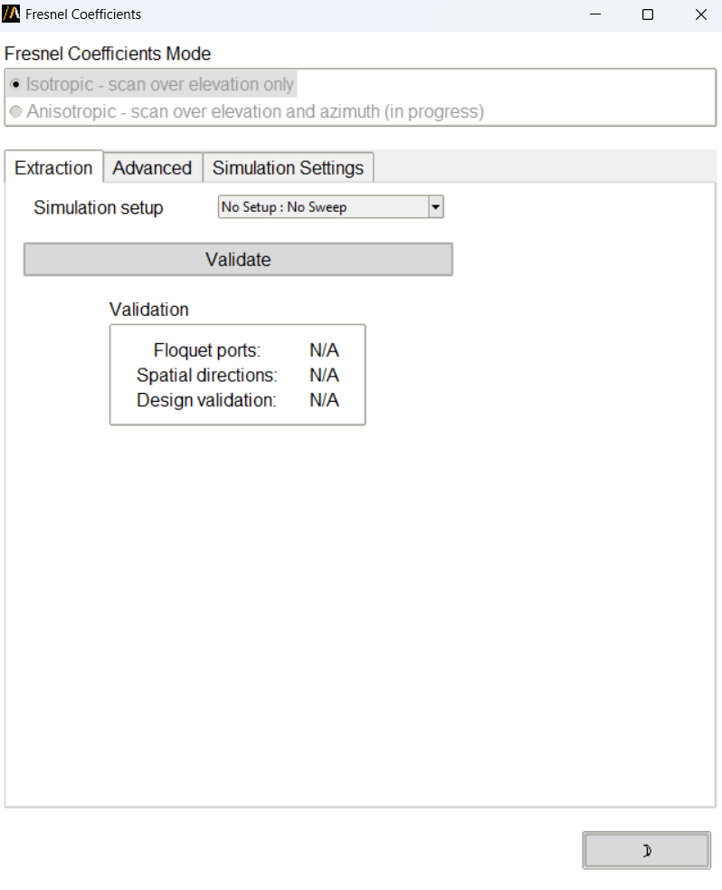
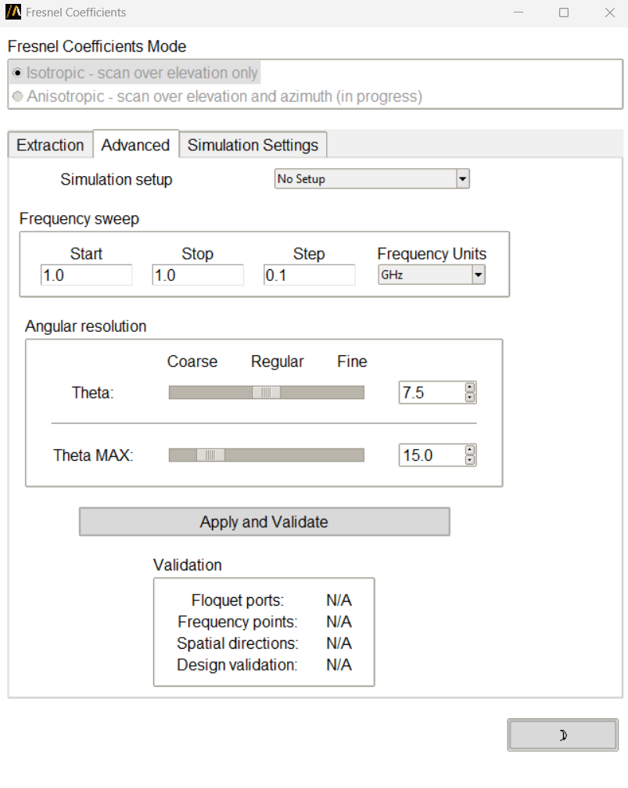
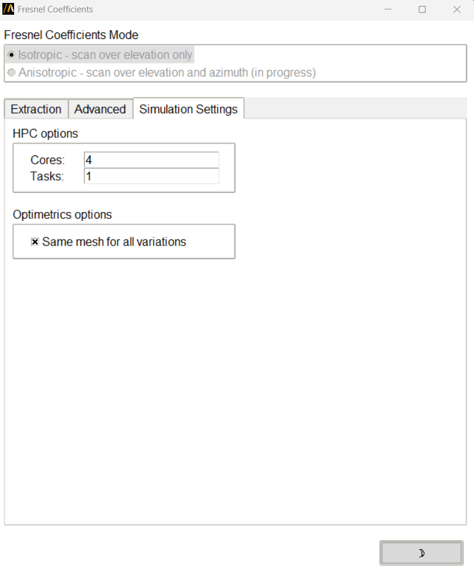

Fresnel Coefficients
====================

With this extension, you can extract Fresnel coefficients from HFSS Floquet port simulations for periodic structures.

You can access the extension from the icon created on the **Automation** tab using the Extension Manager.

Features
--------

The extension supports two analysis modes:

* **Isotropic**: Scans over elevation angle (theta) only
* **Anisotropic**: Scans over both elevation (theta) and azimuth (phi) angles (not available yet)

Workflows
---------

The extension provides three workflow tabs:

Extraction Workflow
~~~~~~~~~~~~~~~~~~~

Extract Fresnel coefficients from an existing simulation setup with parametric sweeps already configured.

1. Select a simulation setup and sweep
2. Click **Validate** to verify the design configuration
3. Click **Start** to extract the coefficients

Advanced Workflow
~~~~~~~~~~~~~~~~~

Configure and run a new parametric analysis:

1. Select a simulation setup
2. Define the frequency sweep range (start, stop, step, units)
3. Set angular resolution for theta and phi (coarse, regular, or fine)
4. Set maximum theta scan angle
5. Click **Apply and Validate** to create the parametric setup
6. Click **Start** to run the analysis and extract coefficients

Simulation Settings
~~~~~~~~~~~~~~~~~~~

Configure HPC and optimization options:

* **HPC Options**: Set number of cores and tasks
* **Optimetrics Options**: Enable mesh reuse across variations

Validation Checks
-----------------

The extension performs several validation checks:

* Verifies Floquet ports are correctly defined with required modes
* Checks for lattice pair boundaries
* Validates design integrity
* Confirms angular sweep configuration
* Calculates total number of frequency points and spatial directions

Requirements
------------

* HFSS design with Floquet ports
* Lattice pair boundaries configured
* Design variables ``scan_T`` (theta) and ``scan_P`` (phi) assigned to lattice pairs

Command Line Usage
------------------

You can also launch the extension from the terminal:

.. code-block:: python

    from ansys.aedt.core.extensions.hfss.fresnel import FresnelExtension

    extension = FresnelExtension(withdraw=False)

.. toctree::
   :maxdepth: 2

   ../commandline