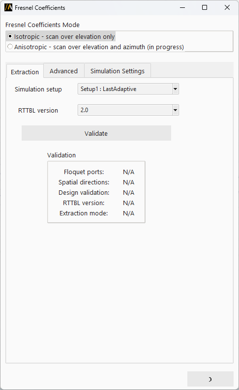
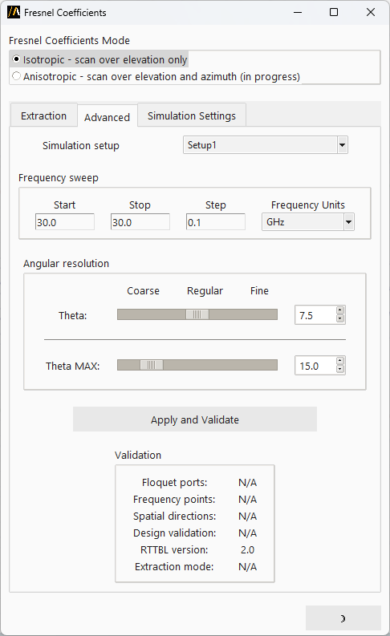
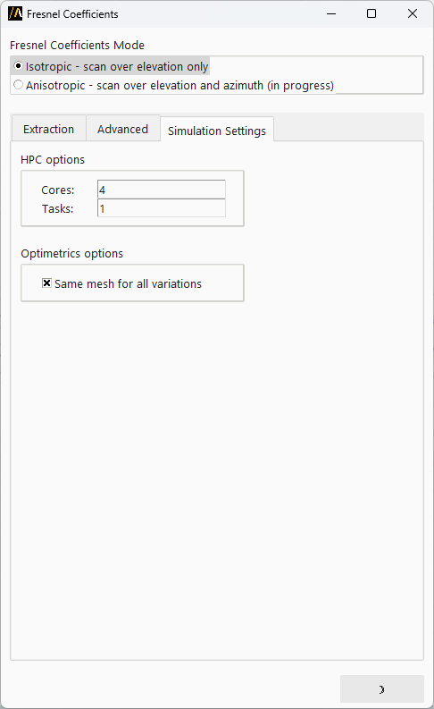

Fresnel coefficients (RTTBL extraction)
=======================================

With this extension, you can export Fresnel Coefficients for periodic structures from an HFSS Unit-Cell design with
Floquet ports in the RTTBL file format for further use in SBR+ for Fresnel (SBR+) Boundary Condition assignment.

You can access the extension from the icon created on the **Automation** tab using the Extension Manager.

Features
--------

The extension supports two regimes for processing Fresnel Coefficients:

* **Isotropic**: Scans over the elevation angle (theta) only - coupling between the TE and TM polarizations is not considered
* **Anisotropic**: Scans over both elevation (theta) and azimuth (phi) angles (not available yet) - considering the polarization coupling

Workflows
---------

The extension provides two workflow tabs:

Extraction workflow
~~~~~~~~~~~~~~~~~~~

Extract Fresnel coefficients from existing analysis results for a setup with parametric sweep.

1. Select a simulation setup and sweep
2. Click **Validate** to verify the design configuration
3. Click **Start** to extract the coefficients

Advanced workflow
~~~~~~~~~~~~~~~~~

Configure and run a new parametric analysis:

1. Select a simulation setup
2. Define the frequency sweep range (start, stop, step, units)
3. Set angular resolution (coarse, regular, or fine) for theta and phi (only for the Anisotropic regime)
4. Set the maximum theta scan value
5. Click **Apply and Validate** to create the parametric setup
6. Click **Start** to run the analysis and extract coefficients

Simulation settings
~~~~~~~~~~~~~~~~~~~

This tab is to configure HPC and Parametric Sweep options:

* **HPC Options**: Set number of cores and tasks
* **Optimetrics Options**: Enable mesh reuse across variations

Validation checks
-----------------

The extension performs several validation checks:

* Verifies Floquet Ports are correctly defined
* Checks for lattice pair boundaries
* Validates design integrity
* Confirms angular sweep configuration
* Calculates total number of frequency points and spatial directions

Requirements
------------
**General:**

* Unit-cell HFSS design with Floquet ports defined
* Lattice pair boundaries configured

**Specific for the Extraction Workflow:**

* Design variables ``scan_T`` (theta) and ``scan_P`` (phi) assigned to Lattice Pairs
* Both spatial and frequency sampling distributions should be uniform

Command line usage
------------------

You can also launch the extension from the terminal:

.. code-block:: python

    from ansys.aedt.core.extensions.hfss.fresnel import FresnelExtension

    extension = FresnelExtension(withdraw=False)

.. toctree::
   :maxdepth: 2

   ../commandline