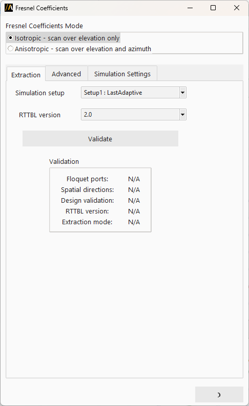
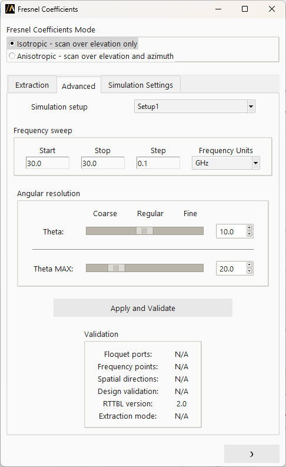
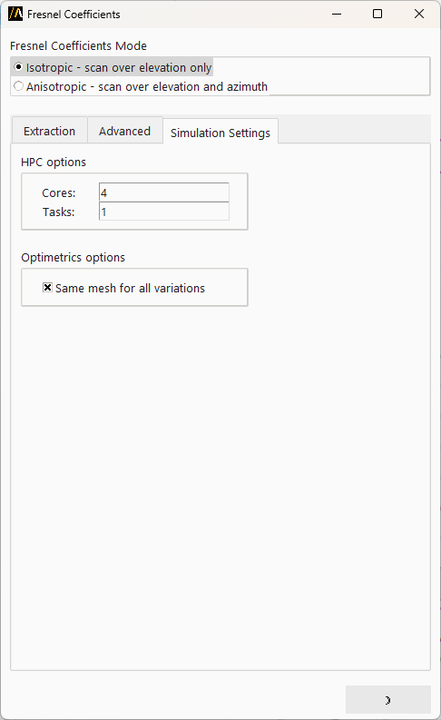

Fresnel coefficients (RTTBL extraction)
=======================================

With this extension, you can export Fresnel Coefficients for periodic structures from an HFSS unit-cell design with
Floquet ports in the RTTBL file format for further use in SBR+ for Fresnel (SBR+) Boundary Condition assignment.

You can access the extension from the icon created on the **Automation** tab using the Extension Manager.

Features
--------

The extension supports two regimes for processing Fresnel Coefficients:

* **Isotropic**: Scans over the elevation angle (theta) only - coupling between the TE and TM polarizations is not considered
* **Anisotropic**: Scans over both elevation (theta) and azimuth (phi) angles - considering the polarization coupling

Isotropic mode is available for all AEDT versions (as RTTBL version 1 and 2), while Anisotropic - only for 2027R1 and beyond (as RTTBL version 2).

AEDT 2026R1 and earlier versions support only RTTBL 1.0.

The preferable RTTBL version for AEDT 2027R1 and beyond is 2.0.

Workflows
---------

The extension provides two workflow tabs:

Extraction workflow
~~~~~~~~~~~~~~~~~~~

Extract Fresnel coefficients from existing analysis results for a setup with parametric sweep.

1. Select a simulation setup and sweep
2. Choose the RTTBL version format (version 1 supports only isotropic (for AEDT 2026R1 and earlier), while version 2 supports both Isotropic and Anisotropic notations (for AEDT 2027R1 and beyond))
3. Click **Validate** to verify the design configuration, after the validation, other options of the extension become hidden
4. Click **Start** to extract the coefficients

Advanced workflow
~~~~~~~~~~~~~~~~~

Configure and run a new parametric analysis:

1. Select a simulation setup
2. Define the frequency sweep range (start, stop, step, units)
3. Set angular resolution (coarse, regular, or fine) for theta and phi (only for the Anisotropic regime)
4. Set the maximum theta scan value
5. Click **Apply and Validate** to create the parametric setup, after the validation, other options of the extension become hidden
6. Click **Start** to run the analysis and extract coefficients

Fresnel extension automatically detects the supported RTTBL version for your AEDT version: 2027R1 and beyond support version 2.

Simulation settings
~~~~~~~~~~~~~~~~~~~

This tab is to configure HPC and Parametric Sweep options:

* **HPC Options**: Set number of cores and tasks
* **Optimetrics Options**: Enable mesh reuse across variations

Validation checks
-----------------

The extension performs several validation checks:

* Verifies Floquet Ports are correctly defined
* Checks for lattice pair boundaries
* Validates design integrity
* Confirms angular sweep configuration
* Calculates total number of frequency points and spatial directions

Requirements
------------
**General:**

* Unit-cell HFSS Modal Design with Floquet ports defined
* Lattice Pair boundaries configured

**Specific for the Extraction Workflow:**

* Design variables for theta and phi scan angles should be defined and assigned to Lattice Pairs
* Theta scan step should be a divisor of 90 degrees
* Phi scan step (if exists) should be a divisor of 180 degrees
* Both spatial and frequency sampling distributions should be uniform
* Isotropic Extraction procedure uses the current value of the Phi scan angle

Command line usage
------------------

You can also launch the extension from the terminal:

.. code-block:: python

    from ansys.aedt.core.extensions.hfss.fresnel import FresnelExtension

    extension = FresnelExtension(withdraw=False)

.. toctree::
   :maxdepth: 2

   ../commandline

Relations between unit-cell s-parameters and Fresnel coefficients in SBR
------------------------------------------------------------------------

The relations below consider that scan directions in the unit-cell are defined in the following ranges:

:math:`\theta_scan^{UC}=[0,90^{\circ}]` and :math:`\phi_scan^{UC}=[0,360^{\circ}]`

Floquet Ports of the unit-cell have only 2 modes: 1 - TE, 2 - TM.

**Single-Sided Case:**

The Floquet Port (FP) is supposed to be placed on the top face of the unit-cell.

.. math:: R_{TE,TE} = S_{FP:1,\ FP:1}
.. math:: R_{TE,TM} = S_{FP:1,\ FP:2}
.. math:: R_{TM,TE} = -S_{FP:2,\ FP:1}
.. math:: R_{TM,TM} = -S_{FP:2,\ FP:2}
.. math:: \theta_refl = \theta_inc = \theta_scan^UC
.. math:: \phi_inc = mod(\phi_scan_UC+180^\circ, 360^\circ)
.. math:: \phi_refl = \phi_scan^UC

**Double-Sided Case:**

The Floquet Ports are supposed to be placed on the top (port TOP) and bottom (port BOT) faces of the unit-cell.
Also, in the equations below, the assumption is that both hemispheres are assigned with the same medium (vacuum).

Independently of the excitation side,

.. math:: \phi_inc = mod(\phi_scan^UC+180^\circ, 360^\circ)
.. math:: \phi_refl = \phi_scan^UC
.. math:: \phi_tr = \phi_scan^UC

* Reflections from the top side

.. math:: R_{TE,TE}^{TOP} = S_{TOP:1,\ TOP:1}
.. math:: R_{TE,TM}^{TOP} = S_{TOP:1,\ TOP:2}
.. math:: R_{TM,TE}^{TOP} = -S_{TOP:2,\ TOP:1}
.. math:: R_{TM,TM}^{TOP} = -S_{TOP:2,\ TOP:2}
.. math:: \theta_refl^{TOP} = \theta_inc^{TOP} = \theta_scan^UC

* Reflections from the bottom side

.. math:: R_{TE,TE}^{BOT} = S_{BOT:1,\ BOT:1}
.. math:: R_{TE,TM}^{BOT} = -S_{BOT:1,\ BOT:2}
.. math:: R_{TM,TE}^{BOT} = S_{BOT:2,\ BOT:1}
.. math:: R_{TM,TM}^{BOT} = -S_{BOT:2,\ BOT:2}
.. math:: \theta_refl^{BOT} = \theta_inc^{BOT} = 180^\circ - \theta_scan^UC

* Transmission "top :math:`\rightarrow` bottom"

.. math:: T_{TE,TE}^{BOT \leftarrow TOP} = S_{BOT:1,\ TOP:1}
.. math:: T_{TE,TM}^{BOT \leftarrow TOP} = S_{BOT:1,\ TOP:2}
.. math:: T_{TM,TE}^{BOT \leftarrow TOP} = S_{BOT:2,\ TOP:1}
.. math:: T_{TM,TM}^{BOT \leftarrow TOP} = S_{BOT:2,\ TOP:2}
.. math:: \theta_tr^{BOT \leftarrow TOP} = 180^\circ - \theta_scan^UC

* Transmission "bottom :math:`\rightarrow` top"

.. math:: T_{TE,TE}^{TOP \leftarrow BOT} = S_{TOP:1,\ BOT:1}
.. math:: T_{TE,TM}^{TOP \leftarrow BOT} = -S_{TOP:1,\ BOT:2}
.. math:: T_{TM,TE}^{TOP \leftarrow BOT} = -S_{TOP:2,\ BOT:1}
.. math:: T_{TM,TM}^{TOP \leftarrow BOT} = S_{TOP:2,\ BOT:2}
.. math:: \theta_tr^{TOP \leftarrow BOT} = \theta_scan^UC
