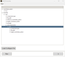
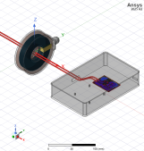

MCAD assembly
=============

With this extension, you can assemble 3D components, 3D layout components in HFSS 3D from a predefined configure file.

Below is an exmaple configure file in json format

.. code-block:: python

    {
        # Create global coordinate system
        "coordinate_system": {
            # Name of the coordinate system
            "CS_1": {
                # Location of the new coordinate system
                "origin": ["100mm", "0mm", "0mm"],
                "reference_cs": "Global"
            },
        },
        # Assembly contains all components to be assembled
        "assembly": {
            # Name of the component
            "case": {
                # Type of the component. Available types are "mcad" for 3D components and "ecad" for 3D layout
                # components.
                "component_type": "mcad",
                # Absolute path to the component file
                "file_path": "E:\\models\\Chassis.a3dcomp",
                # Local coordinate system of the component
                "reference_coordinate_system": "Global",
                # Target coordinate system where the component will be placed
                "target_coordinate_system": "CS_1",
                # Operations to be performed on the component.
                # Available operations are "rotate", "move"
                "arranges": [
                    {"operation": "rotate", "axis": "X", "angle": "0deg"},
                    {"operation": "move", "vector": ["0mm", "0mm", "0mm"]}
                ],
                # Child components, if any
                "sub_components": {
                    "pcb": {
                        "component_type": "mcad",
                        "file_path": "E:\\models\\pcb.a3dcomp",
                        # Target coordinate system must be defined in its parent component
                        "target_coordinate_system": "CS_CHASSIS",
                    },
                }
            }
        }
    }

----------
How to use
----------

1, Down load the example files from https://github.com/ansys/pyaedt/tree/main/tests/system/extensions/mcad_assembly.

2, Copy and paste the below content into a text editor. Correct the component path. Save it as `assembly_config.json`.

.. code-block:: json

    {
        "coordinate_system": {
            "GLOBAL_2": {
                "origin": [
                    "100mm",
                    "0mm",
                    "0mm"
                ],
                "reference_cs": "Global"
            },
            "CS_CLAMP": {
                "origin": [
                    "-130mm",
                    "80mm",
                    "12mm"
                ],
                "reference_cs": "GLOBAL_2"
            }
        },
        "assembly": {
            "case": {
                "component_type": "mcad",
                "file_path": "E:\\Chassi.a3dcomp",
                "reference_coordinate_system": "Global",
                "target_coordinate_system": "GLOBAL_2",
                "arranges": [
                    {"operation": "rotate", "axis": "X", "angle": "0deg"},
                    {"operation": "move", "vector": ["0mm", "0mm", "0mm"]}
                ],
                "sub_components": {
                    "pcb": {
                        "component_type": "ecad",
                        "file_path": "E:\\DCDC-Converter-App_main.aedbcomp",
                        "target_coordinate_system": "Guiding_Pin",
                        "layout_coordinate_systems": [
                            "CABLE1_via_65",
                            "CABLE2_via_65",
                            "H0_via_65"
                        ],
                        "reference_coordinate_system": "H0_via_65",
                        "arranges": [
                            {"operation": "rotate", "axis": "X", "angle": "0deg"},
                            {"operation": "move", "vector": ["0mm", "0mm", "0mm"]}
                        ],
                        "sub_components": {
                            "cable_1": {
                                "component_type": "mcad",
                                "file_path": "E:\\Cable_1.a3dcomp",
                                "target_coordinate_system": "CABLE1_via_65"
                            },
                            "cable_2": {
                                "component_type": "mcad",
                                "file_path": "E:\\Cable_1.a3dcomp",
                                "target_coordinate_system": "CABLE2_via_65"
                            }
                        }
                    }
                }
            },
            "clamp_monitor": {
                "component_type": "mcad",
                "file_path": "E:\\BCI_MONITORING_CLAMP.a3dcomp",
                "reference_coordinate_system": "Global",
                "target_coordinate_system": "CS_CLAMP"
            }
        }
    }

3, Launch AEDT and create a new HFSS 3D design.

4, Launch the extension from the extension manager.

5, Click ``Load Configure File`` and select the ``assembly_config.json`` file. The content of the file is displayed in the
UI.

6, Click ``Run``. The assembly is created in the design.

