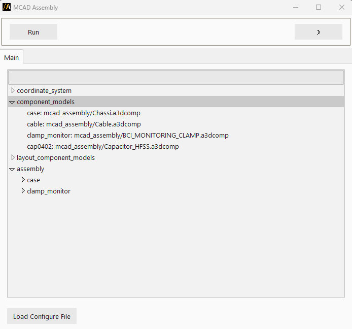
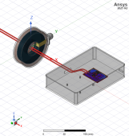

Mcad assembly
=============

With this extension, you can assemble 3D components, 3D layout components in HFSS 3D from a predefined configure file.

The following image shows the extension GUI:

Features
--------

- Assemble 3D components and 3D layout components in HFSS 3D from a predefined configure file.

Using the extension
-------------------

1, Create an empty HFSS 3D design.
2. Open the **Automation** tab in the HFSS interface.
3. Locate and click the **MCAD Assembly** icon under the Extension Manager.
4. Load a configure file in json format. The content of the file is displayed in the UI.
5, Click ``Run``. The assembly is created in the design.

Example configuration file
--------------------------

See an example configuration file in JSON format in :doc:`../../pyaedt_file_data/mcad_assembly`.
