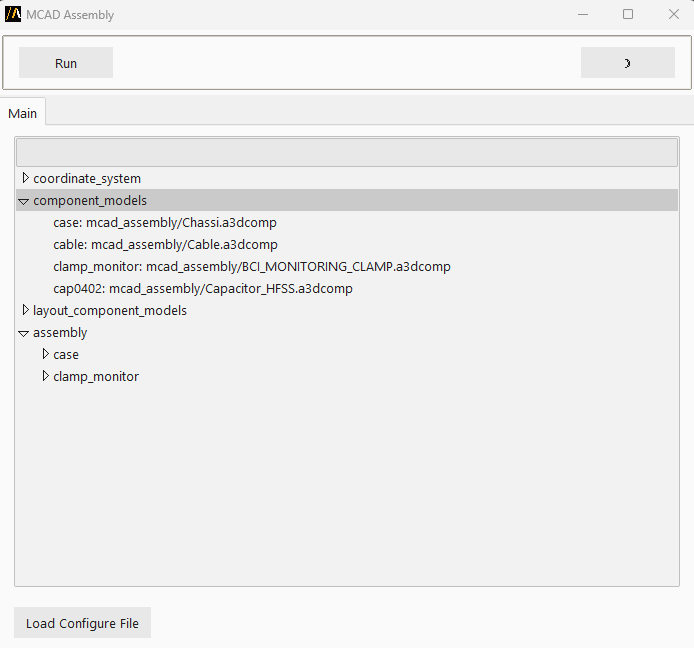
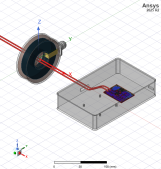

MCAD assembly
=============

This extension enables you to assemble 3D components and 3D layout components in HFSS 3D from a predefined configuration file.

The following image shows the extension GUI:

Features
--------

- Assemble 3D components and 3D layout components in HFSS 3D from a predefined configure file.

Using the Extension
-------------------

1. Create an empty HFSS 3D design.
2. Open the **Automation** tab in the HFSS interface.
3. Locate and click the **MCAD Assembly** icon under the Extension Manager.
4. Load a configure file in json format. The content of the file is displayed in the UI.
5, Click ``Run``. The assembly is created in the design.

Create the assembly from a configuration file
---------------------------------------------

The code loads the configuration file and creates an assembled design in HFSS 3D:

.. code:: python

    from ansys.aedt.core import Hfss
    from ansys.aedt.core.modeler.advanced_cad.mcad_assembly import run

    hfss = Hfss(version="2026.1")
    run(config_data="assembly_config.json", hfss=hfss)
    hfss.release_desktop(close_desktop=False, close_projects=False)

Resources
---------
- :download:`Example Configuration File <../../Resources/assembly_config.json>`

Create a Configuration File
---------------------------

For detailed information about the configuration file format, see :doc:`../../pyaedt_file_data/mcad_assembly`.
