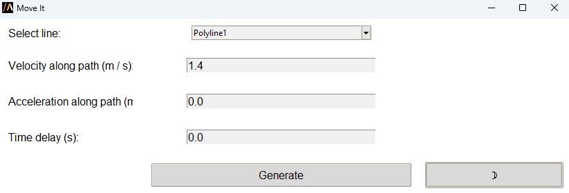

Move it
=======

With this extension, you can generate from a line a parametrize design to simulate a trajectory.

You can access the extension from the icon created on the **Automation** tab using the Extension Manager.

Watch this video tutorial to learn how to use the Move it extension:

.. raw:: html

   <iframe width="560" height="315" src="https://www.youtube.com/embed/a3vZ6uwNux0?si=Ki_Az0TNRyC-jyPP" title="YouTube video player" frameborder="0" allow="accelerometer; autoplay; clipboard-write; encrypted-media; gyroscope; picture-in-picture; web-share" referrerpolicy="strict-origin-when-cross-origin" allowfullscreen></iframe>

The following image shows the extension user interface:

You can also launch the extension user interface from the terminal. An example can be found here:

.. toctree::
   :maxdepth: 2

   ../commandline

