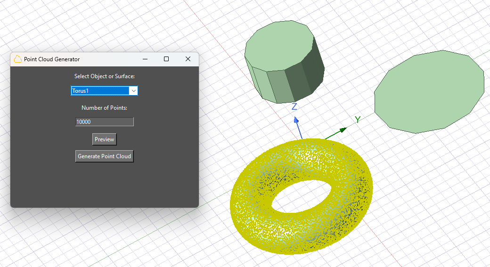

Point cloud generator
=====================

With this extension, you can generate point clouds that conform to objects and surfaces.

You can access the extension from the icon created on the **Automation** tab using the Extension Manager.

The following image shows the extension user interface:

Enables conformal domains for near-field calculations.

You can also launch the extension user interface from the terminal. An example can be found here:

.. toctree::
   :maxdepth: 2

   ../commandline