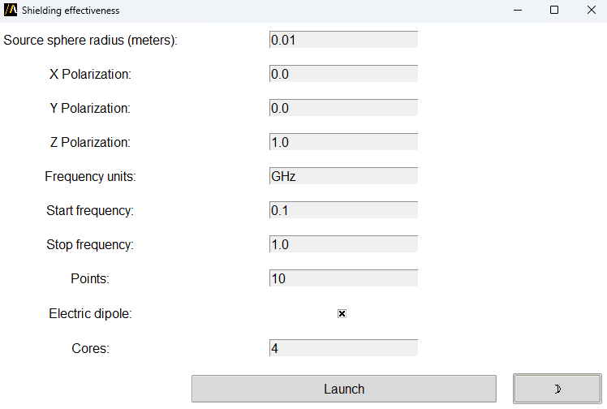

Shielding Effectiveness
=======================

The **Shielding Effectiveness** extension computes the shielding effectiveness of an enclosure.
It calculates the attenuation of an electromagnetic field inside the enclosure due to the presence of a shield.

The extension provides a graphical user interface (GUI) for configuration,
or it can be used in batch mode via command line arguments.

The following image shows the extension GUI:

Features
--------

- Configure input parameters including source sphere radius, polarization, start and stop frequency and dipole type.
- Automatic HFSS setup.
- Switch between light and dark themes in the GUI.

Using the extension
-------------------

1. Open the **Automation** tab in the HFSS interface.
2. Locate and click the **Shielding Effectiveness** icon under the Extension Manager.
3. In the GUI, users can interact with the following elements:
   - **Source sphere radius**: Source sphere radius in meters. It must fit inside the shielding.
   - **Polarization**: X, Y, Z polarization component.
   - **Frequency**: Start and stop frequency and the number of steps to analyze.
   - **Electric dipole**: Activate electric dipole. Electric or magnetic dipole are available.
   - **Cores**: Number of cores for the simulation.
   - Toggle between light and dark themes.
4. Click on **Launch** to start the automated workflow.

Command line
------------

The extension can also be used directly via the command line for batch processing.

Use the following syntax to run the extension:

.. toctree::
   :maxdepth: 2

   ../commandline
