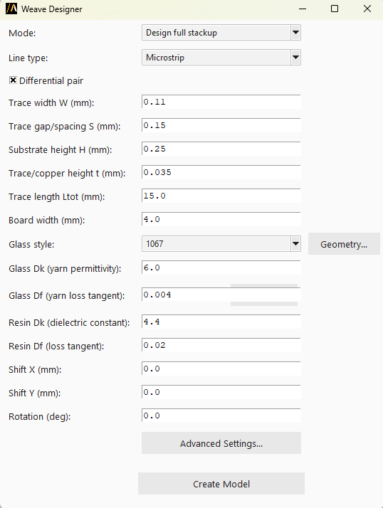

Weave designer
==============

The **Weave designer** extension generates woven glass-fiber fill geometry for PCB substrates and
assigns homogenized or detailed materials to it in HFSS.

The extension provides a graphical user interface (GUI) for configuration,
or it can be used in batch mode via command line arguments.

The following image shows the extension GUI:

Features
--------

- Build a full stackup (ground planes, substrate, trace, ports, and airbox) for a microstrip or
  stripline, differential or single-ended, and weave the glass fiber into it in one step.
- Alternatively, weave the glass fiber onto one or more existing substrate objects in a design that
  already contains vias and routing ("Weave existing layout" mode), without touching the stackup.
- Choose a predefined vendor glass style (weave pattern, pitch, and yarn geometry) or define a fully
  custom one.
- Configure glass/resin Dk and Df, shift and rotate the weave pattern relative to the substrate, and
  expose low-level facet/sector discretization settings in an **Advanced Settings** dialog.

Using the extension
--------------------

1. Open the **Automation** tab in the HFSS interface.
2. Locate and click the **Weave Designer** icon under the Extension Manager.
3. In the GUI, choose the **Mode**:

   - **Design full stackup**: build the ground/substrate/trace/ports/airbox automatically, then weave.
   - **Weave existing layout**: weave onto user-named, pre-existing substrate object(s), picked
     either by typing their names or using the **Get Selection** button.
4. Select the **Line type** (Microstrip or Stripline) and whether the pair is differential.
5. Pick a **Glass style**, or choose **Custom** to edit the glass dimensions in the **Geometry...**
   dialog.
6. Adjust Dk/Df values, shift, and rotation as needed.
7. Click **Advanced Settings...** to change facet/sector discretization if needed.

   .. note::

      Increasing the facetting improves accuracy but slows down the model build time.

8. Click **Create Model** to generate the geometry in HFSS.

Command line
------------

The extension can also be used directly via the command line for batch processing.

Use the following syntax to run the extension:

.. toctree::
   :maxdepth: 2

   ../commandline

