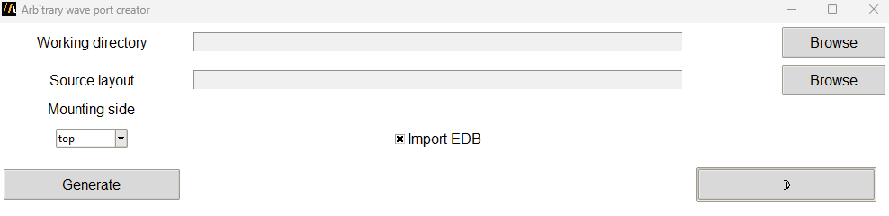

Arbitrary wave port
===================

This extension automates the creation of arbitrary wave ports for PCB layouts or other design files.

The extension provides a graphical user interface (GUI) for configuration,
or it can be used in batch mode via command line arguments.

The following image shows the extension GUI:

Features
--------

- Customizable options for fixing disjoint nets, selecting the cutout type, and applying expansion factors.
- Integration with Ansys EDB for layout cutout creation and post-processing.
- Switch between light and dark themes in the GUI.

It assumes that oblong voids are explicit and some pad-stack instances are inside to define terminal.
After defining the working directory and the source file used for creating wave ports, the combobox for defining
the mounting side is important. You can choose between `top` and `bottom`.
For the selected design, `top` searches for the top metal layer and `bottom` for the bottom signal layer.
If not void are found the tool shows an error message, you might have to change the mounting side.

.. note::

   The selected working directory content is deleted once you press `Generate` button.
   If this folder already exists and is not empty, user gets a warning window asking to continue or not.
   The check box `Import EDB` is checked by default, when user browse for source file,
   only folders are displayed since EDB is an AEDB folder.

The tool also supports other format when the user does not check `Import EDB` box.
The following file formats are available: ODB++, BRD, MCM, or ZIP are allowed.

Using the extension
-------------------

1. Open the **Automation** tab in the HFSS 3D Layout interface.
2. Locate and click the **Layout Cutout** icon under the Extension Manager.
3. In the GUI, users can interact with the following elements:
   - **Working directory**: A text box to specify the directory where output files is saved.
   - **Source layout**: A text box to specify the source layout design file (PCB files).
   - **Mounting side**: A dropdown menu to select the mounting side (top or bottom) for the wave port.
   - **Import EDB**: A checkbox to enable or disable the import of EDB files for the layout.
   - **Theme toggle**: A button to switch between light and dark modes for the UI.
4. Click on **Generate** to create the wave ports and the corresponding 3D component.

Command line
------------

The extension can also be used directly via the command line for batch processing.

Supported arguments include:

- **working path**: The directory where output files are saved.
- **source_path**: The path to the source layout design file.
- **mounting side**: The side to mount the wave port on ("top" or "bottom").
- **import edb**: Boolean flag to enable or disable EDB import.
- **is batch**: Boolean flag to enable batch mode (skip GUI).
- **is test**: Boolean flag to enable or disable test mode.

Use the following syntax to run the extension:

.. toctree::
   :maxdepth: 2

   ../commandline
