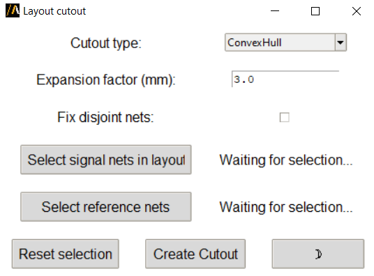

Cutout
======

The **Layout cutout** extension allows users to create cutouts in HFSS 3D Layout designs based on selected nets.

The extension provides a graphical user interface (GUI) for configuration,
or it can be used in batch mode via command line arguments.

Features
--------

- Provides an intuitive user interface for selecting nets, defining the cutout type, and adjusting parameters such as expansion factor.
- Supports batch processing for automated execution via command line arguments.
- Customizable options for fixing disjoint nets, selecting the cutout type, and applying expansion factors.
- Integration with Ansys EDB for layout cutout creation and post-processing.

The following image shows the extension user interface:

Using the extension
-------------------

1. Open the **Automation** tab in the HFSS 3D Layout interface.
2. Locate and click the **Layout Cutout** icon under the Extension Manager.
3. The main window displays the following elements:
   - **Cutout type**: A dropdown menu to select the desired cutout type (e.g., ConvexHull, Bounding, Conforming).
   - **Signal nets**: A button to apply selected signal nets from the layout.
   - **Reference nets**: A button to apply selected reference nets.
   - **Expansion factor**: A text box to define the expansion factor for the cutout (in mm).
   - **Fix disjoint nets**: A checkbox to enable or disable fixing of disjoint nets.

4. Select the desired options and click **Create Cutout** to generate the cutout.

Command Line
------------

The extension can also be used directly via the command line for batch processing.

Supported arguments include:

- **choice**: Type of cutout to apply (e.g., "ConvexHull").
- **signals**: List of signal nets to use for the cutout.
- **reference**: List of reference nets to use for the cutout.
- **expansion_factor**: Expansion factor in mm for the cutout.
- **fix_disjoints**: Boolean flag to enable or disable fixing of disjoint nets.
- **is_batch**: Boolean flag to enable batch mode.

Use the following syntax to run the extension:

.. toctree::
   :maxdepth: 2

   ../commandline
