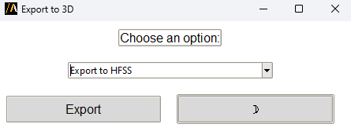

Export to 3D
============

The **Export to 3D** extension allows users to export their HFSS 3D Layout designs into various formats including HFSS,
Q3D, Maxwell 3D, and Icepak, keeping the net names.

The extension provides a graphical user interface (GUI) for configuration,
or it can be used in batch mode via command line arguments.

The following image shows the extension GUI:

Features
--------

- Support multiple export formats among `HFSS`, `Q3D`, `Maxwell 3D`, and `Icepak`.
- Switch between light and dark themes in the GUI.

Using the extension
-------------------

1. Open the **Automation** tab in the HFSS 3D Layout interface.
2. Locate and click the **Export to 3D** icon under the Extension Manager.
3. The GUI displays a label, a combobox to choose an export option, and a button to initiate the export.
3. Click **Export** to export the design.

Command line
------------

The extension can also be used directly via the command line for batch processing.

Supported arguments include:

- **choice**: The export option to choose (`"Export to HFSS"`, `"Export to Q3D"`, `"Export to Maxwell 3D"`,
or `"Export to Icepak"`).
- **is batch**: Boolean flag to indicate if the extension should run in batch mode.

Use the following syntax to run the extension:

.. toctree::
   :maxdepth: 2

   ../commandline
