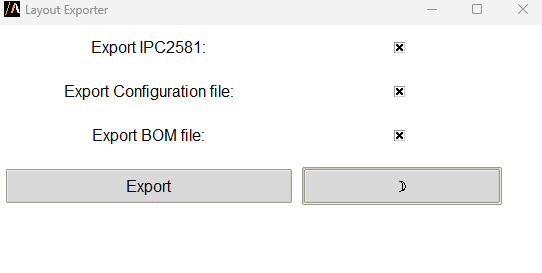

Export layout
=============

The **Layout exporter** extension allows users to export various design data from an HFSS 3D Layout, such as IPC2581,
Bill of materials (BOM), and configuration files.

The extension provides a graphical user interface (GUI) for configuration,
or it can be used in batch mode via command line arguments.

The following image shows the extension GUI:

Features
--------

- Allow users to select and export data in multiple formats: IPC2581, BOM, and configuration files.
- Automatically detects the active project and design in AEDT.
- Validates user input for file paths and selected options.
- Supports both light and dark themes for the GUI.

Using the extension
-------------------

1. Open the **Automation** tab in the HFSS 3D Layout interface.
2. Locate and click the **Layout Cutout** icon under the Extension Manager.
3. In the GUI, users can interact with the following elements:
   - **Export IPC2581**: Checkbox to export the layout data as IPC2581.
   - **Export Configuration**: Checkbox to export the configuration file.
   - **Export BOM**: Checkbox to export the Bill of Materials (BOM).
   - **Theme toggle**: Button to switch between light and dark themes.
4. Once the options are selected, click the **Export** button to generate the respective files.

.. note::
   
   The selected files are saved in the same directory as the AEDB project.

Command line
------------

The extension can also be used directly via the command line for batch processing.

Use the following syntax to run the extension:

.. toctree::
   :maxdepth: 2

   ../commandline
