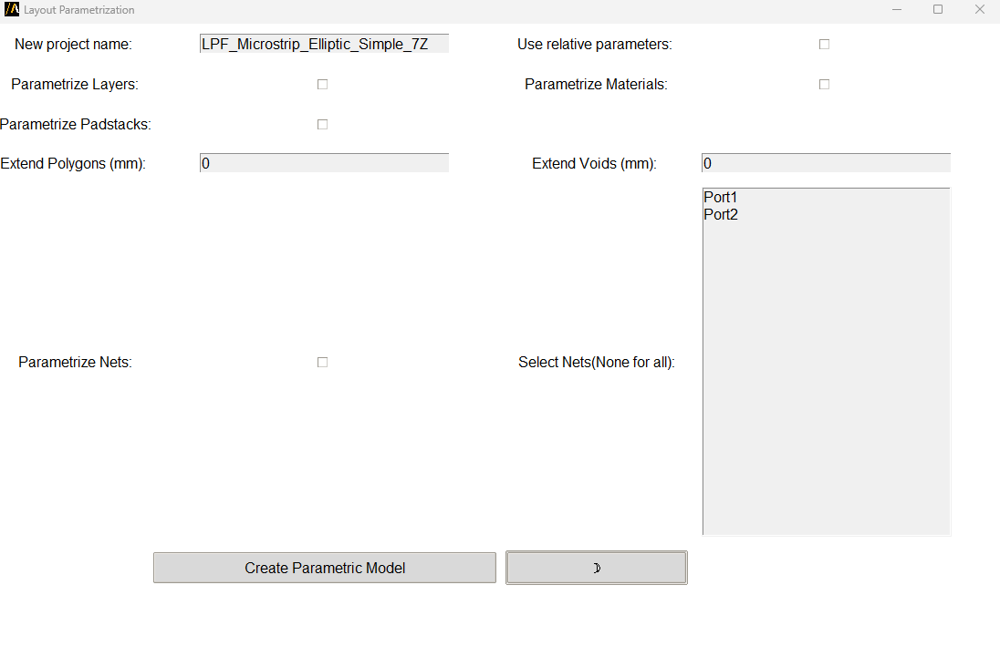

Parametrize Layout
==================

You can parametrize stackup, materials, padstacks and traces of an existing 3D Layout design and also
change size of voids and polygons to conduct corner analysis.

You can access the extension from the icon created on the **Automation** tab using the Extension Manager.

The following image shows the extension user interface:

The available arguments are: ``aedb_path``, ``design_name``, ``parametrize_layers``,
``parametrize_materials``, ``parametrize_padstacks``, ``parametrize_traces``, ``nets_filter``,
``expansion_polygon_mm``, ``expansion_void_mm``, ``relative_parametric``, ``project_name``.

``aedb_path`` and ``design_name`` define the source aedb project.
``parametrize_layers``, ``parametrize_materials``, ``parametrize_padstacks``, ``parametrize_traces``
define which parts of the aedb has to be parametrized while the ``nets_filter`` defines which nets has to be included.
``expansion_polygon_mm`` and ``expansion_void_mm`` define if and which value of expansion has to be applied on
polygons and voids.
``relative_parametric`` define if the parameters have to be considered as a delta of the original value or not.
``project_name`` is the new project name.

You can also launch the extension user interface from the terminal. An example can be found here:

.. toctree::
   :maxdepth: 2

   ../commandline
