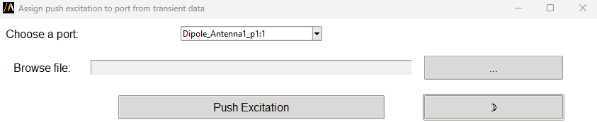

Push excitation from file
=========================

The **push excitation from file** extension allows users to assign a time-domain excitation to a port in an HFSS design
by importing data from a file.

The extension provides a graphical user interface (GUI) for configuration,
or it can be used in batch mode via command line arguments.

Features
--------

- Automatically detects and lists available ports in the active HFSS design.
- Allows users to browse and select a time-domain excitation file.
- Supports both light and dark themes for the GUI.
- Assigns excitations programmatically using a batch-mode interface.
- Validates file paths and port selections to ensure proper configuration.

The following image shows the extension user interface:

Using the extension
--------------------

1. Open the **Automation** tab in the HFSS 3D Layout interface.
2. Locate and click the **push excitation from file** icon under the Extension Manager.
3. The main window displays the following elements:
   - **Port selection**: A dropdown menu to select the desired port from the HFSS design.
   - **File browser**: A text box and button to select the excitation file.
   - **Push excitation button**: A button to assign the excitation to the selected port.
   - **Theme toggle**: A button to switch between light and dark themes.
3. Click **Push excitation** after selecting the port and file to apply the configuration.

Command line
------------

The extension can also be used directly via the command line for batch processing.

Supported arguments include:

- **file_path**: Path to the excitation file.
- **choice**: Name of the port to assign the excitation.
- **is_batch**: Boolean flag to enable batch mode.

Use the following syntax to run the extension:

.. toctree::
   :maxdepth: 2

   ../commandline
