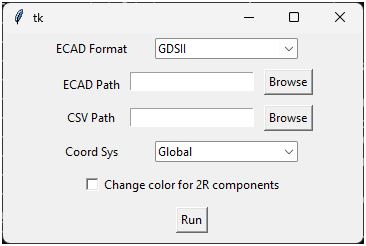

ECAD importer
================

You can import an ECAD in a specific coordinate system and with components properties specified in a CSV files.

There is also an option to use a different color for components treated as 2R networks so that they can be identified easily.

The following image shows the extension user interface:

