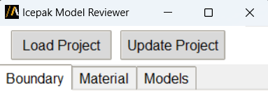
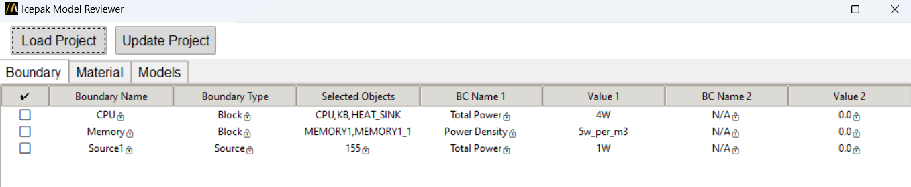

Icepak model reviewer
=====================

The Icepak Model Reviewer extension allows users to inspect and modify details of an Icepak project. It enables
reviewing critical data such as boundary conditions, materials, and model-specific properties.

The extension provides a graphical user interface (GUI) where the user can load a project, review its components,
and make necessary updates.

The following image shows the extension GUI:

After the project is loaded by clicking, the GUI show tables

Features
--------

- Load and inspect an Icepak project.
- Display editable tables showing:
  - Boundary conditions
  - Material properties
  - Model details
- Update project parameters.

Using extension
-------------------

1. Open the **Automation** tab in the Icepak interface.
2. Click on the **Icepak model reviewer** icon under the Extension Manager.
3. In the GUI, interact with the following elements:
   - **Load Project**: Load the Icepak project into the GUI.
   - **Update Project**: Push any modifications made in the tables back to the project.
4. After the project is loaded:
   - The GUI displays three main tables:
     - **Boundary Conditions**: Lists all the boundary condition settings applied in the model.
     - **Materials**: Shows the materials used and their key properties.
     - **Models**: Displays model-specific data and configurations.

Each table allows inline editing of values. To commit changes, click the **Update Project** button.
Commit changes apply all modifications to the currently loaded project.

Tables overview
---------------

**Boundary Conditions Table**

This table displays the thermal boundary conditions defined in the Icepak project.
The data is organized with both read-only and editable fields to help users review and make updates.
+--------------------------+----------------------------------------------------------------------------------+
| **Property**            | **Description**                                                                   |
+==========================+==================================================================================+
| **Name**                 | Name of the boundary. This field is **read-only** and cannot be modified.        |
+--------------------------+----------------------------------------------------------------------------------+
| **Boundary Type**        | Indicates whether the boundary is a *Block* or a *Source*. This is               |
|                          | also a **read-only** field.                                                      |
+--------------------------+----------------------------------------------------------------------------------+
| **BC Name 1 / BC Name 2**| Names of the boundary conditions applied (*Total Power*, *Power Density*,        |
|                          | *Heat Transfer Coefficient*, *Temperature*). These fields are **read-only**      |
+--------------------------+----------------------------------------------------------------------------------+
| **Value 1 / Value 2**    | Corresponding values for the selected boundary conditions. These fields          |
|                          | are **editable**.                                                                |
+--------------------------+----------------------------------------------------------------------------------+

**Materials Table**

This table displays material properties for all objects used in the Icepak project.
Some fields are read-only and provided for reference, while others can be modified depending on the simulation setup.

+----------------------------------+--------------------------------------------------------------+
| **Property**                     | **Description**                                              |
+==================================+==============================================================+
| **Name**                         | Material name (**read-only**)                                |
+----------------------------------+--------------------------------------------------------------+
| **Material Type**                | Indicates if the material is *Solid* or *Fluid*              |
|                                  | (**read-only**)                                              |
+----------------------------------+--------------------------------------------------------------+
| **Thermal Conductivity**         | Thermal conductivity in **W/m·K**                            |
+----------------------------------+--------------------------------------------------------------+
| **Mass Density**                 | Density in **kg/m³**                                         |
+----------------------------------+--------------------------------------------------------------+
| **Specific Heat**                | Specific heat capacity in **J/kg·K**                         |
+----------------------------------+--------------------------------------------------------------+
| **Thermal Expansion Coefficient**| Coefficient of thermal expansion in **1/K**                  |
+----------------------------------+--------------------------------------------------------------+
| **Thermal Diffusivity**          | Thermal diffusivity in **m²/s**                              |
+----------------------------------+--------------------------------------------------------------+
| **Viscosity**                    | Dynamic viscosity in **Kg/m-s**                              |
+----------------------------------+--------------------------------------------------------------+

**Models Table**

This table lists the object-level settings related to modeling in the Icepak project.
It shows the assigned bulk and surface materials. Information about whether an object is model/ non-model object.

Notes
-----

- Ensure the CSV file for power map creation is formatted correctly before importing.
- Changes made in the tables are not applied to the project until the **Update Project** button is clicked.
- This extension is intended for reviewing model data efficiently without the need to navigate complex menus.

