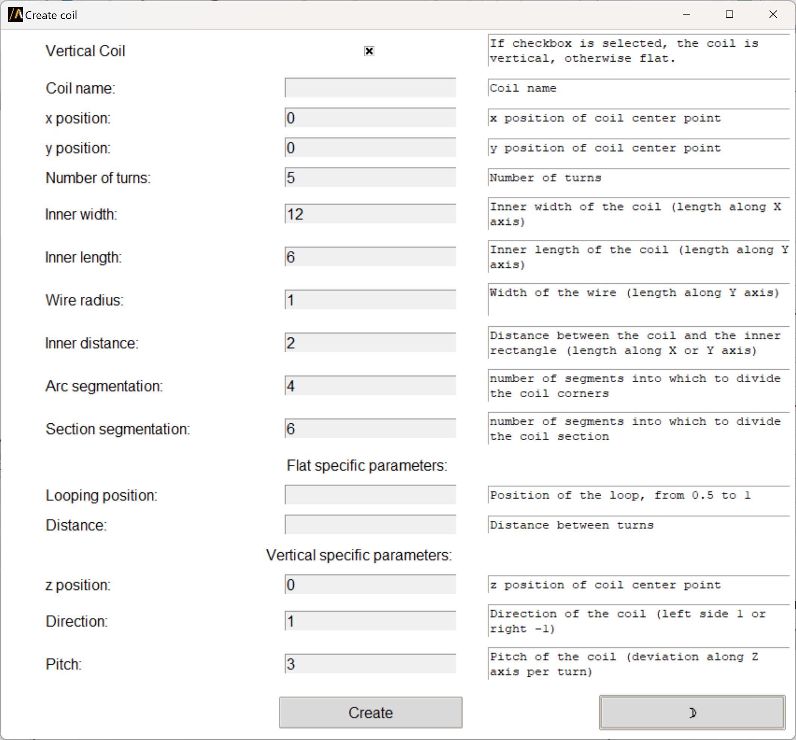

Create coil design geometries
=============================

This extension aims to create vertical or flat coil geometries in Maxwell 3D using specific parameters.
It supports more complex shapes than simple cylinders because it allows the segmentation of the coil profile as well as
the segmentation of corners.
The segmentation features are designed to optimize AEDT meshing operations.

You can access the extension from the icon created on the **Automation** tab using the Extension Manager.
Select the **Maxwell3D** tab and then click on the **Create Coil** icon:

.. image:: ../../../_static/extensions/create_coil_EM.png
   :width: 600
   :alt: Launch Create coil extension from EM

The following image shows the extension user interface:

.. image:: ../../../_static/extensions/create_coil1.png
   :width: 400
   :alt: Create coil vertical parameters

.. image:: ../../../_static/extensions/create_coil2.png
   :width: 400
   :alt: Create coil flat parameters

The user can select the coil type by checking the **Vertical Coil** checkbox, define the coil parameters that are common
to both types from the **Common** tab, and then define the parameters that are specific to each type in **Vertical**
or **Flat** tabs.

With the button **Parameters** the user can see a summary of all the parameters defined for the coil in a self-explanatory
picture:

.. image:: ../../../_static/extensions/vertical_flat_parameters.png
   :width: 600
   :alt: Vertical flat coil parameters

Finally, with one simple button click, the user can create the coil geometry in AEDT.
The object is created and replaced as a 3D component in the active Maxwell 3D design.
In the working directory folder (.pyaedt) the .a3dcomp file is created and can be reused.
The coil geometry is created and parametrized according to the defined parameters.
Now accessible from the design properties:

.. image:: ../../../_static/extensions/coil_parametrization.png
   :width: 450
   :alt: Coil parametrization

You can also launch the extension user interface from the terminal. An example can be found here:

.. toctree::
   :maxdepth: 2

   ../commandline