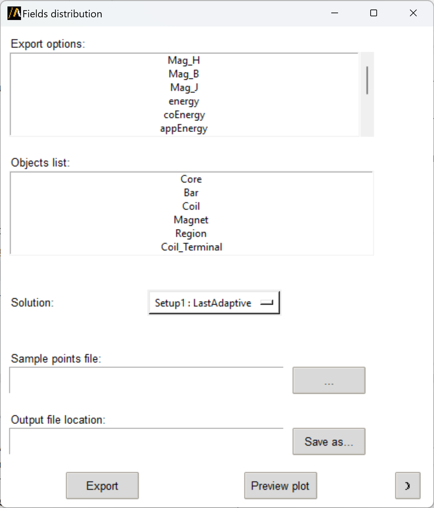
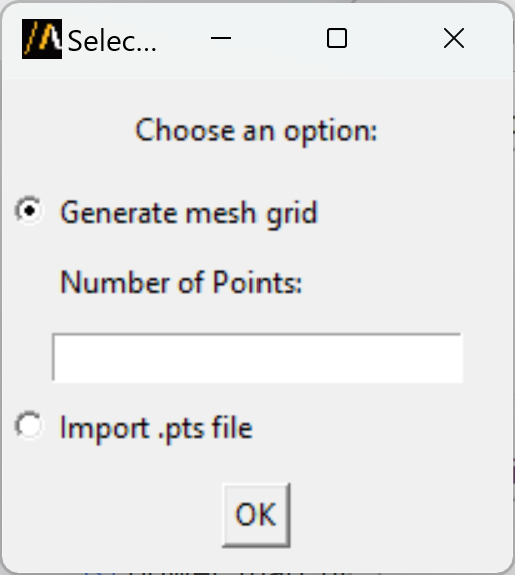
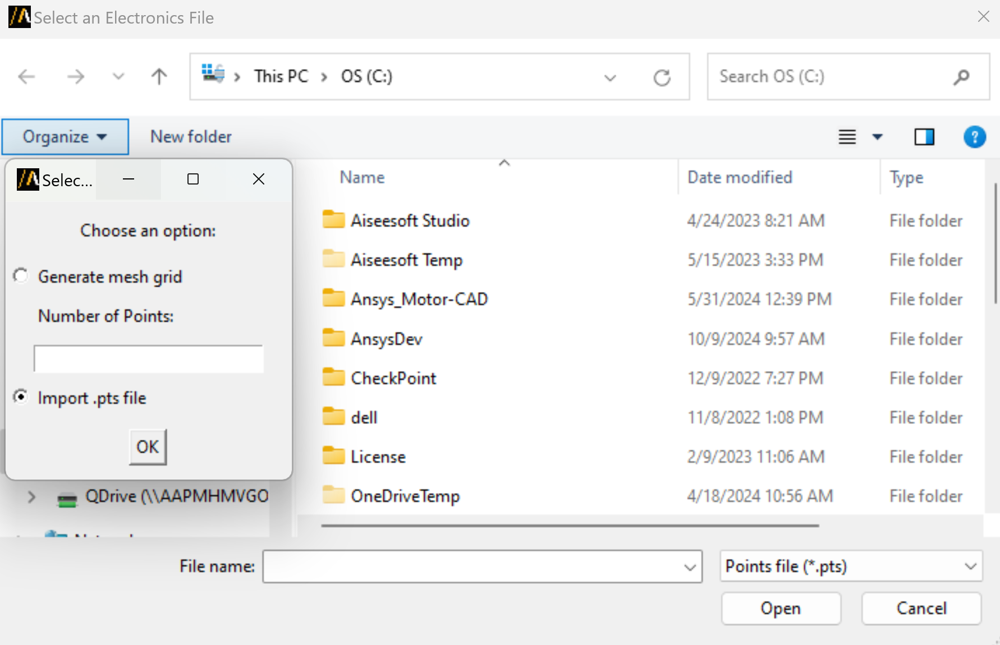

Fields distribution
===================

This extensions allows to export fields distribution in generic formats such as CSV, TAB, or NPY on a defined grid of points or on mesh nodes.
The user can import a PTS file or generate a point cloud thanks to the **Point Cloud Generator** extension.

You can access the extension from the icon created on the **Automation** tab using the Extension Manager.

The following image shows the extension user interface:

The user can select the field to export from the **Export options** list. This list displays all the available named expressions in the fields calculator.
The **Objects list** option allows the user to select the object or multiple objects on which the field is exported.

In the **Sample points file** field, the user can specify a PTS file containing the points where the field is exported
or generate a point cloud using the **Point Cloud Generator** extension by clicking on the button.
In the latter case a new window appears:

In case the user has a PTS file, the browse file window appears:

The **Save as** button allows to browse the location to save the output file in the selected format (CSV, TAB, or NPY).

Finally, the user has the option to preview the field distribution on the selected object surface with PyVista or simply export
the field in the desired location both in the selected format and as a FLD file.

You can also launch the extension user interface from the terminal. An example can be found here:

.. toctree::
   :maxdepth: 2

   ../commandline