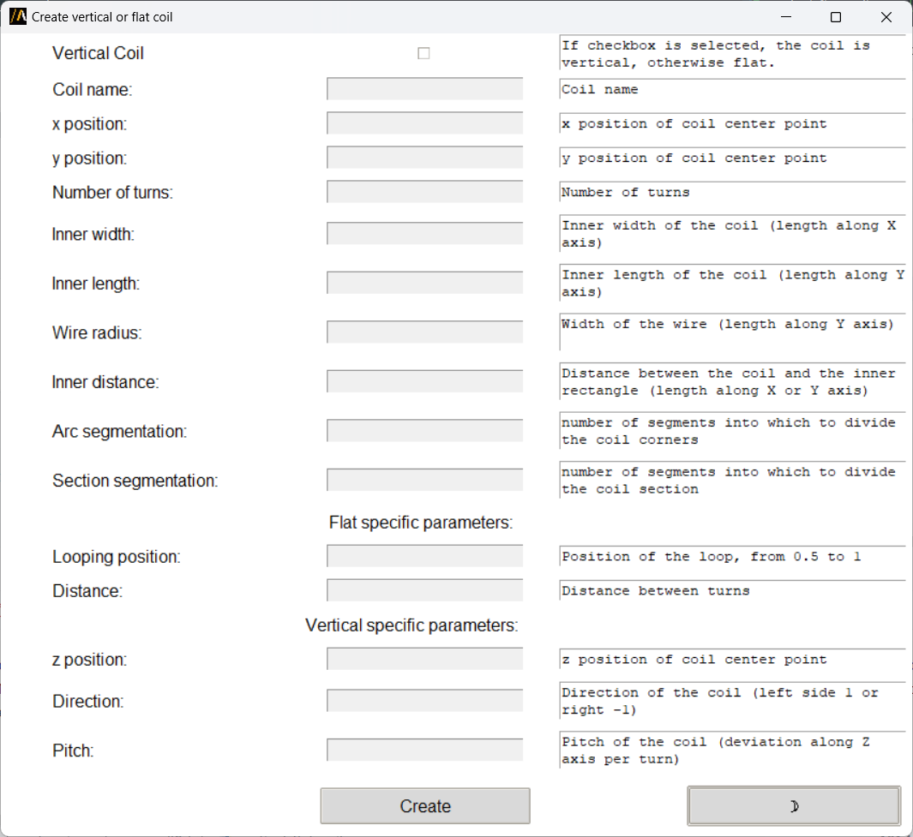

Vertical and Flat Coil Geometries
=================================

This extension aims  to create vertical or flat coil geometries in Maxwell 3D using specific parameters.
It supports more complex shapes than simple cylinders because it allows the segmentation of the coil profile as well as
the segmentation of corners.
The segmentation features are designed to optimize AEDT meshing operations.

You can access the extension from the icon created on the **Automation** tab using the Extension Manager.

The following image shows the extension user interface:

