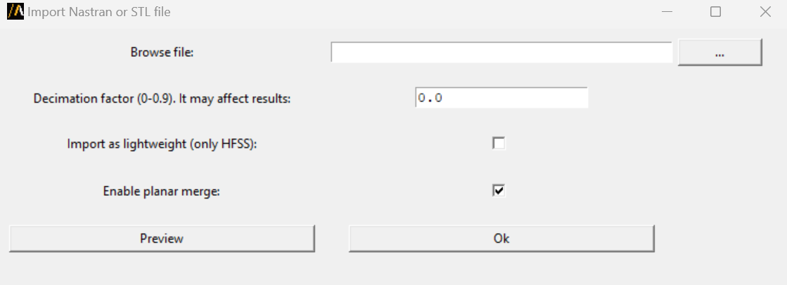

Import Nastran
==============

Import Nastran or STL file in any 3D modeler application. The user can also preview the imported file and decimate it before import it.

User can access the extension from the icon created in the Automation tab through the extension manager.
The following image shows the extension user interface:

User can launch the user interface from the terminal:

.. code::

   SET PYAEDT_SCRIPT_PORT=50051
   SET PYAEDT_SCRIPT_VERSION=2024.1
   python.exe path/to/pyaedt/workflows/project/import_nastran.py

The available arguments are: file_path, planar, lightweight, and decimate. These arguments can be obtained from the help:

.. code::

   python.exe path/to/pyaedt/workflows/project/import_nastran.py --help

This code shows how to pass the input file as an argument, which doesn't launch the user interface:

.. code::

   export PYAEDT_SCRIPT_PORT=50051
   export PYAEDT_SCRIPT_VERSION=2024.1
   python.exe path/to/pyaedt/workflows/project/import_nastran.py --file_path="my_file.stl"

Fianlly, the extension can be used in a python script without the user interface with the following code:

.. code:: python

    import pyaedt
    import os
    from pyaedt.workflows.project.import_nastran import main
    file_path = "my_file.stl"
    hfss = pyaedt.Hfss()
    # Specify the AEDT session to connect
    os.environ["PYAEDT_SCRIPT_PORT"] = str(hfss.desktop_class.port)
    os.environ["PYAEDT_SCRIPT_VERSION"] = hfss.desktop_class.aedt_version_id
    # Launch extension
    main({"file_path": file_path, "lightweight": True, "decimate": 0.0, "planar": True, "is_test": False})

