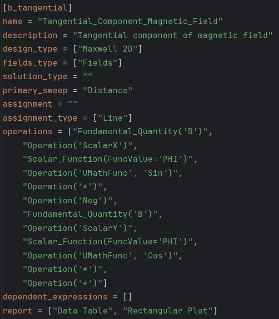
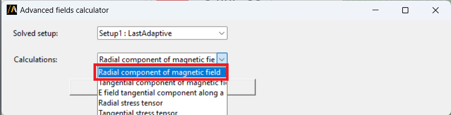
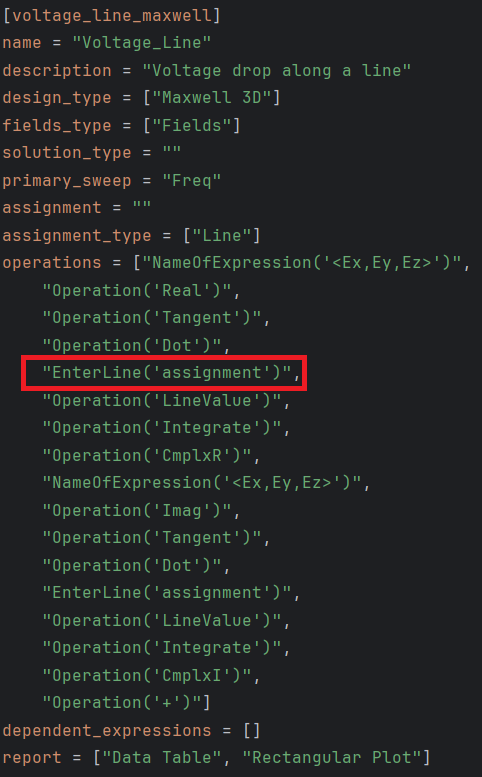
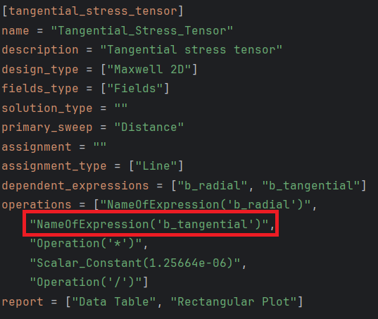

Advanced Fields Calculator
==========================

The Advanced Fields Calculator provides an additional pool of custom expressions appropriate for each solver.
These expressions sum up on top of the already existing ones available in the AEDT Fields Calculator.
These two libraries combined together provide a way to conveniently calculate frequently used quantities.

Operations such as adding, loading and deleting named expressions, as well as creating .clc expressions files, is now
automatized and available in PyAEDT.

The core component is a .toml file that functions as an expressions catalog.
It is located in ``pyaedt>misc>expression_catalog.toml`` and the content for each expression is the following:

- ``Description``: The name that will be displayed in the UI:

- ``Operations``: List of operations to perform to compute the expression.

We tend to divide expressions in ``general`` or ``non-general`` expressions.

- For general expressions is intended expressions that are independent from a geometry definition.
In the previous screenshot, to calculate the magnetic field tangential component, there is no need to specify a
geometry assignment.
Whereas in the following example, to calculate the voltage drop along a line, the line assignment is needed for the computation:

To help the user understand this difference we implemented a method called ``is_general_expression(expression_name)``.
This returns either True if the expression is general or False otherwise.

It is possible to add named expressions dependent to one another:

There is also the opportunity for the user to add an external .toml file (that must be placed in PersonalLib folder)
to load custom expressions. This could be especially useful if the user does not want to share expressions.
To load a personalized .toml file use ``load_expression_file(toml_file_path)``.

Finally, this code shows how you can use the Advanced Field Calculator:

.. code:: python

    import pyaedt
    hfss = pyaedt.Hfss()

    # Specify the AEDT session to connect
    os.environ["PYAEDT_SCRIPT_PORT"] = str(hfss.desktop_class.port)
    os.environ["PYAEDT_SCRIPT_VERSION"] = hfss.desktop_class.aedt_version_id

    # Add an existing expression in the catalog
    name = hfss.post.fields_calculator.add_expression("voltage_line", "Polyline1")

    # Create plots in AEDT specified in the .toml
    hfss.post.fields_calculator.expression_plot("voltage_line", "Polyline1", [name])

    # Delete expression
    hfss.post.fields_calculator.delete_expression(name)

    hfss.release_desktop(False, False)