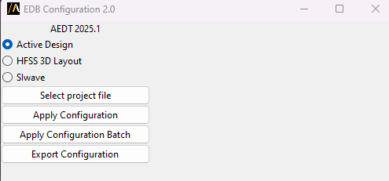
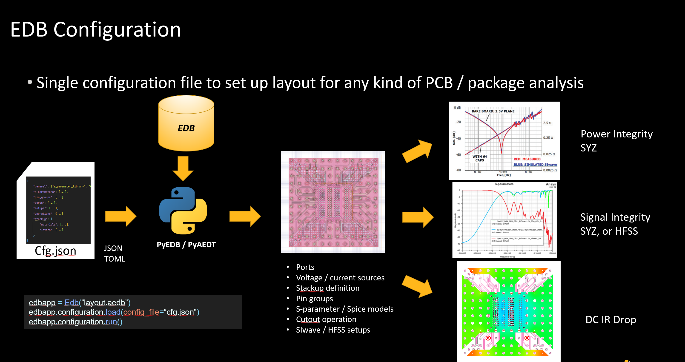

Configure layout EDB
====================

Single configuration file to set up layout for any kind of PCB & package analysis.

The following image shows the extension user interface:

The available arguments are: ``aedb_path``, ``configuration_path``.
User can pass as an argument a configuration file (a json formatted file or a toml file) or a folder containing more
than N configuration files. In such case the script creates N new aedb projects, each one with corresponding
setting file applied.

You can also launch the extension user interface from the terminal. An example can be found here:

.. toctree::
   :maxdepth: 2

   ../commandline