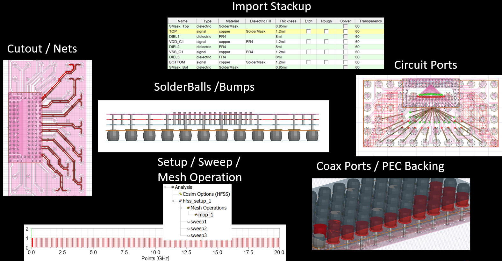

Configure layout EDB
====================

------------
Introduction
------------

This extension provides the capability of

- Apply simulation configuration to HFSS 3D Layout design or SIwave project.
- Export simulation configuration as a text file from HFSS 3D Layout design or SIwave project.

The simulation configuration file is a text file in json or toml format. It contains information like layer stackup,
materials, components, HFSS/SIwave setups, etc. This configure file can be used to set up PCB for DCIR, signal
integrity as well as power integrity analysis.

.. image:: ../../../_static/extensions/configure_edb_way_of_work.png
  :width: 800
  :alt: Principle of working of Layout UI

--------------------------------------------------------------------------
A brief description of which options are defined in the configuration file
--------------------------------------------------------------------------

As depicted above, these options are importing a stackup, defining components and solderballs / bumps on them,
doing a cutout (much faster and easier than the UI one),
creating coaxial ports with an appropriate PEC backing, as well as, automatically creating distributed circuit ports (or current / voltage sources) on a component,
with the negative terminal of each being its nearest pin of the reference net. Moreover, a variety of simulation setups are supported, namely HFSS, SIwave SYZ, SIwave DC,
as well as, mesh operations that is length based. Last but not least, exporting a configuration file from the active design is also supported, hence the user can get the
configuration setup and re-use it with or without modifications as many times as possible.

The value of this format and toolkit, lies in the fact that it is totally reusable, it is really user-friendly, even with users that are not familiar with scripting.
It supports most of the options that the UI also supports (not only the ones explained above, but many additional), and it has the advantage of obtaining the initial
configuration file from the design, by using its export property.

----------
How to use
----------

.. image:: ../../../_static/extensions/configure_edb.png
  :width: 800
  :alt: Configure Layout UI

~~~~~~~~~~~~~~~~~~~~~~~~~~~~~~~~~~~~~~~~~~~~~~~~~~~~~~~~~
Configure HFSS 3D Layout design in active AEDT project
~~~~~~~~~~~~~~~~~~~~~~~~~~~~~~~~~~~~~~~~~~~~~~~~~~~~~~~~~

1, Select ``Active Design`` in GUI.

2, Make sure the HFSS 3D Layout design is open and active in AEDT.

3, Click ``Select and Apply Configuration`` and browse to your configuration files.

~~~~~~~~~~~~~~~~~~~~~~~~~~~~~~~~~~~~~~~~~~~~~~~~~
Configure HFSS 3D Layout design in a AEDT project
~~~~~~~~~~~~~~~~~~~~~~~~~~~~~~~~~~~~~~~~~~~~~~~~~

1, Select ``HFSS 3D Layout`` in GUI.

2, Click ``Select Project File`` and browse to .aedt file.

3, Click ``Select and Apply Configuration`` and browse to your configuration files.

4, In the second pop-up window. Specify where to save the new project.

~~~~~~~~~~~~~~~~~~~~~~~~~~~~~~~~~~
Configure design in siwave project
~~~~~~~~~~~~~~~~~~~~~~~~~~~~~~~~~~

1, Select ``SIwave`` in GUI.

2, Click ``Select Project File`` and browse to .siw file.

3, Click ``Select and Apply Configuration`` and browse to your configuration files.

4, In the second pop-up window. Specify where to save the new project.

~~~~~~~~~
Resources
~~~~~~~~~

1, EDB Configuration `User Guide`_ for details

.. _User Guide: https://edb.docs.pyansys.com/version/stable/examples/use_configuration/index.html

2, `Demo video`_

.. _Demo video: https://www.linkedin.com/posts/electronics-simulation_accelerate-hfss-configuration-via-ansys-pyedb-activity-7252325488168177666-ypbN/?utm_source=share&utm_medium=member_desktop

3, `Webinar Automating Signal and Power Integrity workflow with PyAEDT`_

.. _Webinar Automating Signal and Power Integrity workflow with PyAEDT: https://www.ansys.com/webinars/automating-signal-power-integrity-workflow-pyaedt?campaignID=7013g000000Y8uOAAS&utm_campaign=product&utm_content=digital_electronics_oktopost-Ansys+Electronics_oktopost-%25campaign_n&utm_medium=social-organic&utm_source=LinkedIn