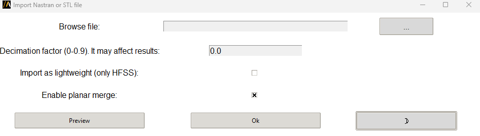

Import Nastran
==============

You can import a Nastran or STL file in any 3D modeler. You can also preview the imported file and decimate it prior to import.

You can access the extension from the icon created on the **Automation** tab using the Extension Manager.

The following image shows the extension user interface:

The available arguments are: ``file_path``, ``planar``, ``lightweight``, and ``decimate``.
You can also launch the extension user interface from the terminal. An example can be found here:

.. toctree::
   :maxdepth: 2

   ../commandline