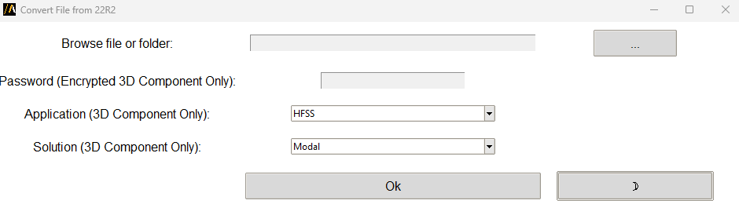
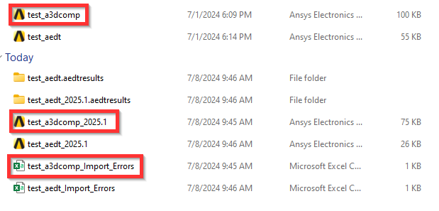

Kernel conversion
=================

Conversion of the kernel from ACIS (2022R2 and previous versions),
to Parasolid (2023R1 and following versions) is becoming accessible to the customer,
with the use of a simple script.

This script is compatible with AEDT files, as well as A3DCOMP files (including encrypted 3DComponents).

The following image shows the extension user interface:

The Browse file or folder input points to a path which is either an A3DCOMP file,
an AEDT file, or a folder containing a variety of files of both types
(this way the user is capable to convert the kernel of a component library with one launch of the script)

.. warning::

   For encrypted 3D components the enable editing should be always on (with the corresponding
   password that is given as an input). When pointing to a library, in order for
   all the 3DComponents to be converted, they must have the same Application and Solution type,
   given as an input in the last two entries of the UI, as well as same password, in order for the
   conversion to be successful for all files.

Last but not least, for every file in the folder, a new file is generated in the path provided, that contains the
design converted to the latest version, and its name indicating the initial file version (i.e.test_aedt_2025.1)
Furthermore, for every conversion, a CSV file is created, with a name pointing to the converted design name,
containing any violations that occurred during the conversion, and that need **manual** fixing by the user.

The following image show, the initial test_aedt and test_a3dcomp files, the corresponding CSV files and
the generated 2025R1 version (with the Parasolid Kernel) files.

You can launch the extension user interface from the terminal, you can find the script in the PyAEDT installation:

.. code::

   python.exe path/to/pyaedt/extensions/project/kernel_converter.py

Finally, this code shows how you can run the extension directly from a Python script:

.. code:: python

    from ansys.aedt.core.extensions.project.kernel_converter import main

    main(test_args = {"password": "my_pwd",
                    "application": "HFSS",
                    "solution": "Modal",
                    "file_path": "C:\my_path\file_containing_projects"})
